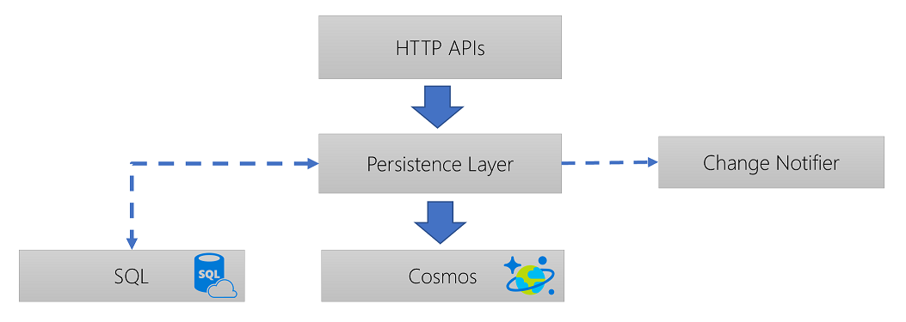
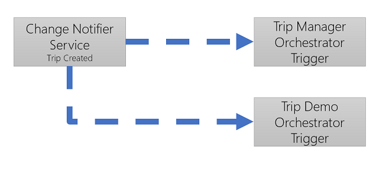
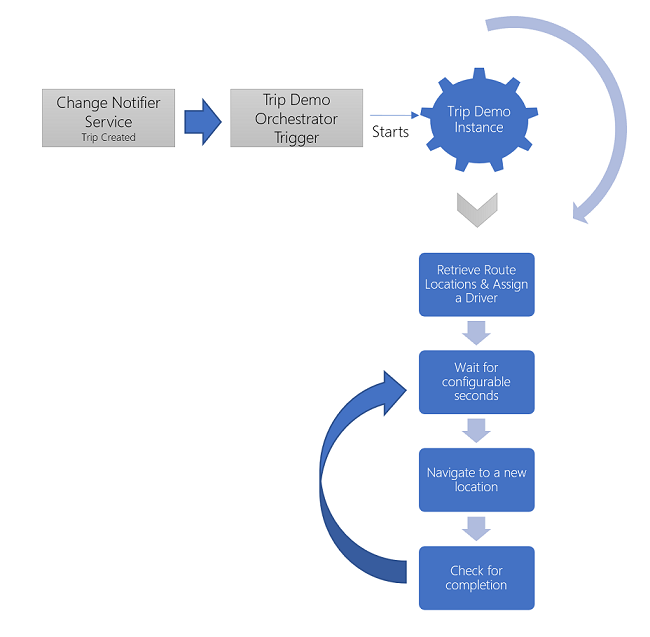

# API endpoints using Azure Functions

- [API endpoints using Azure Functions](#api-endpoints-using-azure-functions)
    - [RideShare APIs](#rideshare-apis)
    - [Durable Orchestrators](#durable-orchestrators)
  - [Next steps](#next-steps)

### RideShare APIs

The sample contains front-end APIs that are used to manage Drivers, Passengers and Trips:

- They are built on Azure Functions using RESTful design principles.
- They use an [Azure Cosmos DB](https://docs.microsoft.com/en-us/azure/cosmos-db/introduction) collection to store their respective data. **Please note**, however, that, due to cost constraints, the sample APIs share the same Cosmos DB collection.
- They use [Application Insights](https://docs.microsoft.com/en-us/azure/application-insights/app-insights-overview) to send traces, metrics and telemetry to.

As the macro architecture depicts, the APIs are implemented using C# Azure Functions. They have a simple architecture that can be illustrated as follows:



Please note the following:

- The `Persistence Layer` implements the `IPersistenceService` interface. In the reference solution implementation, there are two implementations: `CosmosPersistenceLayer` and `SqlPersistenceService`. Only the `CosmosPersistenceLayer` is fully implemented in the reference implementation:

```csharp
public interface IPersistenceService
{
    // Drivers
    Task<DriverItem> RetrieveDriver(string code);
    Task<List<DriverItem>> RetrieveDrivers(int max = Constants.MAX_RETRIEVE_DOCS);
    Task<List<DriverItem>> RetrieveDrivers(double latitude, double longitude, double miles, int max = Constants.MAX_RETRIEVE_DOCS);
    Task<List<DriverItem>> RetrieveActiveDrivers(int max = Constants.MAX_RETRIEVE_DOCS);
    Task<int> RetrieveDriversCount();
    Task<DriverItem> UpsertDriver(DriverItem driver, bool isIgnoreChangeFeed = false);
    Task<string> UpsertDriverLocation(DriverLocationItem driver, bool isIgnoreChangeFeed = false);
    Task<List<DriverLocationItem>> RetrieveDriverLocations(string code, int max = Constants.MAX_RETRIEVE_DOCS);
    Task DeleteDriver(string code);

    // Trips
    Task<TripItem> RetrieveTrip(string code);
    Task<List<TripItem>> RetrieveTrips(int max = Constants.MAX_RETRIEVE_DOCS);
    Task<List<TripItem>> RetrieveTrips(double latitude, double longitude, double miles, int max = Constants.MAX_RETRIEVE_DOCS);
    Task<List<TripItem>> RetrieveActiveTrips(int max = Constants.MAX_RETRIEVE_DOCS);
    Task<int> RetrieveTripsCount();
    Task<int> RetrieveActiveTripsCount();
    Task<TripItem> UpsertTrip(TripItem trip, bool isIgnoreChangeFeed = false);
    Task DeleteTrip(string code);

    // High-level methods
    Task<TripItem> AssignTripAvailableDrivers(TripItem trip, List<DriverItem> drivers);
    Task<TripItem> AssignTripDriver(TripItem trip, string driverCode);
    Task RecycleTripDriver(TripItem trip);
    Task<TripItem> CheckTripCompletion(TripItem trip);
    Task<TripItem> AbortTrip(TripItem trip);
}
```

- To make things testable, the Functions are only a wrapper around the PersistenceLayer. Here is an example:

```csharp
[FunctionName("GetTrips")]
public static async Task<IActionResult> GetTrips([HttpTrigger(AuthorizationLevel.Function, "get", Route = "trips")] HttpRequest req,
    ILogger log)
{
    log.LogInformation("GetTrips triggered....");

    try
    {
        var persistenceService = ServiceFactory.GetPersistenceService();
        return (ActionResult)new OkObjectResult(await persistenceService.RetrieveTrips());
    }
    catch (Exception e)
    {
        var error = $"GetTrips failed: {e.Message}";
        log.LogError(error);
        return new BadRequestObjectResult(error);
    }
}
```

- The `PersistenceService` accepts an `IChangeNotifierService` as one of its dependencies. The purpose of this service is to handle entity changes:

```csharp
public interface IChangeNotifierService
{
    Task DriverChanged(DriverItem driver);
    Task TripCreated(TripItem trip, int activeTrips);
    Task TripDeleted(TripItem trip);
    Task PassengerChanged(PassengerItem trip);
}
```

When a trip is added, for example, the change notifier service implementation triggers the `TripManagerOrchestrator` so it creates and assigns a new instance to manage the newly created trip.

In addition, depending on whether the newly created trip is `normal` or `demo` mode, the change notifier service might trigger the `TripDemoOrchestrator` so it creates and assigns a new instance to mimic a demo/robot behavior such as accepting a driver, stepping through a driver route until the final destination is reached. More explanation about this in the [Durable Orchestrators](#durable-orchestrators) section:

```csharp
public async Task TripCreated(TripItem trip, int activeTrips)
{
    var error = "";

    try
    {
        // Start a trip manager
        var baseUrl = _settingService.GetStartTripManagerOrchestratorBaseUrl();
        var key = _settingService.GetStartTripManagerOrchestratorApiKey();
        if (string.IsNullOrEmpty(baseUrl) || string.IsNullOrEmpty(key))
            throw new Exception("Trip manager orchestrator base URL and key must be both provided");

        // Trigger the trip manager orchestrator
        // ...omitted for brevity

        if (trip.Type == TripTypes.Demo)
        {
            // Trigger the trip demo orchestrator
            // ...omitted for brevity
        }
    }
    catch (Exception ex)
    {
        error = $"Error while starting the trip manager: {ex.Message}";
        throw new Exception(error);
    }
    finally
    {
        _loggerService.Log($"{LOG_TAG} - TripCreated - Error: {error}");
    }
}
```

### Durable Orchestrators

Durable Orchestrators are the heart of the solution. They are made up of 3 orchestrators:

- Trip Manager
- Trip Monitor
- Trip Demo (optional)

In the RideShare solution, orchestrators are like Serverless [Actors](https://en.wikipedia.org/wiki/Actor_model). They are stateful instances running in the Azure Functions container and made persistent to a storage account automatically. Read more about [Azure Functions Durable Functions](https://docs.microsoft.com/azure/azure-functions/durable-functions-overview).

Each orchestrator has 3 sections:

- **HTTP Trigger Endpoints** - used to start, terminate and retrieve state of a particular orchestrator instance.
- **Orchestrator Function** - used to provide the orchestrator main body of execution and state management.
- **Activity Functions** - one or more activity functions that the orchestrator calls upon to run the different activities that make up the execution.

To make functions easily identifiable, the reference implementation follows a naming convention where the Trigger Functions start with a `T_` i.e. `T_StartTripManager`, the Orchestrator Functions start with an `O_` i.e. `O_ManageTrip` and the Activity Functions start with an `A_` and a 2-digit identifier i.e. `A_TM_AssignTripDriver`. The `_TM_` denotes Trip Manager, for example.

Orchestrator instances require application-level unique instance IDs. In the reference implementation, the Trip code is used as an instance ID for the Trip Manager. The Trip Monitor uses the trip code and appends `-M` to make it unique while the Trip Demo uses the trip code and appends `-D` to make it unique.

As the macro architecture depicts, the orchestrators are implemented in C#. The following illustrates their overall architecture:


The following describes the process that newly created trips go through:

- The `ChangeNotifierService` triggers the Trip Manager Orchestrator to start a new Trip Manager instance.
- The new instance retrieves the available drivers (available & within x miles from trip's source location) and notifies them of a new trip
- The instance then waits for either an external event to arrive (driver accepts the trip) or time out to occur.
- If time out occurs, the instance aborts the trip and exits
- If a driver accepts the trip, the instance assigns the driver to the trip and enqueues the trip code to a storage queue
- The storage queue will trigger the Trip Monitor Orchestrator to start a new Trip Monitor instance.
- The new monitor instance starts the trip and waits for a configurable seconds
- The instance checks for a completion and re-waits until either the trip completes or the the configured number of iterations gets exhausted
- If the number of iterations is exhausted, the instance will abort the trip
- If the trip is in demo mode, the `ChangeNotifierService` triggers both the Trip Manager Orchestrator and the Trip Demo Orchestrator to start new instances



- The `Trip Demo` instance acts like a bot to simulate accepting a driver and navigating through the locations of a random route



**Please note** that, in the the reference implementation:

- The trip is considered `complete` if the trip's driver location matches the trip's destination location. While this is not realistic, it does provide a method to determine when the trip is complete. In reality though, there has to be a more reliable way of determining completion.
- The orchestrators currently use the persistence layer (described above) instead of calling the APIs to retrieve and persist trips. There is a setting in the `ISettingService` that controls this behavior i.e. `IsPersistDirectly`. More about this in the [source code](source-code-structure.md) document.
- The route locations that the `Demo` uses to step through the trip's source and destination locations is not really. It is basically the random number of locations made up from the trip's source location and destination location. In real scenarios, [Bing Route API](https://msdn.microsoft.com/library/ff701717.aspx?f=255&MSPPError=-2147217396) can be used to determine the actual route between the source and destination.

The Azure Durable Functions are quite powerful as they provide a way to instantiate thousands of managed stateful instances in a serverless environment. This capability exists in other Azure products such as [Service Fabric](https://azure.microsoft.com/services/service-fabric/)'s stateful actors. The difference is that the Azure Durable Functions require a lot less effort to setup, maintain and code.

Although Azure Durable Functions can [query and enumerate all instances](https://docs.microsoft.com/azure/azure-functions/durable-functions-instance-management) of a specific orchestrator:

```csharp
IList<DurableOrchestrationStatus> instances = await context.GetStatusAsync(); // You can pass CancellationToken as a parameter.
foreach (var instance in instances)
{
    log.Info(JsonConvert.SerializeObject(instance));
};
```

It is still probably a good idea to store the instance ids and their status in a table storage for example in case a solution requires special querying capability against the instances.

## Next steps

Create your Azure Function Apps, then perform the steps to configure and deploy your functions:

- [Create the Azure Function Apps](setup.md#create-the-azure-function-apps)
- [Function App Application Settings](setup.md#function-app-application-settings)
  - [Drivers Function App](setup.md#drivers-function-app)
  - [Passengers Function App](setup.md#passengers-function-app)
  - [Orchestrators Function App](setup.md#orchestrators-function-app)
  - [Trips Function App](setup.md#trips-function-app)
  - [Trip Archiver Function App](setup.md#trip-archiver-function-app)
- [Build the solution](setup.md#build-the-solution)

Read about how the Relecloud Rideshare architecture uses Event Grid for services intercommunication:

- [Services intercommunication using Event Grid](services-intercommunication.md)
  - [Logic App handler](services-intercommunication.md#logic-app-handler)
  - [SignalR handler](services-intercommunication.md#signalr-handler)
    - [DOTNET SignalR client](services-intercommunication.md#dotnet-signalr-client)
    - [JavaScript SignalR client](services-intercommunication.md#javascript-signalr-client)
  - [Power BI handler](services-intercommunication.md#power-bi-handler)
  - [Trip Archiver handler](services-intercommunication.md#trip-archiver-handler)
