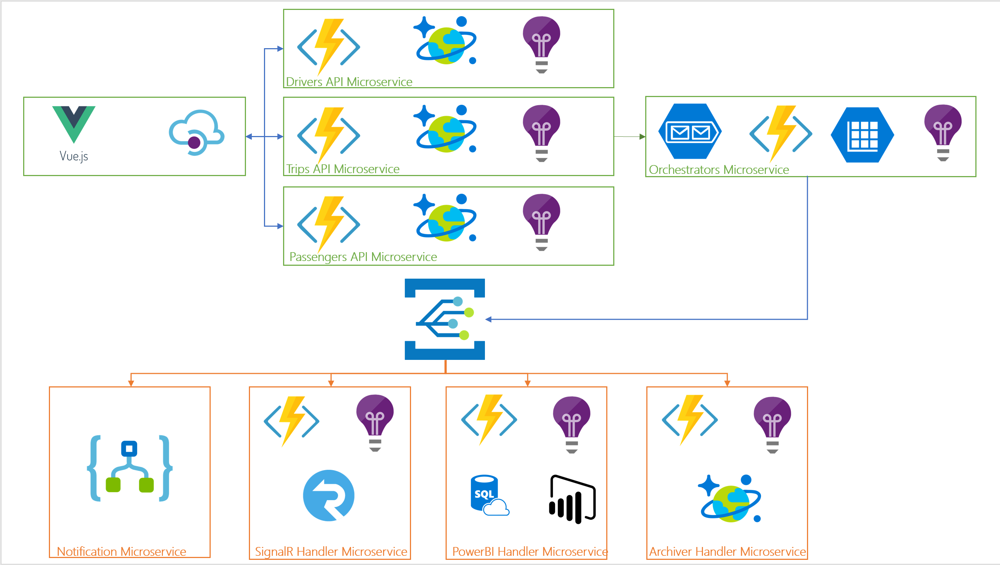

# Architecture overview

- [Architecture overview](#architecture-overview)
  - [Macro architecture](#macro-architecture)
  - [Data flow](#data-flow)
  - [Next steps](#next-steps)

## Macro architecture

Relecloud decided to use the following macro architecture in their RideShare solution:


The architecture major building blocks are:

| Component             | Technology                                                                                          | Description                                                                                                                                                                                                                                                                                                                                                                                 |
| --------------------- | --------------------------------------------------------------------------------------------------- | ------------------------------------------------------------------------------------------------------------------------------------------------------------------------------------------------------------------------------------------------------------------------------------------------------------------------------------------------------------------------------------------- |
| RideShare Web App     | Vue.js SPA                                                                                          | A multi-purpose, single-page application web app that allows users to sign up and sign in against a B2C Active Directory instance. Users have different levels and permissions. For example, passenger users can request rides and receive real-time notifications of ride status. Executive users, on the other hand, can view top-level reports that reveal rides and system performance. |
| API Manager           | [Azure API Manager](https://docs.microsoft.com/azure/api-management/)                               | An API gateway that acts as a front-end to the solution APIs. Among many other benefits, the API management service provides RideShare APIs with security verification, usage telemetry, documentation and rate limiting.                                                                                                                                                                   |
| RideShare APIs        | C# [Azure Functions](https://azure.microsoft.com/services/functions/)                               | Three Function Apps are deployed to serve RideShare's APIs: Drivers, Trips and Passengers. These APIs are exposed to the Web App applications via the API manager and provide CRUD operations for each of RideShare entities.                                                                                                                                                               |
| Durable Orchestrators | C# [Durable Functions](https://docs.microsoft.com/azure/azure-functions/durable-functions-overview) | Trip Manager, Monitor and Demo orchestrators are deployed to manage the trip and provide real-time status updates. The orchestrators are launched for the duration of the trip and they perform management and monitoring functions as will be explained in more [details](#durable-orchestrators) later. In essence, these orchestrators make up the heart of the solution.                |
| Event Emitter         | [Event Grid Topic](https://docs.microsoft.com/azure/event-grid/overview)                            | A custom topic used to externalize trips as they go through the different stages.                                                                                                                                                                                                                                                                                                           |
| Event Subscribers     | Functions & Logic Apps                                                                              | Several Event Grid topic subscribers listen to the Event Grid topic events to provide multi-process capability of an externalized trip.                                                                                                                                                                                                                                                     |
| Key Vault             | [Azure Key Vault](https://docs.microsoft.com/azure/key-vault/key-vault-overview)                    | All secrets, such as database connection strings and keys are securely stored in Azure Key Vault. This prevents accidental leakage of sensitive values and the same keys can be easily shared by multiple services.                                                                                                                                                                         |

The following are the Event Grid Subscribers:

| Subscriber   | Technology                                                    | Description                                                                                               |
| ------------ | ------------------------------------------------------------- | --------------------------------------------------------------------------------------------------------- |
| Notification | [Logic App](https://azure.microsoft.com/services/logic-apps/) | A trip processor to notify admins i.e. emails or SMS as the trip passes through the different stages.     |
| SignalR      | C# Azure Function                                             | A trip processor to update passengers (via browsers or mobile apps) in real-time about trip status.       |
| Power BI     | C# Azure Function                                             | A trip processor to insert the trip into an SQL Database and possibly into a Power BI dataset (via APIs). |
| Archiver     | Node.js Azure Function                                        | A trip processor to archive the trip into Azure Cosmos DB                                                 |

Relecloud decided to use the following criteria to determine when a certain piece of functionality is to be considered a Microservice:

- The functionality must scale or be deployed independently from other parts.
- The functionality must be written in a separate language/technology like Node.js in case there is some certain expertise that is only available in that specific technology.
- The functionality must be isolated by a clean boundary

Given the above principles, the following are identified as Microservices:

| Microservice                    | Technology | Reason                                                                                                                                                              |
| ------------------------------- | ---------- | ------------------------------------------------------------------------------------------------------------------------------------------------------------------- |
| Drivers APIs                    | C#         | The `Drivers` API is code and deployment independent isolated in a Function App.                                                                                    |
| Trips APIs                      | C#         | The `Trips` API is code and deployment independent isolated in a Function App.                                                                                      |
| Passengers APIs                 | C#         | The `Passengers` API is code and deployment independent isolated in a Function App.                                                                                 |
| Durable Orchestrators           | C#         | The Trip `Manager`, `Monitor` and `Demo` i.e. Orchestrators are independent as they provide the heart of the solution. They need to scale and deploy independently. |
| Event Grid Notification Handler | Logic App  | The `Logic App` handler adds value to the overall solution but works independently.                                                                                 |
| Event Grid SignalR Handler      | C#         | The `SignalR` handler adds value to the overall solution but works independently.                                                                                   |
| Event Grid Power BI Handler     | C#         | The `Power BI` handler adds value to the overall solution but works independently.                                                                                  |
| Event Grid Archiver             | Node.js    | The Node.js `Archiver` handler adds value to the overall solution but works independently.                                                                          |

**Please note** that, due to code layout, some Microservices might be a Function within a Function App. Examples of this are the `Event Grid SignalR Handler` and `Event Grid Power BI Handler` Microservices. They are both part of the `Trips` Function App.

## Data flow

The following is a detailed diagram showing how the different architecture components communicate and the Azure services they use:



The sample uses a front-end SPA Web App to allow passengers to login in, manage trips and see previous trips. The SPA uses an API manager to access the solution front-end APIs.

When a passenger decides to request a trip, a request containing the passenger information and the trip source and destination locations is posted to the `Trips` Microservice via is exposed front-end API:

```json
{
  "passenger": {
    "code": "joe@gmail.com",
    "firstName": "Joe",
    "lastName": "James",
    "mobileNumber": "+13105551212",
    "email": "joe@gmail.com"
  },
  "source": {
    "latitude": -31.7654,
    "longitude": 54.9011
  },
  "destination": {
    "latitude": -32.5625,
    "longitude": 60.6276
  },
  "type": 1
}
```

The `Trips` Microservice stores the trip in Azure Cosmos DB, enqueues the `Trip` item to the `Orchestrators` Microservice and returns the newly created `Trip` information such as code and other properties. Optionally the `Orchestrators` Microservice can also be triggered via its internally-exposed API.

**For more information** on the operation of the durable orchestrators, please refer to the [Durable Orchestrators](api-endpoints.md#durable-orchestrators) document.

The `Orchestrators` Microservice instantiates a Durable `Trip Manager` to manage the trip until it completes. The `Trip Manager` performs the following tasks:

- Notify available drivers that a new trip is requested. Available drivers are identified as drivers who are within x mile radius from the trip source location and that they are currently not servicing other passengers. The `Trip Manager` sends `Drivers notified` state change event to the Event Grid.
- Wait for either a timeout timer to occur or an external event to signal that a driver accepted the trip:
  - If a timeout occurs, the `Trip Manager` aborts the trip indicating that no driver is interested in the requested trip. The `Trip Manager` sends `Trip aborted` state change event to the Event Grid.
  - If an external signal is received, the `Trip Manager` proceeds with the orchestration. It is worth mentioning that when a driver accepts a trip, he/she posts a request (via the SPA or more realistically a Mobile App) to the `Trips` API indicating that a driver is willing to accept the trip i.e. `api/trips/{code}/drivers/{drivercode}`. The `Trips` Microservice then calls upon the `Orchestrators` Microservice API to trigger the external event.
- Assign the driver (that accepted the trip) to the `Trip` item. The `Trip Manager` sends `Drivers picked` state change event to the Event Grid.
- Enqueue a message to the `Trip Monitor` queue.

When the `Trip Monitor` queue is triggered, the `Orchestrators` Microservice instantiates a Durable `Trip Monitor` to monitor the trip progress and report state changes.

- The `Trip Monitor` starts a timer to be triggered every x seconds to check whether the trip is completed or not. If completed, it indicates that the trip is completed and sends `Trip completed` state change event to the Event Grid. Otherwise, it sends `Trip running` state change event to the Event Grid.
- The `Trip Monitor` does not let trips run forever! It aborts the trip if it does not complete within configurable amount of time.

When events are sent to the `Event Grid Topic`, they trigger the different handler Microservices to further process the trip:

- Notification Microservice
- SignalR Handler Microservice
- Power BI Handler Microservice
- Archiver Handler Microservice

## Next steps

Read about the API endpoints that are created using Azure Functions:

- [API endpoints using Azure Functions](api-endpoints.md)
  - [RideShare APIs](api-endpoints.md#rideshare-apis)
  - [Durable Orchestrators](api-endpoints.md#durable-orchestrators)
