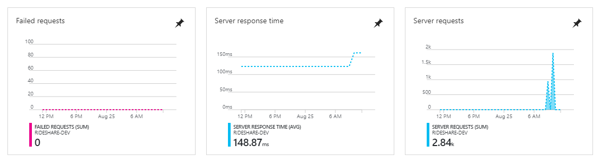
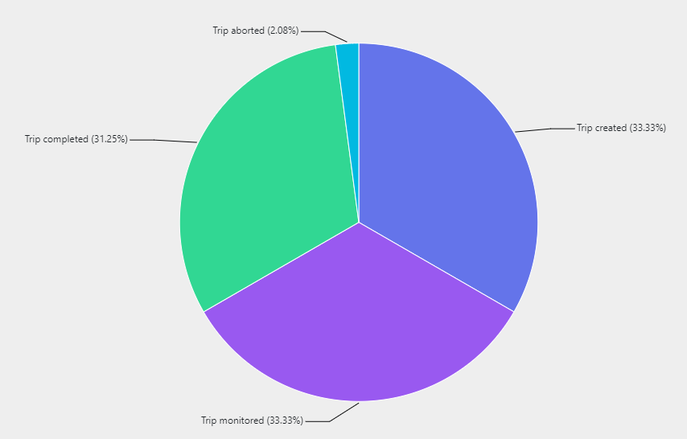
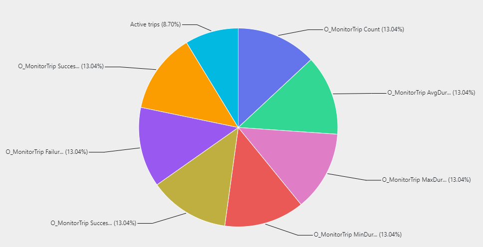

# Monitoring and testing

- [Integration testing](#integration-testing)
- [Monitoring](#monitoring)
  - [Telemetry correlation](#telemetry-correlation)
  - [Monitoring for different audiences](#monitoring-for-different-audiences)
- [Next steps](#next-steps)

## Integration testing

The .NET `ServerlessMicroservices.Seeder` project contains a multi-thread tester that can be used to submit `demo` trip requests against the `Trips` API. The test will simulate load on the deployed solution and test end-to-end.

**Please note** that the test will usually run against a deployment environment where the `AuthEnabled` setting is set to false.

```powershell
> ServerlessMicroservices.Seeder.exe testTrips --help

Usage:  testTrips [options]

Options:
  --help               Show help information
  -t|--seeddriversurl  Set seed drivers url
  -t|--testurl         Set test url
  -i|--testiterations  Set test iterations
  -s|--testseconds     Set test seconds
  -v|--signalrinfourl  Set SignalR Info URL

> ServerlessMicroservices.Seeder.exe testTrips --seeddriversurl http://localhost:7071 --testurl http://localhost:7072/api/triptestparameters
```

The `testTrips` command takes 1 mandatory argument and 2 optional arguments i.e. `ServerlessMicroservices.Seeder testTrips testUrl testiterations testseconds`

- Test Parameters URL to read the test data from.
- Optional: # of iterations. Default to 1.
- Optional: # of seconds to delay between each iteration. Default to 60.

The Test Parameters URL is the `RetrieveTripTestParameters` endpoint defined in the Trips API Function App. It reads test parameters stored in blob storage i.e. . The blob storage is written to by the `StoreTripTestParameters` endpoint defined in the Trips API Function App.

The following is a sample POST payload the `StoreTripTestParameters` API i.e. `https://<your-trips-function-api>.azurewebsites.net/api/triptestparameters?code=<your code>`. It defines 4 trips to run simultaneously:

```json
[
  {
    "url": "https://<your-trips-function-app>.azurewebsites.net/api/trips?code=<your code>",
    "passengerCode": "bsam@gmail.com",
    "passengerFirstName": "Bill",
    "passengerLastName": "Sam",
    "PassengerMobile": "50551000",
    "PassengerEmail": "bsam@gmail.com",
    "sourceLatitude": 31,
    "sourceLongitude": 50,
    "destinationLatitude": 32,
    "destinationLongitude": 60
  },
  {
    "url": "https://<your-trips-function-app>.azurewebsites.net/api/trips?code=<your code>",
    "passengerCode": "krami@gmail.com",
    "passengerFirstName": "Kurt",
    "passengerLastName": "Ramo",
    "PassengerMobile": "505551515",
    "PassengerEmail": "krami@gmail.com",
    "sourceLatitude": 28,
    "sourceLongitude": 40,
    "destinationLatitude": 33,
    "destinationLongitude": 51
  },
  {
    "url": "https://<your-trips-function-app>.azurewebsites.net/api/trips?code=<your code>",
    "passengerCode": "sjones@gmail.com",
    "passengerFirstName": "Smith",
    "passengerLastName": "Jones",
    "PassengerMobile": "50551102",
    "PassengerEmail": "sjones@gmail.com",
    "sourceLatitude": 31,
    "sourceLongitude": 50,
    "destinationLatitude": 32,
    "destinationLongitude": 60
  },
  {
    "url": "https://<your-trips-function-app>.azurewebsites.net/api/trips?code=<your code>",
    "passengerCode": "rita_ghana@gmail.com",
    "passengerFirstName": "Rita",
    "passengerLastName": "Ghana",
    "PassengerMobile": "505556156",
    "PassengerEmail": "rita_ghana@gmail.com",
    "sourceLatitude": 28,
    "sourceLongitude": 40,
    "destinationLatitude": 33,
    "destinationLongitude": 51
  }
]
```

Please note the following about the `Seeder` test:

- Since the tester loads the test parameters from a URL, the test parameters can be varied independently without having to re-compile the code.
- Since each test parameter defines the URL to submit trip requests to, production and dev environments can be tested at the same time.

One way to verify that the test ran successfully is to query the trip summaries in the `TripFact` table for the number of entries after the test runs:

```sql
SELECT * FROM dbo.TripFact
```

The number of entries should match the number of submitted trips. Let us say, for example, we started the test with the test parameters shown above: `Seeder.exe url 2 60`. This means that the test will run for 2 iterations submitting 4 trips in each iteration. Therefore we expect to see 8 new entries in the `TripFact` table.

The following is a sample tester output for 2 iterations:

```bash
Iteration 0 starting....
TestTripRunner - Url https://ridesharetripsfunctionappdev.azurewebsites.net/api/trips?code=rtTQCEXCzUvrw0l28oCfZjhxkIMDeIyQWWj2NFuLxYbld/OwGdZ9aA== started....
TestTripRunner - Simulate a little delay....
TestTripRunner - Url https://ridesharetripsfunctionappdev.azurewebsites.net/api/trips?code=rtTQCEXCzUvrw0l28oCfZjhxkIMDeIyQWWj2NFuLxYbld/OwGdZ9aA== started....
TestTripRunner - Simulate a little delay....
TestTripRunner - Url https://ridesharetripsfunctionappdev.azurewebsites.net/api/trips?code=rtTQCEXCzUvrw0l28oCfZjhxkIMDeIyQWWj2NFuLxYbld/OwGdZ9aA== started....
TestTripRunner - Simulate a little delay....
TestTripRunner - Url https://ridesharetripsfunctionappdev.azurewebsites.net/api/trips?code=rtTQCEXCzUvrw0l28oCfZjhxkIMDeIyQWWj2NFuLxYbld/OwGdZ9aA== started....
TestTripRunner - Simulate a little delay....
TestTripRunner - Passenger Code: sjones@gmail.com ....
TestTripRunner - Passenger Code: rita_ghana@gmail.com ....
TestTripRunner - Passenger Code: bsam@gmail.com ....
TestTripRunner - Passenger Code: krami@gmail.com ....
TestTripRunner - submitted in 15.02846 seconds.
TestTripRunner - submitted in 18.5976287 seconds.
TestTripRunner - submitted in 11.6632886 seconds.
TestTripRunner - submitted in 17.1535626 seconds.
Thread 0 => Duration: 17.1535626 - Error:
Thread 1 => Duration: 11.6632886 - Error:
Thread 2 => Duration: 15.02846 - Error:
Thread 3 => Duration: 18.5976287 - Error:
All tasks are finished.
Iteration 0 completed
Delaying for 60 seconds before starting iteration 1....
Iteration 1 starting....
TestTripRunner - Url https://ridesharetripsfunctionappdev.azurewebsites.net/api/trips?code=rtTQCEXCzUvrw0l28oCfZjhxkIMDeIyQWWj2NFuLxYbld/OwGdZ9aA== started....
TestTripRunner - Simulate a little delay....
TestTripRunner - Url https://ridesharetripsfunctionappdev.azurewebsites.net/api/trips?code=rtTQCEXCzUvrw0l28oCfZjhxkIMDeIyQWWj2NFuLxYbld/OwGdZ9aA== started....
TestTripRunner - Simulate a little delay....
TestTripRunner - Url https://ridesharetripsfunctionappdev.azurewebsites.net/api/trips?code=rtTQCEXCzUvrw0l28oCfZjhxkIMDeIyQWWj2NFuLxYbld/OwGdZ9aA== started....
TestTripRunner - Simulate a little delay....
TestTripRunner - Url https://ridesharetripsfunctionappdev.azurewebsites.net/api/trips?code=rtTQCEXCzUvrw0l28oCfZjhxkIMDeIyQWWj2NFuLxYbld/OwGdZ9aA== started....
TestTripRunner - Simulate a little delay....
TestTripRunner - Passenger Code: krami@gmail.com ....
TestTripRunner - Passenger Code: bsam@gmail.com ....
TestTripRunner - submitted in 1.3980593 seconds.
TestTripRunner - submitted in 1.2487726 seconds.
TestTripRunner - Passenger Code: rita_ghana@gmail.com ....
TestTripRunner - submitted in 1.3474113 seconds.
TestTripRunner - Passenger Code: sjones@gmail.com ....
TestTripRunner - submitted in 1.3841847 seconds.
Thread 0 => Duration: 1.2487726 - Error:
Thread 1 => Duration: 1.3980593 - Error:
Thread 2 => Duration: 1.3841847 - Error:
Thread 3 => Duration: 1.3474113 - Error:
All tasks are finished.
Iteration 1 completed
Test is completed. Press any key to exit...
```

## Monitoring

[Application Insights](https://azure.microsoft.com/services/application-insights/) and [Azure Dashboard](https://azure.microsoft.com/updates/upload-download-azure-dashboards/) are great resources to monitor a solution in production. One can pin response time, requests and failure requests from the solution Application Insights resource right into the Azure Dashboard:



In addition, one can also create custom queries and pin their results to the dashboard as well. For example, the following is an analytic query that shows the distribution of custom events (sent from the code) in the last 24 hours:

```sql
customEvents
| where timestamp > ago(24h)
| summarize count() by name
| render piechart
```

The result shows the distribution of a trip during different stages:



Custom metrics are sent from the solution to the Application Insights resources to denote a metric value. In fact, if an Application Insights is attached to a Function App, the Azure Functions framework automatically sends `Count`, `AvgDurationMs`, `MaxDurationMs`, `MinDurationMs`, `Failures`, `Successes` and `SuccessRate` custom metrics for each function i.e. trigger, orchestrator or activity.

The following is an analytic query that shows in a pie chart the occurrences of the following two custom metrics in the last 24 hours: `Active trips` and `O_MonitorTrip`:

```sql
customMetrics
| where timestamp > ago(24h)
| where name == "Active trips" or name contains "O_MonitorTrip"
| summarize count() by name
| render piechart
```

The result shows the distribution of the above 2 custom metrics:



### Telemetry correlation

The Rideshare Azure Function Apps have been configured to use Application Insights automatically by supplying the Application Insights instrumentation key to the `APPINSIGHTS_INSTRUMENTATIONKEY` app setting. This makes it trivial to integrate App Insights, because the functions within your Function App will transparently send log messages, exceptions, and telemetry data to App Insights for you. While this makes integrating the two services a simple task, there are some benefits that can be gained from manually using Application Insights using the [available SDKs](https://docs.microsoft.com/azure/application-insights/app-insights-platforms). Chief among these benefits is [telemetry correlation](https://docs.microsoft.com/azure/application-insights/application-insights-correlation). Every operation, or request, within a microservices architecture such as this can generate telemetry data in Application Insights. When this activity is logged, it is associated with a unique field called the `operation_id`. This `id` is associated with all telemetry (traces, exceptions, etc.) that is part of a request. However, there are usually several services involved in a request pipeline. In the case of the Rideshare architecture, a request pipeline can involve an Azure function with an HTTP trigger that handles a new ride request from a customer, which then uses several other functions to [orchestrate the trip activity](#durable-orchestrators). These microservices will be assigned their own `operation_id` in App Insights. However, it is easy to lose track of how these various service activities relate over a period of time from the start of the trip request transaction to the end. Especially when there is a lot of trip activity due to high customer demand (hopefully!). One way to resolve this is to correlate all of these activities together for a given request pipeline (such as a trip request). You can do this by passing the initial `operation_id` to each service so it can be stored as the `operation_parentId`. This information, along with [request telemetry](https://docs.microsoft.com/en-us/azure/application-insights/application-insights-data-model-request-telemetry) and [dependency telemetry](https://docs.microsoft.com/en-us/azure/application-insights/application-insights-data-model-dependency-telemetry) can help you relate, or correlate, all of the related activities from your microservices together in a way that helps you trace activity throughout your architecture and have a better understanding of how your request pipelines are behaving.

Read more about using Application Insights to [monitor Azure Functions and track custom telemetry](https://docs.microsoft.com/en-us/azure/azure-functions/functions-monitoring?toc=%2fazure%2fapplication-insights%2ftoc.json#custom-telemetry-in-c-functions).

### Monitoring for different audiences

Using Application Insights is a great way for developers and operations to monitor raw telemetry and overall service health, especially when using a combination of real-time views like [Live Metrics Stream](https://docs.microsoft.com/azure/application-insights/app-insights-live-stream) and [built-in dashboards](https://docs.microsoft.com/en-us/azure/azure-functions/functions-monitoring?toc=%2fazure%2fapplication-insights%2ftoc.json#view-telemetry-in-app-insights). These are views that provide crucial information about technical aspects of the application, but generally do not clearly show the overall state of _the data_ and _business metrics_, such as how many trips were completed vs. how many aborted, top drivers by number of trips, geographic areas with the most trips, etc.

The [Power BI](#power-bi-handler) within our solution is configured to save this data to Azure SQL database for simple consumption from [Power BI](https://powerbi.microsoft.com/) for analyzing snapshots of business metrics. Alternatively, you can use this handler to send trips to a [streaming Power BI dataset](https://docs.microsoft.com/en-us/power-bi/service-real-time-streaming) to display the data in real-time. In this way, you will have real-time monitoring that is tuned for developers/operations, and for business users.

## Next steps

[Create the Application Insights resource](#create-the-application-insights-resource) so you can follow along with the testing and monitoring steps above.

Read an overview of the source code structure for the reference architecture:

- [Source code structure](source-code-structure.md)
  - [.NET](source-code-structure.md#net)
  - [Node.js](source-code-structure.md#nodejs)
  - [Web](source-code-structure.md#web)
