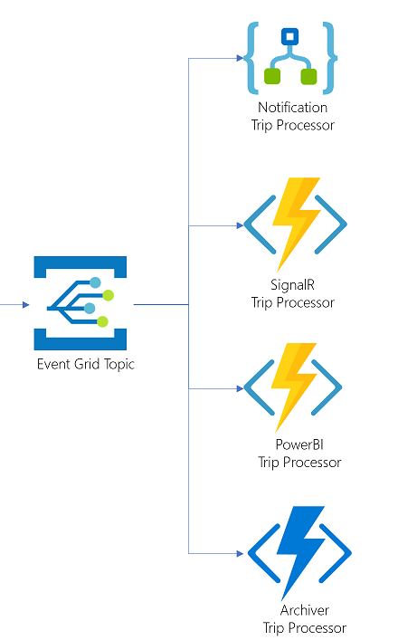
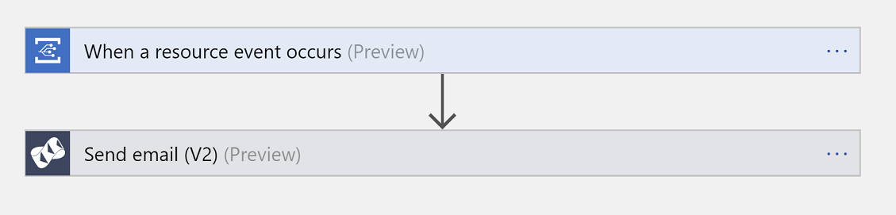
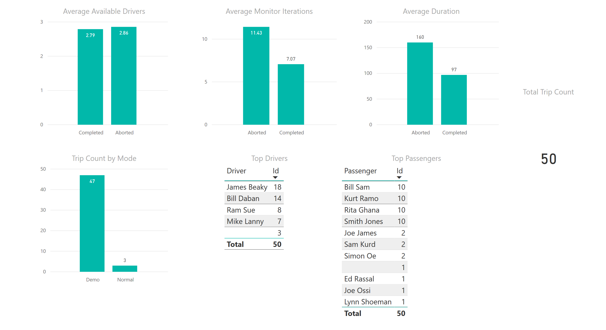

# Services intercommunication using Event Grid

- [Services intercommunication using Event Grid](#services-intercommunication-using-event-grid)
  - [Event Grid](#event-grid)
        - [Logic App handler](#logic-app-handler)
        - [SignalR handler](#signalr-handler)
          - [DOTNET SignalR client](#dotnet-signalr-client)
          - [JavaScript SignalR client](#javascript-signalr-client)
        - [Power BI handler](#power-bi-handler)
        - [Trip Archiver handler](#trip-archiver-handler)
  - [Next steps](#next-steps)

## Event Grid

[Event Grid](https://docs.microsoft.com/azure/event-grid/overview) is a fully-managed event routing service. In the reference implementation, it is used to report `Trip` state changes and kick off different `Trip` processors. Each processor or handler is an independent Microservice that receives a discrete event and decides for itself what type of action it will need to take. The key advantages of Event Grid Topics are:

- The emitter fires and forgets. No need to wait until a response arrives.
- Events can be delivered to multiple listeners that can process the event data.
- Events have data and meta data such as subject that can be used to determine processing. For example, the `Power BI Trip Processor filters out events based on subject.

Being an event source, the [Durable Orchestrators](api-endpoints.md#durable-orchestrators) externalize `Trip` state changes to an Event Grid Topic upon the following events:

```csharp
// Event Grid Event Subjects
public const string EVG_SUBJECT_TRIP_DRIVERS_NOTIFIED = "Drivers notified!";
public const string EVG_SUBJECT_TRIP_DRIVER_PICKED = "Driver picked :-)";
public const string EVG_SUBJECT_TRIP_STARTING = "Trip starting :-)";
public const string EVG_SUBJECT_TRIP_RUNNING = "Trip running...";
public const string EVG_SUBJECT_TRIP_COMPLETED = "Trip completed :-)";
public const string EVG_SUBJECT_TRIP_ABORTED = "Trip aborted :-(";
```

The `TripManager` and the `TripMonitor` orchestrators have a common routine used by activities to externalize the trip state changes:

```csharp
private static async Task Externalize(TripItem trip, string subject)
{
    await Utilities.TriggerEventGridTopic<TripItem>(null, trip, Constants.EVG_EVENT_TYPE_MONITOR_TRIP, subject, ServiceFactory.GetSettingService().GetTripExternalizationsEventGridTopicUrl(), ServiceFactory.GetSettingService().GetTripExternalizationsEventGridTopicApiKey());
}
```

**Please note** that the code uses a `Utility` method to post the `TripItem` to an Event Grid Topic using the Topic's Endpoint and API Key as identified by the setting service.

A `TripItem` is defined this way:

```csharp
public class TripItem : BaseItem
{
    [JsonProperty(PropertyName = "code")]
    public string Code { get; set; } = "";

    // Included here ...just in case the passenger state changed ...this captures the passenger state at the time of the trip
    [JsonProperty(PropertyName = "passenger")]
    public PassengerItem Passenger { get; set; } = new PassengerItem();

    // Included here ...just in case the driver state changed ...this captures the driver state at the time of the trip
    [JsonProperty(PropertyName = "driver")]
    public DriverItem Driver { get; set; } = null;

    // Included here ...just in case the driver state changed ...this captures the available drivers state at the time of the trip
    [JsonProperty(PropertyName = "availableDrivers")]
    public List<DriverItem> AvailableDrivers { get; set; } = new List<DriverItem>();

    [JsonProperty(PropertyName = "source")]
    public TripLocation Source { get; set; } = new TripLocation();

    [JsonProperty(PropertyName = "destination")]
    public TripLocation Destination { get; set; } = new TripLocation();

    [JsonProperty(PropertyName = "acceptDate")]
    public DateTime? AcceptDate { get; set; } = null;

    [JsonProperty(PropertyName = "startDate")]
    public DateTime StartDate  { get; set; } = DateTime.Now;

    [JsonProperty(PropertyName = "endDate")]
    public DateTime? EndDate { get; set; } = null;

    // Computed values
    [JsonProperty(PropertyName = "duration")]
    public double Duration { get; set; } = 0;

    [JsonProperty(PropertyName = "monitorIterations")]
    public int MonitorIterations { get; set; } = 0;

    [JsonProperty(PropertyName = "isAborted")]
    public bool IsAborted { get; set; } = false;

    [JsonProperty(PropertyName = "error")]
    public string Error { get; set; } = "";

    [JsonProperty(PropertyName = "type")]
    public TripTypes Type { get; set; } = TripTypes.Normal;
}
```

As shown in the macro architecture section, the solution implements several listeners for the trip:



##### Logic App handler

[Logic Apps](https://azure.microsoft.com/services/logic-apps/) provide a special trigger for Event Grids. When selected, the connector handles all the things needed to provide the web hook required to subscribe to the Event Grid topic. Please refer to the [setup](./setup.md#connect-event-grid-to-logic-app) to see how to set this up.

In the reference implementation, the Logic App is triggered by the Event Grid Topic to notify admins of trip state changes:



**Please note** that the [Logic Apps](https://azure.microsoft.com/services/logic-apps/) Event Grid trigger exposes the event's meta data as dynamic content. To access the event data, you must switch to `Code view` i.e. `@{triggerBody()?['data']}`.

##### SignalR handler

Azure Functions provide a special binding trigger `EventGridEvent` to handle the Event Grid event. In addition, there is a new [special binding](https://github.com/anthonychu/AzureAdvocates.WebJobs.Extensions.SignalRService) for [SignalR Service](https://azure.microsoft.com/en-us/services/signalr-service/) which makes broadcasting SignalR messages super flexible.

```csharp
[FunctionName("EVGH_TripExternalizations2SignalR")]
public static async Task ProcessTripExternalizations2SignalR([EventGridTrigger] EventGridEvent eventGridEvent,
    [SignalR(HubName = "trips")] IAsyncCollector<SignalRMessage> signalRMessages,
    ILogger log)
{
    log.LogInformation($"ProcessTripExternalizations2SignalR triggered....EventGridEvent" +
                    $"\n\tId:{eventGridEvent.Id}" +
                    $"\n\tTopic:{eventGridEvent.Topic}" +
                    $"\n\tSubject:{eventGridEvent.Subject}" +
                    $"\n\tType:{eventGridEvent.EventType}" +
                    $"\n\tData:{eventGridEvent.Data}");

    try
    {
        TripItem trip = JsonConvert.DeserializeObject<TripItem>(eventGridEvent.Data.ToString());
        if (trip == null)
            throw new Exception("Trip is null!");

        log.LogInformation($"ProcessTripExternalizations2SignalR trip code {trip.Code}");

        // Convert the `event subject` to a method to be called on clients
        var clientMethod = "tripUpdated";
        if (eventGridEvent.Subject == Constants.EVG_SUBJECT_TRIP_DRIVERS_NOTIFIED)
            clientMethod = "tripDriversNotified";
        else if (eventGridEvent.Subject == Constants.EVG_SUBJECT_TRIP_DRIVER_PICKED)
            clientMethod = "tripDriverPicked";
        else if (eventGridEvent.Subject == Constants.EVG_SUBJECT_TRIP_STARTING)
            clientMethod = "tripStarting";
        else if (eventGridEvent.Subject == Constants.EVG_SUBJECT_TRIP_RUNNING)
            clientMethod = "tripRunning";
        else if (eventGridEvent.Subject == Constants.EVG_SUBJECT_TRIP_COMPLETED)
            clientMethod = "tripCompleted";
        else if (eventGridEvent.Subject == Constants.EVG_SUBJECT_TRIP_ABORTED)
            clientMethod = "tripAborted";

        log.LogInformation($"ProcessTripExternalizations2SignalR firing SignalR `{clientMethod}` client method!");
        await signalRMessages.AddAsync(new SignalRMessage()
        {
            UserId = trip.Passenger.Code,
            Target = clientMethod,
            Arguments = new object[] { trip}
        });
    }
    catch (Exception e)
    {
        var error = $"ProcessTripExternalizations2SignalR failed: {e.Message}";
        log.LogError(error);
        throw e;
    }
}
```

**Please note** that, in the reference implementation, `EVGH_` is added to the function name that handles an Event Grid event i.e. `EVGH_TripExternalizations2SignalR`.

When an Event Grid Topic event arrives at the SignalR processor, it extracts the `TripItem` from the event data and calls different client methods based on the event subject to notify SignalR clients, in real-time, of trip state changes. The `UserId` value tells the SignalR Service which client should receive the message so it will not be sent to every connected user.

In this reference implementation, the SignalR client is the Web App SPA. But a Xamarin Mobile App or .NET client can also receive SignalR messages. When a client receives a SignalR message, they change the trip state so passengers and drivers become aware of the latest trip status.

**Below we provide two sample SignalR client implementations: .NET SignalR client and JavaScript SignalR client.**

###### DOTNET SignalR client

The following is sample .NET SignalR client written to receive the `SignalR` messages emitted by the `SignalR` handler:

```csharp
// Get the SignalR service url and access token by calling the `signalrinfo` API
var singnalRInfo = await GetSignalRInfo();
if (singnalRInfo == null)
    throw new Exception("SignalR info is NULL!");

var connection = new HubConnectionBuilder()
.WithUrl(singnalRInfo.Endpoint, option =>
{
    option.AccessTokenProvider = () =>
    {
        return Task.FromResult(singnalRInfo.AccessKey);
    };
})
.ConfigureLogging( logging =>
{
    logging.AddConsole();
})
.Build();

connection.On<TripItem>("tripUpdated", (trip) =>
{
    Console.WriteLine($"tripUpdated - {trip.Code}");
});

connection.On<TripItem>("tripDriversNotified", (trip) =>
{
    Console.WriteLine($"tripDriversNotified - {trip.Code}");
});

connection.On<TripItem>("tripDriverPicked", (trip) =>
{
    Console.WriteLine($"tripDriverPicked - {trip.Code}");
});

connection.On<TripItem>("tripStarting", (trip) =>
{
    Console.WriteLine($"tripStarting - {trip.Code}");
});

connection.On<TripItem>("tripRunning", (trip) =>
{
    Console.WriteLine($"tripRunning - {trip.Code}");
});

connection.On<TripItem>("tripCompleted", (trip) =>
{
    Console.WriteLine($"tripCompleted - {trip.Code}");
});

connection.On<TripItem>("tripAborted", (trip) =>
{
    Console.WriteLine($"tripAborted - {trip.Code}");
});

await connection.StartAsync();

Console.WriteLine("SignalR client started....waiting for messages from server. To cancel......press any key!");
Console.ReadLine();
```

Where `GetSignalRInfo` retrieves via a `Get` operation the `SignalR Info` from a Function also defined in the `Trips Function App`. Notice that the `SignalRConnectionInfo` binding contains a `HubName` parameter to define the SignalR hub, and a `UserId` parameter that defines the request header value used to retrieve the requestor's User ID value. When you pass a User ID to this method, then you are able to target messages just to that user so it doesn't appear for all users. This is useful when sending trip-related messages, as you would not want those to display on every user's screen.

```csharp
[FunctionName("GetSignalRInfo")]
public static IActionResult GetSignalRInfo([HttpTrigger(AuthorizationLevel.Anonymous, "get", Route = "signalrinfo")] HttpRequest req,
    [SignalRConnectionInfo(HubName = "trips", UserId = "{headers.x-ms-signalr-userid}")] AzureSignalRConnectionInfo info,
    ILogger log)
{
    log.LogInformation("GetSignalRInfo triggered....");

    try
    {
        if (info == null)
            throw new Exception("SignalR Info is null!");

        return (ActionResult)new OkObjectResult(info);
    }
    catch (Exception e)
    {
        var error = $"GetSignalRInfo failed: {e.Message}";
        log.LogError(error);
        return new BadRequestObjectResult(error);
    }
}
```

###### JavaScript SignalR client

The following is sample JavaScript SignalR client written to receive the `SignalR` messages emitted by the `SignalR` handler:

```JavaScript
let signalRInfoUrl = "<trips-function-app-base-url>/api/signalrinfo";
let hubConnection = {};

getSignalRInfoAsync = async (url) => {
	console.log(`SignalR Info URL ${url}`);
	const rawResponse = await fetch(url, {
        method: "GET", // *GET, POST, PUT, DELETE, etc.
        mode: "cors", // no-cors, cors, *same-origin
        cache: "no-cache", // *default, no-cache, reload, force-cache, only-if-cached
        credentials: "same-origin", // include, same-origin, *omit
        headers: {
            "Content-Type": "application/json; charset=utf-8"
        },
        redirect: "follow", // manual, *follow, error
        referrer: "no-referrer" // no-referrer, *client
    });
	if (rawResponse.status === 200) {
		let signalRInfo = await rawResponse.json();
		console.log(signalRInfo);
		console.log(signalRInfo.accessKey);
		console.log(signalRInfo.endpoint);
		return signalRInfo;
	} else {
		alert(`getSignalRInfoAsync Response status: ${rawResponse.status}`);
		return null;
	}
}

document.getElementById("start").addEventListener("click", async e => {
    e.preventDefault();

	let info = await getSignalRInfoAsync(signalRInfoUrl);
	if (info != null) {
		let options = {
			accessTokenFactory: () => info.accessKey
		};

		hubConnection = new signalR.HubConnectionBuilder()
			.withUrl(info.endpoint, options)
			.configureLogging(signalR.LogLevel.Information)
			.build();

		hubConnection.on('tripUpdated', (trip) => {
			console.log(`tripUpdated: ${trip.code}`);
		});

		hubConnection.on('tripDriversNotified', (trip) => {
			console.log(`tripDriversNotified: ${trip.code}`);
		});

		hubConnection.on('tripDriverPicked', (trip) => {
			console.log(`tripDriverPicked: ${trip.code}`);
		});

		hubConnection.on('tripStarting', (trip) => {
			console.log(`tripStarting: ${trip.code}`);
		});

		hubConnection.on('tripRunning', (trip) => {
			console.log(`tripRunning: ${trip.code}`);
		});

		hubConnection.on('tripCompleted', (trip) => {
			console.log(`tripCompleted: ${trip.code}`);
		});

		hubConnection.on('tripAborted', (trip) => {
			console.log(`tripAborted: ${trip.code}`);
		});

		hubConnection.start().catch(err => console.error(err.toString()));
	}
});
```

##### Power BI handler

Similar to the [SignalR](#signalr-handler) handler above, the [Power BI](https://powerbi.microsoft.com/) Event Grid handler uses the special binding trigger `EventGridEvent` to process the event:

```csharp
[FunctionName("EVGH_TripExternalizations2PowerBI")]
public static async Task ProcessTripExternalizations2PowerBI([EventGridTrigger] EventGridEvent eventGridEvent,
    ILogger log)
{
    log.LogInformation($"ProcessTripExternalizations2PowerBI triggered....EventGridEvent" +
                    $"\n\tId:{eventGridEvent.Id}" +
                    $"\n\tTopic:{eventGridEvent.Topic}" +
                    $"\n\tSubject:{eventGridEvent.Subject}" +
                    $"\n\tType:{eventGridEvent.EventType}" +
                    $"\n\tData:{eventGridEvent.Data}");

    try
    {
        TripItem trip = JsonConvert.DeserializeObject<TripItem>(eventGridEvent.Data.ToString());
        if (trip == null)
            throw new Exception("Trip is null!");

        log.LogInformation($"ProcessTripExternalizations2PowerBI trip code {trip.Code}");

        if (eventGridEvent.Subject == Constants.EVG_SUBJECT_TRIP_ABORTED ||
            eventGridEvent.Subject == Constants.EVG_SUBJECT_TRIP_COMPLETED)
        {
            var archiveService = ServiceFactory.GetArchiveService();
            await archiveService.UpsertTrip(trip);

            var powerBIService = ServiceFactory.GetPowerBIService();
            await powerBIService.UpsertTrip(trip);
        }
    }
    catch (Exception e)
    {
        var error = $"ProcessTripExternalizations2PowerBI failed: {e.Message}";
        log.LogError(error);
        throw e;
    }
}
```

**Please note** that, in the reference implementation, `EVGH_` is added to the function name that handles an Event Grid event i.e. `EVGH_TripExternalizations2SignalR`.

When an Event Grid Topic event arrives at the Power BI processor, it extracts the `TripItem` from the event data and, if the event subject is either `completed` or `aborted`, it:

- Persists the trip in [Azure SQL Database](https://docs.microsoft.com/azure/sql-database/sql-database-technical-overview).
- Optionally, sends the trip to a streaming dataset in [Power BI](https://powerbi.microsoft.com/).

In addition to archiving trip summaries, persisting to an Azure SQL Database provides a way to report on trips using Power BI for example. A Power BI report can provide RideShare management with several performance indicators such:

- Total Trips
- Average Trip Duration
- Top Drivers
- Top Passengers
- Average Available Drivers
- Etc.

This is a sample Power BI report against test trip data:



Sending trips to a streaming Power BI dataset provides a way to display real-time trip information on a Power BI dashboard. This is great for product launches but it is outside the scope of this reference implementation.

##### Trip Archiver handler

Similar to the [Power BI](#power-bi-handler) handler above, the Trip Archiver Event Grid handler uses the special binding trigger `EventGridEvent` to process the event, however as shown below, this function was written using Node.js instead of C#:

index.js

```javascript
{
    "bindings": [
      {
        "type": "eventGridTrigger",
        "name": "eventGridEvent",
        "direction": "in"
      },
      {
        "type": "documentDB",
        "name": "document",
        "databaseName": "RideShare",
        "collectionName": "Archive",
        "createIfNotExists": false,
        "connection": "DocDbConnectionStringKey",
        "direction": "out"
      }
    ],
    "disabled": false
  }
```

function.json

```javascript
module.exports = function(context, eventGridEvent) {
  context.log(typeof eventGridEvent);
  context.log(eventGridEvent);

  context.log('JavaScript Event Grid function processed a request.');
  context.log('Subject: ' + eventGridEvent.subject);
  context.log('Time: ' + eventGridEvent.eventTime);
  context.log('Data: ' + JSON.stringify(eventGridEvent.data));

  context.bindings.document = JSON.stringify(eventGridEvent.data);

  context.done();
};
```

**Please note** that, in the reference implementation, `EVGH_` is added to the function name that handles an Event Grid event i.e. `EVGH_TripExternalizations2CosmosDB`.

When an Event Grid Topic event arrives at the Trip Archiver processor, it extracts the `TripItem` from the event data and it:

- Persists the trip in the Cosmos DB Archiver Collection.

## Next steps

[Create the Event Grid Topic](setup.md#create-the-event-grid-topic), then perform the following steps to consume Event Grid events:

- [Connect Event Grid to Function Apps](setup.md#connect-event-grid-to-function-apps)
- [Connect Event Grid to Logic App](setup.md#connect-event-grid-to-logic-app)

Read about how API Management is used as a gateway for all API endpoints of the Relecloud Rideshare architecture:

- [Gateway with API Management](api-management.md)
