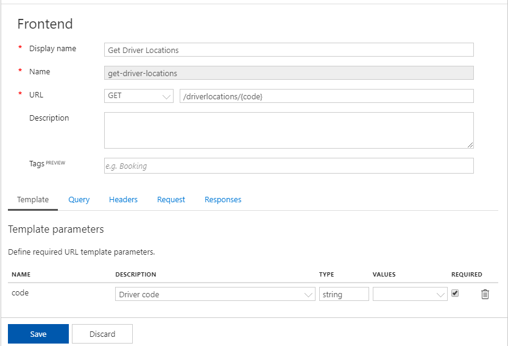
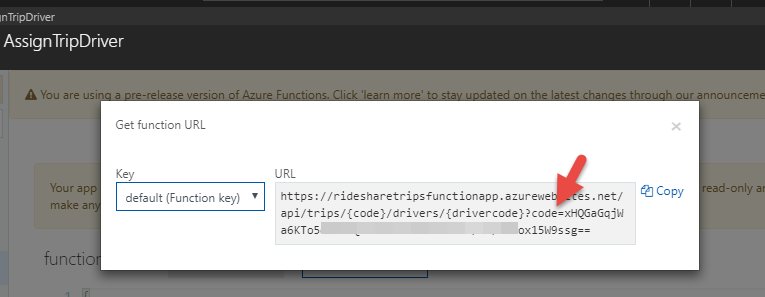

# Serverless Microservices reference architecture

In this document:

- [Resources](#resources)
- [Provision](#provision)
    - [Manual via the Portal](#manual-via-the-portal)
        - [Create the Azure function apps](#create-the-azure-apps)
        - [Create the Resource Group](#create-the-resource-group)
        - [Create the Cosmos Assets](#create-the-cosmos-assets)
        - [Create the Storage Account](#create-the-storage-account)
        - [Create the Storage Account](#create-the-storage-account)
        - [Create the Azure function apps](#create-the-azure-apps)
        - [Create the Web App Service Plan](#create-the-web-app-service-plan)
        - [Create the Azure SQL Database Assets](#create-the-azure-sql-database-assets)
        - [Create the Event Grid Topic](#create-the-event-grid-topic)
        - [Create the Application Insights Resource](#create-the-application-insights-resource)
        - [Create the API Management Service](#create-the-api-management-service)
        - [Create the SignalR Service](#create-the-signalr-service)
        - [Create the B2C Tenant](#create-the-b2c-tenant)
    - [ARM Template](#arm-template)
    - [Cake Provision](#cake-provision)
- [Setup](#setup)
    - [Add APIM Products and APIs](#add-apim-products-and-apis)
        - [Drivers API](#drivers-api)
        - [Trips API](#trips-api)
        - [Passengers API](#passengers-api)
    - [Connect Event Grid to Function Apps](#connect-event-grid-to-function-apps)
    - [Connect Event Grid to Logic App](#connect-event-grid-to-logic-app)
    - [Create TripFact Table](#create-tripfact-table)
- [Setting Files](#setting-files)
    - [Drivers Function App](#drivers-function-app)
    - [Passengers Function App](#passengers-function-app)
    - [Orchestrators Function App](#orchestrators-function-app)
    - [Trips Function App](#trips-function-app)
    - [Trip Archiver Function App](#trip-archiver-function-app)
- [Build the solution](#build-the-solution)
    - [.NET](#.net)
    - [Node](#node)
    - [Web](#web)
- [Deployment](#deployment)
    - [VSTS](#vsts)
    - [Cake Deployment](#cake-deployment)

## Resources

The following is a summary of all Azure resources required to deploy the solution:

| Prod Resource Name | Dev Resource Name | Type | Provision Mode |
|---|---|---|:---:|
| serverless-microservices | serverless-microservices-dev | Resource Group | Auto | 
| rideshare | rideshare | Cosmos DB Account | Auto |
| Main | Main | Cosmos DB Collection | Auto |
| Archive | Archive | Cosmos DB Collection | Auto |
| ridesharefunctionstore | ridesharefunctiondev | Storage Account | Auto |
| RideShareFunctionAppPlan | RideShareFunctionAppPlan | Consumtpion Plan | Auto |
| RideShareDriversFunctionApp | RideShareDriversFunctionAppDev | Function App | Auto |
| RideShareTripsFunctionApp | RideShareTripsFunctionAppDev | Function App | Auto |
| RideSharePassengersFunctionApp | RideSharePassengersFunctionAppDev | Function App | Auto |
| RideShareOrchestratorsFunctionApp | RideShareOrchestratorsFunctionAppDev | Function App | Auto |
| RideShareTripArchiverFunctionApp | RideShareTripArchiverFunctionAppDev | Function App | Auto |
| RideShareAppServicePlan | RideShareAppServicePlanDev | Web App Service Plan | Auto |
| RelecloudRideshare | RelecloudRideshareDev | Web App Service | Auto |
| rideshare-db | rideshare-db-dev | SQL Database Server | Auto |
| RideShare | RideShare | SQL Database | Auto |
| TripFact | TripFact | SQL Database Table | Manual |
| RideShareTripExternalizations | RideShareTripExternalizationsDev | Event Grid Topic | Manual |
| rideshare | rideshare-dev | Application Insights | Manual |
| ProcessTripExternalization | ProcessTripExternalizationDev | Logic App | Manual |
| rideshare | N/A | API Management Service | Manual |
| rideshare | rideshare-dev | SignalR Service | Manual |
| relecloudrideshare.onmicrosoft.com | N/A | B2C Tenant | Manual |

:eight_spoked_asterisk: **Please note** that, in some cases, the resource names must be unique globally. We suggest you append an identifier to the above reosurce names so they become unique i.e. `ridesharefunctionstore-xyzw`, `rideshare-xyzw`, etc.   

:eight_spoked_asterisk: **Please note** that, if you are planning to use `Cake` to [provision](#cake-provision) or [deploy](#cake-deployment), you must adjust the `cake/paths.cake` file to match your resource names. The `public static class Resources` class defines the resource names. 

## Provision

There are 3 ways to provision the required resources:

- [Manual via the Portal](#manual-via-the-portal)
- [ARM Template](#arm-template)
- [Cake](#cake-provision)

### Manual via the Portal

Log in to the [Azure portal](https://portal.azure.com).

#### Create the Resource Group

1.  Type **Resource** into the Search box at the top of the `All Services` page, then select **Resource Groups**  section.

2.  Click the **Add** button to create a new resource group.

3.  Complete the resource group creation form with the following:

    1. **Name**: Enter a unique value for the **reource group** i.e. `serverless-microservices`.
    2. **Subscription**: Select your Azure subscription.
    3. **Location**: Select a region closest to you. Make sure you select the same region for the rest of your resources.

    

#### Create the Cosmos Assets

1.  Type **Cosmos** into the Search box at the top of the `All Services` page, then select **Azure Cosmos DB**  section.

2.  Click the **Add** button to create a new Cosmos DB Account.

3.  Complete the resource group creation form with the following:

    1. **ID**: Enter a unique ID for the **Cosmos DB Account** i.e. `rideshare`.
    2. **API**: Select `SQL`.
    3. **Subscription**: Select your Azure subscription.
    4. **Resource Group**: Either select an existing Resource Group or create a new one such as `serverless-microservices`.
    5. **Location**: Select a region closest to you. Make sure you select the same region for the rest of your resources.
    6. Un-check the `geo-redundancy`

    

    **Please note** that this process of creating a Cosmos DB Account might take about 5 minutes. 

4.  Once the DB is online, select it and click `Data Explorer` and `Add Collection`:

    1. **Database ID**: Use existing and select the **Cosmos DB Account** you created i.e. `rideshare`.
    2. **Collection Id**: Type `Main`.
    3. **Storage capacity**: Select `Fixed`.
    4. **Throughput**: Select 400.

    

5.  Repeat step 4 for a new collection called `Archiver`

6.  Take note of the DB Account keys:

    

#### Create the Storage Account

1.  Type **Storage** into the Search box at the top of the `All Services` page, then select **Storage accounts**  section.

2.  Click the **Add** button to create a new Storage Account.

3.  Complete the storage creation form with the following:

    1. **Name**: Enter a unique name for the **Storage Account** i.e. `ridesharefuncstore`.
    2. **Deployment Model**: Select `Reosurce Manager`.
    3. **Account Kind**: Select ``Storage V2``.
    4. **Location**: Select a region closest to you. Make sure you select the same region for the rest of your resources.
    5. **Subscription**: Select your Azure subscription.
    6. **Resource Group**: Either select an existing Resource Group or create a new one such as `serverless-microservices`.

    

4.  Take note of the DB Account keys:

    

#### Create the Azure function apps

In this step, you will be creating six new function apps in the Azure portal. There are many ways this can be accomplished, such as [publishing from Visual Studio](), [Visual Studio Code](), the [Azure CLI](), Azure [Cloud Shell](), an [Azure Resource Manager (ARM) template](), and through the Azure portal.

Each of these function apps act as a hosting platform for one or more functions. In our solution, they double as microservices with each function serving as an endpoint or method. Having functions distributed amongst multiple function apps enables isolation, providing physical boundaries between the microservices, as well as independent release schedules, administration, and scaling.

1.  Log in to the [Azure portal](https://portal.azure.com).

2.  Type **Function App** into the Search box at the top of the page, then select **Function App** within the Marketplace section.

    

3.  Complete the function app creation form with the following:

    1. **App name**: Enter a unique value for the **Drivers** function app.
    2. **Subscription**: Select your Azure subscription.
    3. **Resource Group**: Either select an existing Resource Group or create a new one such as `serverless-microservices`.
    4. **OS**: Select Windows.
    5. **Hosting Plan**: Select Consumption Plan.
    6. **Location**: Select a region closest to you. Make sure you select the same region for the rest of your resources.
    7. **Storage**: Select Create new and supply a unique name. You will use this storage account for the remaining function apps.
    8. **Application Insights**: Set to Off. We will create an Application Insights instance later that will be associated with all of the Function Apps and other services.

    

4.  Repeat the steps above to create the **Trips** function app.

    1. Enter a unique value for the App name, ensuring it has the word **Trips** within the name so you can easily identify it.
    2. Make sure you enter the same remaining settings and select the storage account you created in the previous step.

5.  Repeat the steps above to create the **Orchestrators** function app.

6.  Repeat the steps above to create the **Passengers** function app.

7.  Repeat the steps above to create the **TripArchiver** function app.

#### Create the Web App Service Plan

1.  Type **App Service** into the Search box at the top of the `All Services` page, then select **App Service Plans**  section.

2.  Click the **Add** button to create a new app service plan.

3.  Complete the app service plan creation form with the following:

    1. **App Service Plan**: Enter a unique value for the **App Service Plan** i.e. `RideShareAppServicePlan`.
    2. **Subscription**: Select your Azure subscription.
    3. **Resource Group**: Either select an existing Resource Group or create a new one such as `serverless-microservices`.
    3. **Operating system**: Select `Windows`
    4. **Location**: Select a region closest to you. Make sure you select the same region for the rest of your resources.
    5. **Pricing Tier**: Select `Free`.

    

#### Create the Web App

1.  Type **App Service** into the Search box at the top of the `All Services` page, then select **App Services**  section.

2.  Click the **Add** button to create a new app service and select `Web App` from the marketplace. Click `Create`.

3.  Complete the app service creation form with the following:

    1. **App Name**: Enter a unique value for the **App Name** i.e. `RelecloudRideShare`.
    2. **Subscription**: Select your Azure subscription.
    3. **Resource Group**: Either select an existing Resource Group or create a new one such as `serverless-microservices`.
    3. **Operating system**: Select `Windows`
    4. **App Service PLan**: Select the pan you created in the previous step.
    5. **Application Insights**: Select `Off`.

    

#### Create the Azure SQL Database Assets

1.  Type **SQL** into the Search box at the top of the `All Services` page, then select **SQL Database**  section.

2.  Click the **Add** button to create a new SQL Database.

3.  Complete the SQL Database creation form with the following:

    1. **Name**: Enter a unique value for the **Database** i.e. `RideShare`.
    2. **Subscription**: Select your Azure subscription.
    3. **Resource Group**: Either select an existing Resource Group or create a new one such as `serverless-microservices`.
    4. **Source**: Select `Blank Database`.
    5. **Server**: Select and Create a new server.
    6. **Elatic Pool**: Select `Not Now`.
    7. **Pricing Tier**: Will be filled in automaticlaly once you complete the server creation i.e `10 DTUs, 250 GB` 
    8. **Coallation**: Select `SQL_Latin_1_General_CP1_CI_AS`.

    

4. Complete the SQL Database Server creation form with the following:

    1. **Name**: Enter a unique value for the SQL Database **Server** i.e. `rideshare-db`.
    2. **Server admin login**: Select your login.
    3. **Password**: select your password.
    4. **Confirm password**: Re-type your password.
    5. **Location**: Select a region closest to you. Make sure you select the same region for the rest of your resources.
    6. **Allow Azure services to access server**: Select `Checked`.

    

5. Take note of the newly-created database connection string:

    

#### Create the Event Grid Topic

1.  Type **Event Grid** into the Search box at the top of the `All Services` page, then select **Event Grid Topic**  section.

2.  Click the **Add** button to create a new Event Grid Topic.

3.  Complete the event grid topic creation form with the following:

    1. **Name**: Enter a unique value for the Event Grid **Topic** i.e. `RideShareExternalizations`.
    2. **Subscription**: Select your Azure subscription.
    3. **Resource Group**: Either select an existing Resource Group or create a new one such as `serverless-microservices`.
    4. **Location**: Select a region closest to you. Make sure you select the same region for the rest of your resources.

    

4. Take note of the newly-created topic key:

    

5. Take note of the newly-created topic endpoint URL:

    

#### Create the Application Insights Resource

1.  Type **Application Insights** into the Search box at the top of the `All Services` page, then select **Application Insights**  section.

2.  Click the **Add** button to create a new Application Insights resource.

3.  Complete the application insights creation form with the following:

    1. **Name**: Enter a unique value for the application Insights i.e. `rideshare`.
    2. **Application Type**: Select `General`. This is required by Function Apps.
    3. **Subscription**: Select your Azure subscription.
    4. **Resource Group**: Either select an existing Resource Group or create a new one such as `serverless-microservices`.
    5. **Location**: Select a region closest to you. Make sure you select the same region for the rest of your resources.

    

4. Take note of the newly-created resource instrumentation key:

    

#### Create the API Management Service 

1.  Type **API Management** into the Search box at the top of the `All Services` page, then select **API Management**  section.

2.  Click the **Add** button to create a new API Management service.

3.  Complete the API Management service creation form with the following:

    1. **Name**: Enter a unique value for the APIM Service i.e. `rideshare`.
    2. **Subscription**: Select your Azure subscription.
    3. **Resource Group**: Either select an existing Resource Group or create a new one such as `serverless-microservices`.
    3. **Location**: Select a region closest to you. Make sure you select the same region for the rest of your resources.
    5. **Organization name**: Type in your organization name.
    6. **Administrator email**: Type in an admin email.
    7. **Pricing tier**: Select `Developer (No SLA)`.

    

#### Create the SignalR Service 

1.  Click **Ctreate a resource** and type **SignalR** into the Search box, then select **SignalR Service**  section.

2.  Click the **Create** button to create a new SignalR service.

3.  Complete the SignalR service creation form with the following:

    1. **Resource Name**: Enter a unique value for the SignalR Service i.e. `rideshare`.
    2. **Subscription**: Select your Azure subscription.
    3. **Resource Group**: Either select an existing Resource Group or create a new one such as `serverless-microservices`.
    3. **Location**: Select a region closest to you. Make sure you select the same region for the rest of your resources.
    7. **Pricing tier**: Select `Free`.

    

4. Take note of the newly-created resource connection string:

    

#### Create the B2C Tenant 

//TBA

Once completed, please jump to the [setup](#setup) section to continue. 

### ARM Template

//TBA

Once completed, please jump to the [setup](#setup) section to continue. 

### Cake Provision

The `Cake` script reponsible to `deploy` and `provision` is included in the `dotnet` source directory. In order to run the Cake Script locally and deploy to your Azure Subscription, there are some pre-requisites:

1. Create a service principal that can be used to authenticate the script to use your Azure subscription. This can be easily accomplished using the following PowerShell script:

```powershell
# Login
Login-AzureRmAccount

# Set the Subscriptions
Get-AzureRmSubscription  

# Set the Subscription to your preferred subscription
Select-AzureRmSubscription -SubscriptionId "<your_subs_id>"

# Create an application in Azure AD
$pwd = convertto-securestring "<your_pwd>" -asplaintext -force
$app = New-AzureRmADApplication  -DisplayName "RideSharePublisher"  -HomePage "http://rideshare" -IdentifierUris "http://rideshare" -Password $pwd

# Create a service principal
New-AzureRmADServicePrincipal -ApplicationId $app.ApplicationId

# Assign role
New-AzureRmRoleAssignment -RoleDefinitionName Contributor -ServicePrincipalName $app.ApplicationId.Guid
```
2. Place two text files in the `dotnet` directory that can tell the Cake script about the service principal that you just created. The two text files are: `dev_authfile.txt` and `prod_authfile.txt`. They contain the following:

```
subscription=<your_subs_id>  
client=<your_client_id_produced_by_ps_above>  
key=<your_pwd_you_set_up_in_ps_above>  
tenant=<your_azure_tenant_id>
managementURI=https\://management.core.windows.net/  
baseURL=https\://management.azure.com/  
authURL=https\://login.windows.net/  
graphURL=https\://graph.windows.net/ 
```

If your `dev` and `prod` environments are hosted on the same Azure subscription, then the two auth files will be identical.

:eight_spoked_asterisk: **Please note** that you must adjust the `cake/paths.cake` file to match your resource names. The `public static class Resources` class defines the resource names. 

Once the above is completed, from a PowerShell command, use the following commands to provision the `Dev` and `Prod` environments:

- `./build.ps1 -Target Provision -ScriptArgs '--Env=Dev'`
- `./build.ps1 -Target Provision -ScriptArgs '--Env=Prod'`

**Please note** that provisiong a Cosmos DB Account takes a long time to be online. If you proceed with creating a database and the colections while the DB account status is `Creating`, you will get an error that says something like `bad request` without much of an explanation. Once the DB Account becomes `Online`, you can continue to provision the rest (by re-invoking the `provision` command). The exact error is: One or more errors occurred. Long running operation failed with status `BadRequest`.

Unfortunately, the Cake script cannot provision the following resources because they are currently not supported in the [Azure Management Libraries for .NET](https://github.com/Azure/azure-libraries-for-net). So please complete the following provisions manually as described in the manual steps above:

- [Event Grid](#create-the-event-grid-topic)
- [Application Insights](#create-the-application-insights-resource)
- [Logic App](#create-the-logic-app)
- [API Management Service](#create-the-api-management-service)
- [SignalR Service](#create-the-signalr-service)
- [B2C Tenant](#create-the-b2c-tenant)

Once completed, please jump to the [setup](#setup) section to continue. 

## Setup

After you have provisioned all your resources, there are some manual steps that you need to do to complete the setup:

- [Add APIM Products and APIs](#Add-APIM-Products-and-APIs)
- [Connect Event Grid to Function Apps](#connect-event-grid-to-functions-apps)
- [Connect Event Grid to Logic App](#connect-event-grid-to-logic-app) 
- [Run a script to create the TripFact table](#create-tripfact-table)

### Add APIM Products and APIs

**Please note** that you should have created the [Create the API Management Service ](#create-the-api-management-service) before you can proceed with this step. In addition, you should have already [deployed](#deployment) the Function Apps to Azure before you can make them available in the API Management Service.

APIM defines two top-pevel entities: `Product` and `Api`. They are related this way:


Therefore we want to create a new product and add to it several APIs.

1.  Type **API Management** into the Search box at the top of the `All Services` page, then select **API Managememt Service**  section.

2.  Select the **resource** you created earlier i.e. `rideshare`.

3.  Select it to go to detail and click on `products`. Click the **Add** button to create a new API Management product.

4.  Complete the API Management product creation form with the following:

    1. **Display Name**: Enter a name i.e. `RideShare`.
    2. **Id**: Enter a unique identifier `rideshare-product`.
    3. **Description**: Enter an optional description.
    3. **State**: Select `Not Published`.
    5. **Requires subscription**: Checked.

    

3.  Re-select the API Management Service to go to detail and click on `APIs`. Click the **Add a new API** and select the `Blank API`. 

**Please note** that, normally the Function App can produce a Swagger file that can be imported directly. But unfortunately for V2 Beta (at the time of this writing), the `API Definitions` feature is not available. 

4.  Complete the API Management API creation form for `Drivers` with the following:

    1. **Display Name**: Enter a name i.e. `RideShare Drivers API`.
    2. **Name**: Enter an identifier `rideshare-drivers`.
    3. **Description**: Enter an optional description.
    4. **Web Service URL**: Enter the Drivers Function App base url `https://ridesharedriversfunctionapp.azurewebsites.net/api/`.
    5. **URL Scheme**: HTTPS.
    6. **API URL Suffix**: d (or any character...just to make it unique)
    7. **Product**: Select `RideShare` product you created earlier. This is how the API is linked to the product.

    

5.  Repeat step 4 for the `Trips` and `Passengers` Function Apps. The `Orchestrators` are not exposed to the outside world and hence they should not be added to APIM.

6. For each API we created, we need to design its operations. As noted above, this step will have to be done manually for V2 Beta. Select `Design` and click on **Add operation** for each operation (**please note** that the API operations are listed below so they can be added manually). Complete the operation form as shown here for a sample operation:

    1. **Display Name**: Enter a name i.e. `Get Driver Locations`.
    2. **Name**: Enter an identifier `get-driver-locations`.
    3. **URL**: `GET`/driverlocations/{code}
    4. **Description**: Enter optional description
    5. **Template**: The URL slug may contain replaceable parameters such as `/driverlocations/{code}`. The `{code}` needs to be defined in the template:
        - *Name*: code
        - *Description*: Driver Code
        - *Type*: string
        - *Required*: yes 
    6. **Inbound Policy**: Add an inbound policy to automatically inject the `Function Auth Code` as a query parameter (if it does not exist) so it can be passed to the actual Function API. The inbound policy may look something like this:

    ```xml
    <policies>
        <inbound>
            <base />
            <set-query-parameter name="code" exists-action="skip">
                <value>--function code--</value>
            </set-query-parameter>
        </inbound>
        <backend>
            <base />
        </backend>
        <outbound>
            <base />
        </outbound>
        <on-error>
            <base />
        </on-error>
    </policies>
    ```

    

    7. **Function URL and the Auth Code**: Select the Function App and select the function you are interested in. The portal shows the `function.json` and a button to `Get function URL`. If you click it, it will expose the function URL with the code:

    

For each API, please add a new operation as defined below. Once completed, please `publish` the `RideShare` product.

#### Drivers API

| Display Name | Name | URL | Template | Query |
|---|---|---|---|---|
| Get Drivers | get-drivers | `GET`/drivers | None | `GetDrivers` Auth Code | 
| Get Drivers Within Location| get-drivers-within-location | `GET`/drivers/{latitude}/{longitude}/{miles} | latitude = double, longitude = double, miles = double | `GetDriversWithinLocation` Auth Code | 
| Get Active Drivers | get-active-drivers | `GET`/activedrivers | None | `GetActiveDrivers` Auth Code | 
| Get Driver | get-driver | `GET`/drivers/{code} | code = driver code = string | `GetDriver` Auth Code | 
| Create Driver | create-driver | `POST`/drivers | None | `CreateDriver` Auth Code | 
| Update Driver | update-driver | `PUT`/drivers | None | `UpdateDriver` Auth Code | 
| Update Driver Location | update-driver-location | `PUT`/driverlocations | None | `UpdateDriverLocation` Auth Code | 
| Get Driver Locations | get-driver-locations | `GET`/driverlocations/{code} | code = driver code = string | `GetDriverLocations` Auth Code | 
| Delete Driver | delete-driver | `DELETE`/drivers/{code} | code = driver code = string | `DeleteDriver` Auth Code | 

#### Trips API

| Display Name | Name | URL | Template | Query |
|---|---|---|---|---|
| Get Trips | get-trips | `GET`/trips | None | `GetTrips` Auth Code | 
| Get Active Trips | get-active-trips | `GET`/activetrips | None | `GetActiveTrips` Auth Code | 
| Get Trip | get-trip | `GET`/trips/{code} | code = trip code = string | `GetTrip` Auth Code | 
| Create Trip | create-trip | `POST`/trips | None | `CreateTrip` Auth Code | 
| Assign Trip Driver | assign-trip-driver | `POST`/trips/{code}/drivers/{drivercode} | code = trip code = string, drivercode = driver code = string | `AssignTripDriver` Auth Code | 

#### Passengers API

| Display Name | Name | URL | Template | Query |
|---|---|---|---|---|
| Get Passengers | get-passengers | `GET`/passengers | None | `GetPassengers` Auth Code | 
| Get Passenger | get-passenger | `GET`/passengers/{code} | code = passenger code = string | `GetPassenger` Auth Code | 

### Connect Event Grid to Function Apps

**Please note** that you should have created the [Event Grid Topic](#create-the-event-grid-topic) and the [Function Apps](#create-the-azure-function-apps) before you can proceed with this step. In addition, you should have already [deployed](#deployment) the Function Apps to Azure before you can make them listen to an Event Grid Topic. 

1.  Type **Function Apps** into the Search box at the top of the `All Services` page, then select **Function Apps**  section.

2.  Select the **RideShareTripsFunctionApp** app.

3. Expand the Functions (Read Only) tree leaf:


4. Select the `EVGH_TripExternalizations2PowerBI` Function and click on **Add Event Grid Subscription**. This will show a dialog to allow you to make this function a listener for the Event Grid Topic: 

    1. **Name**: Select a name i.e. `RideShareTripExternalizations2PpowerBI`.
    2. **Topic Type**: Select `Event Grid Topic`.
    3. **Subscription**: Select your Azure subscription.
    4. **Resource Group**: Either select an existing Resource Group or create a new one such as `serverless-microservices`.
    5. **Instance**: Select the Event Grid Topic you are subscribing to i.e. `RideShareTripExternalizations`
    6. Check the **Subscribe to all event types**

    

5. Repeat step 4 for the `EVGH_TripExternalizations2SignalR` Function.

6. Repeat step 5 for the `EVGH_TripExternalizations2CosmosDB` Function.

### Connect Event Grid to Logic App

**Please note** that you should have created the [Event Grid Topic](#create-the-event-grid-topic) before you can proceed with this step.

1.  Type **Logic Apps** into the Search box at the top of the `All Services` page, then select **Logic Apps**  section.

2.  Click the **Add** button to create a new Logic App.

3.  Complete the logic app creation form with the following:

    1. **Name**: Enter a unique value for the logic app i.e. `ProcessTripExternalization`.
    2. **Subscription**: Select your Azure subscription.
    3. **Resource Group**: Either select an existing Resource Group or create a new one such as `serverless-microservices`.
    4. **Location**: Select a region closest to you. Make sure you select the same region for the rest of your resources.

    

4. Once the resource is created, navigate to it and select `Blank Logic App`. In the `Search connectors and triggers`, type `Event Grid` and select the `Azure Event Grid` trigger:

    

5. Then select the `When Event source occurs`:

    

6. Finally select the `When Event source occurs`:

    1. **Subscription**: Select your Azure subscription.
    2. **Resource Type**: Select `Microsoft.EventGrid.Topic`.
    3. **Resource Name**: Select the Event Grid Topic you provisioned.

    

7. Then click on the `New Step` and type in the `Choose an action` search box `SendGrid`:

    1. Select `Send Email (v2) (preview).
    2. You may need to setup a [SendGrid account](https://sendgrid.com/) if you have not done so already. Alternatively you can choose Office 365 Email email sender or Gmail sender or whatever Logic App supports.

    

8. Fill out the Email Sender form:
    1. **From**: The email address you wish this notification be sent from
    2. **To**: The email address you wish this notification be sent to
    3. **Subject**: If you select this field, you can either type whatever you want the subject or pick from one the dynamic fields shown. The Event Grid `Subject` is what makes sense. 

    

    4. **Body**: If you select this field, you can either type whatever you want the body or pick from one the dynamic fields shown.

**As noted before**, the Logic App Event Grid Connector does not make the event body (or data) readily available.

### Create TripFact Table 

Connect to the SQL database and run the following script to create the `TripFact` table and its indices:  

```sql
    USE [RideShare]
    GO

    SET ANSI_NULLS ON
    GO

    SET QUOTED_IDENTIFIER ON
    GO

    CREATE TABLE[dbo].TripFact (
        [Id][int] IDENTITY(1, 1) NOT NULL,
        [StartDate][datetime] NOT NULL,
        [EndDate][datetime] NULL,
        [AcceptDate][datetime] NULL,
        [TripCode] [nvarchar] (20) NOT NULL,
        [PassengerCode] [nvarchar] (20) NULL,
        [PassengerName] [nvarchar] (100) NULL,
        [PassengerEmail] [nvarchar] (100) NULL,
        [AvailableDrivers] [int] NULL,
        [DriverCode] [nvarchar] (20) NULL,
        [DriverName] [nvarchar] (100) NULL,
        [DriverLatitude] [float] NULL,
        [DriverLongitude] [float] NULL,
        [DriverCarMake] [nvarchar] (100) NULL,
        [DriverCarModel] [nvarchar] (100) NULL,
        [DriverCarYear] [nvarchar] (4) NULL,
        [DriverCarColor] [nvarchar] (20) NULL,
        [DriverCarLicensePlate] [nvarchar] (20) NULL,
        [SourceLatitude] [float] NULL,
        [SourceLongitude] [float] NULL,
        [DestinationLatitude] [float] NULL,
        [DestinationLongitude] [float] NULL,
        [Duration] [float] NULL,
        [MonitorIterations] [int] NULL,
        [Status] [nvarchar] (20) NULL,
        [Error] [nvarchar] (200) NULL,
        [Mode] [nvarchar] (20) NULL
        CONSTRAINT[PK_dbo.TripFact] PRIMARY KEY CLUSTERED
    (
        [Id] ASC
    )WITH(PAD_INDEX = OFF, STATISTICS_NORECOMPUTE = OFF, IGNORE_DUP_KEY = OFF, ALLOW_ROW_LOCKS = ON, ALLOW_PAGE_LOCKS = ON)
    )

    GO

    CREATE INDEX IX_TRIP_START_DATE ON dbo.TripFact(StartDate);
    CREATE INDEX IX_TRIP_CODE ON dbo.TripFact(TripCode);
    CREATE INDEX IX_TRIP_PASSENGER_CODE ON dbo.TripFact(PassengerCode);
    CREATE INDEX IX_TRIP_DRIVER_CODE ON dbo.TripFact(DriverCode);
```

## Setting Files

The reference implementation solution requires several settings for each function app. The `settings` directory contains the setting file for each function app. The files are a collection of `KEY` and `VALUE` delimited by a `|`. They need to be imported as `Application Settings` for each function app. The Cake deployment script can auto-import these files into the `Application Settings`.

### Drivers Function App

| KEY | DESCRIPTION |
|---|---|
| APPINSIGHTS_INSTRUMENTATIONKEY | The Application Insights Resource Instrumentation Key. This key is required by the Function App so it knows there is an application insights resource associated with it | 
| FUNCTIONS_EXTENSION_VERSION | Must be set to `beta` since the solution uses V2 beta | 
| DocDbApiKey | The Cosmos DB API Key | 
| DocDbEndpointUri | The Cosmos DB Endpoint URI | 
| DocDbRideShareDatabaseName | The Cosmos Database i.e. `RideShare` | 
| DocDbRideShareMainCollectionName | The Cosmos Main Collection i.e. `Main` | 
| DocDbThroughput | The provisioned collection RUs i.e. 400  | 
| InsightsInstrumentationKey | Same value as APPINSIGHTS_INSTRUMENTATIONKEY. This value is used by the Function App while the other is used by the Function framework  | 
| AuthorityUrl | The B2C Authority URL i.e. https://login.microsoftonline.com/tfp/relecloudrideshare.onmicrosoft.com/b2c_1_default-signin/v2.0| 
| ApiApplicationId | The B2C Client ID | 
| ApiScopeName | The Scope Name i.e. rideshare | 
| EnableAuth | if set to true, the JWT token validatidaion will be enforced | 

### Passengers Function App

| KEY | DESCRIPTION |
|---|---|
| APPINSIGHTS_INSTRUMENTATIONKEY | The Application Insights Resource Instrumentation Key. This key is required by the Function App so it knows there is an application insights resource associated with it | 
| FUNCTIONS_EXTENSION_VERSION | Must be set to `beta` since the solution uses V2 beta | 
| DocDbApiKey | The Cosmos DB API Key | 
| DocDbEndpointUri | The Cosmos DB Endpoint URI | 
| DocDbRideShareDatabaseName | The Cosmos Database i.e. `RideShare` | 
| DocDbRideShareMainCollectionName | The Cosmos Main Collection i.e. `Main` | 
| DocDbThroughput | The provisioned collection RUs i.e. 400  | 
| InsightsInstrumentationKey | Same value as APPINSIGHTS_INSTRUMENTATIONKEY. This value is used by the Function App while the other is used by the Function framework  | 
| AuthorityUrl | The B2C Authority URL i.e. https://login.microsoftonline.com/tfp/relecloudrideshare.onmicrosoft.com/b2c_1_default-signin/v2.0| 
| ApiApplicationId | The B2C Client ID | 
| ApiScopeName | The Scope Name i.e. rideshare | 
| EnableAuth | if set to true, the JWT token validatidaion will be enforced | 
| GraphTenantId| Azure Tenant ID |
| GraphClientId| Azure Graph client ID |
| GraphClientSecret| Azure Graps secret |

### Orchestrators Function App

| KEY | DESCRIPTION |
|---|---|
| APPINSIGHTS_INSTRUMENTATIONKEY | The Application Insights Resource Instrumentation Key. This key is required by the Function App so it knows there is an application insights resource associated with it | 
| FUNCTIONS_EXTENSION_VERSION | Must be set to `beta` since the solution uses V2 beta | 
| DocDbApiKey | The Cosmos DB API Key | 
| DocDbEndpointUri | The Cosmos DB Endpoint URI | 
| DocDbRideShareDatabaseName | The Cosmos Database i.e. `RideShare` | 
| DocDbRideShareMainCollectionName | The Cosmos Main Collection i.e. `Main` | 
| DocDbThroughput | The provisioned collection RUs i.e. 400  | 
| InsightsInstrumentationKey | Same value as APPINSIGHTS_INSTRUMENTATIONKEY. This value is used by the Function App while the other is used by the Function framework  | 
| DriversAcknowledgeMaxWaitPeriodInSeconds |The number of seconds to wait before the solution times out waiting for drivers to accept a trip i.e. 120|
| DriversLocationRadiusInMiles |The miles radius that the solution locates available drivers within i.e. 15|
| TripMonitorIntervalInSeconds | The number of seconds the `TripMonitor` waits in its monitoring loop i.e. 10 |
| TripMonitorMaxIterations |The number of maximum iterations the `TripMonitor` loops before it aborts the trip i.e. 20|
| IsPersistDirectly| If true, the orechestrators access the data storage layer directly. Default to true |
| TripExternalizationsEventGridTopicUrl| The URL of the event grid topic i.e. https://ridesharetripexternalizations.eastus-1.eventgrid.azure.net/api/events|
| TripExternalizationsEventGridTopicApiKey|The API Key of the event grid topic |

### Trips Function App

| KEY | DESCRIPTION |
|---|---|
| APPINSIGHTS_INSTRUMENTATIONKEY | The Application Insights Resource Instrumentation Key. This key is required by the Function App so it knows there is an application insights resource associated with it | 
| FUNCTIONS_EXTENSION_VERSION | Must be set to `beta` since the solution uses V2 beta | 
| DocDbApiKey | The Cosmos DB API Key | 
| DocDbEndpointUri | The Cosmos DB Endpoint URI | 
| DocDbRideShareDatabaseName | The Cosmos Database i.e. `RideShare` | 
| DocDbRideShareMainCollectionName | The Cosmos Main Collection i.e. `Main` | 
| DocDbThroughput | The provisioned collection RUs i.e. 400  | 
| InsightsInstrumentationKey | Same value as APPINSIGHTS_INSTRUMENTATIONKEY. This value is used by the Function App while the other is used by the Function framework  | 
| AuthorityUrl | The B2C Authority URL i.e. https://login.microsoftonline.com/tfp/relecloudrideshare.onmicrosoft.com/b2c_1_default-signin/v2.0| 
| ApiApplicationId | The B2C Client ID | 
| ApiScopeName | The Scope Name i.e. rideshare | 
| EnableAuth | if set to true, the JWT token validatidaion will be enforced | 
| SqlConnectionString | The connection string to the Azure SQL Databse where `TripFact` is provisioned  | 
| AzureSignalRConnectionString  | The connection string to the SignalR Service  | 
| StartTripManagerOrchestratorApiKey|The Start Trip Manager Orchestrator trigger endpoint function code key |
| StartTripManagerOrchestratorBaseUrl|The Start Trip Manager Orchestrator trigger endpoint function base url |
| StartTripDemoOrchestratorApiKey|The Trip Start Demo Orchestrator trigger endpoint function code key |
| StartTripDemoOrchestratorBaseUrl|The Trip Start Demo Orchestrator trigger endpoint function base url |
| TerminateTripManagerOrchestratorApiKey|The Terminate Trip Manager Orchestrator trigger endpoint function code key |
| TerminateTripManagerOrchestratorBaseUrl|The Trip Manager Orchestrator trigger endpoint function base url |
| TerminateTripMonitorOrchestratorApiKey|The Terminate Trip Demo Orchestrator trigger endpoint function code key |
| TerminateTripMonitorOrchestratorBaseUrl|The Trip Terminate Demo Orchestrator trigger endpoint function base url |

### Trip Archiver Function App

//TBA

## Build the solution

### .NET

In order to build .NET solition form Visiual Studio, you need:

- VS 2017 15.7 or later
- .NET Core 2.1 SDK Installed

### Node

//TBA

### Web

//TBA

## Deployment

Function App deployments can happen from [Visual Studio]() IDE, [Visual Studio Team Services](https://visualstudio.microsoft.com/vso/) by defining a build pipeline that can be triggered upon push to the code repository, for example, or a build script such as [Cake](https://cakebuild.net/) or [Psake](https://github.com/psake/psake).

Relecloud decided to use [Visual Studio team Services](https://visualstudio.microsoft.com/vso/) for production build and deployment and [Cake](https://cakebuild.net/) for development build and deployment.

### VSTS 

//TBA

## Cake Deployment

The `Cake` script reponsible to `deploy` and `provision` is included in the `dotnet` source directory. In order to run the Cake Script locally and deploy to your Azure Subscription, there are some pre-requisites. Please refer to the [Cake](#cake-provision) provision section to know how to do this. 

**Make sure** the `settings` are updated as shown in [Setting Files](#setting-files) section to reflect your own resource app settings and connection strings.

Once all of the above is in place, Cake is now able to authenticate and deploy the C# function apps. 

:eight_spoked_asterisk: **Please note** that you must adjust the `cake/paths.cake` file to match your resource names. The `public static class Resources` class defines the resource names. 

From a PowerShell command, use the following commands for the `Dev` environment:

- `./build.ps1 -Target Deploy -Configuration Debug -ScriptArgs '--Site=Drivers','--App=ServerlessMicroservices.FunctionApp.Drivers','--Env=Dev'`
- `./build.ps1 -Target Deploy -Configuration Debug -ScriptArgs '--Site=Orchestrators','--App=ServerlessMicroservices.FunctionApp.Orchestrators','--Env=Dev'`
- `./build.ps1 -Target Deploy -Configuration Debug -ScriptArgs '--Site=Trips','--App=ServerlessMicroservices.FunctionApp.Trips','--Env=Dev'`
- `./build.ps1 -Target Deploy -Configuration Debug -ScriptArgs '--Site=Passengers','--App=ServerlessMicroservices.FunctionApp.Passengers','--Env=Dev'`

From a PowerShell command, use the following commands for the `Prod` environment:

- `./build.ps1 -Target Deploy -Configuration Release -ScriptArgs '--Site=Drivers','--App=ServerlessMicroservices.FunctionApp.Drivers','--Env=Prod'`
- `./build.ps1 -Target Deploy -Configuration Release -ScriptArgs '--Site=Orchestrators','--App=ServerlessMicroservices.FunctionApp.Orchestrators','--Env=Prod'`
- `./build.ps1 -Target Deploy -Configuration Release -ScriptArgs '--Site=Trips','--App=ServerlessMicroservices.FunctionApp.Trips','--Env=Prod'`
- `./build.ps1 -Target Deploy -Configuration Release -ScriptArgs '--Site=Passengers','--App=ServerlessMicroservices.FunctionApp.Passengers','--Env=Prod'`


