# Serverless Microservices reference architecture

In this document:

- [Serverless Microservices reference architecture](#serverless-microservices-reference-architecture)
  - [Getting Started](#getting-started)
  - [Resources](#resources)
  - [Provision](#provision)
    - [Manual via the Portal](#manual-via-the-portal)
      - [Create the Resource Group](#create-the-resource-group)
      - [Create the Azure Cosmos DB assets](#create-the-azure-cosmos-db-assets)
      - [Create the Storage account](#create-the-storage-account)
      - [Create the Azure Function Apps](#create-the-azure-function-apps)
      - [Create the Web App Service Plan](#create-the-web-app-service-plan)
      - [Create the Web App](#create-the-web-app)
      - [Create the Azure SQL Database assets](#create-the-azure-sql-database-assets)
      - [Create the Event Grid Topic](#create-the-event-grid-topic)
      - [Create the Application Insights resource](#create-the-application-insights-resource)
      - [Create the API Management Service](#create-the-api-management-service)
      - [Create the SignalR Service](#create-the-signalr-service)
      - [Create Azure Key Vault](#create-azure-key-vault)
      - [Create the Azure AD B2C tenant](#create-the-azure-ad-b2c-tenant)
      - [Add Azure AD Graph API](#add-azure-ad-graph-api)
      - [Configure Azure AD B2C tenant](#configure-azure-ad-b2c-tenant)
      - [Create a sign-up or sign-in policy](#create-a-sign-up-or-sign-in-policy)
    - [Cake Provision](#cake-provision)
    - [Deploy from Bicep](#deploy-from-bicep)
  - [Setup](#setup)
    - [Add APIM Products and APIs](#add-apim-products-and-apis)
      - [Drivers API](#drivers-api)
      - [Trips API](#trips-api)
      - [Passengers API](#passengers-api)
    - [Publish the RideShare APIM product](#publish-the-rideshare-apim-product)
    - [Retrieve the APIM API key](#retrieve-the-apim-api-key)
    - [Connect Event Grid to Function Apps](#connect-event-grid-to-function-apps)
    - [Connect Event Grid to Logic App](#connect-event-grid-to-logic-app)
    - [Create TripFact Table](#create-tripfact-table)
  - [Add secrets to Key Vault](#add-secrets-to-key-vault)
    - [Retrieving a secret's URI](#retrieving-a-secrets-uri)
  - [Function App Application Settings](#function-app-application-settings)
    - [Drivers Function App](#drivers-function-app)
    - [Passengers Function App](#passengers-function-app)
    - [Orchestrators Function App](#orchestrators-function-app)
    - [Trips Function App](#trips-function-app)
    - [Trip Archiver Function App](#trip-archiver-function-app)
  - [Configure your Function Apps to connect to Key Vault](#configure-your-function-apps-to-connect-to-key-vault)
    - [Create a system-assigned managed identity](#create-a-system-assigned-managed-identity)
    - [Add Function Apps to Key Vault access policy](#add-function-apps-to-key-vault-access-policy)
  - [Build the solution](#build-the-solution)
    - [.NET](#net)
    - [Node.js](#nodejs)
    - [Web](#web)
      - [Create and populate settings.js](#create-and-populate-settingsjs)
      - [Compile and minify for production](#compile-and-minify-for-production)
      - [Create settings.js in Azure](#create-settingsjs-in-azure)
  - [Deployment](#deployment)
    - [Azure DevOps](#azure-devops)
      - [Prerequisites](#prerequisites)
      - [Create build pipelines](#create-build-pipelines)
      - [Create release pipeline](#create-release-pipeline)
      - [Import remaining two release pipelines](#import-remaining-two-release-pipelines)
    - [Cake Deployment](#cake-deployment)
  - [Seeding](#seeding)
  - [Containers](#containers)
    - [Docker Files](#docker-files)
    - [Docker Images](#docker-images)
    - [Running Locally](#running-locally)
    - [Running in ACI](#running-in-aci)
    - [Running in AKS](#running-in-aks)

## Getting Started

In your local development environment you will need latest versions of:

* Visual Studio or VS Code
* git
* `func` CLI
* `az` CLI
* Powershell
* Nodejs & npm

Deploy Azure resources:

```powershell
copy bicep/parameters.json bicep/parameters.local.json

# Change params in @bicep/parameters.local.json to suit

az group create -n serverless-microservices-dev -l westus2
az deployment group create -g serverless-microservices-dev -f bicep/main.bicep -p @bicep/parameters.local.json
```

Create local settings:

``` powershell
cd dotnet

# create copies of the Functions settings example files
copy ServerlessMicroservices.FunctionApp.Drivers/local.settings.example.json ServerlessMicroservices.FunctionApp.Drivers/local.settings.json
copy ServerlessMicroservices.FunctionApp.Orchestrators/local.settings.example.json ServerlessMicroservices.FunctionApp.Orchestrators/local.settings.json
copy ServerlessMicroservices.FunctionApp.Passengers/local.settings.example.json ServerlessMicroservices.FunctionApp.Passengers/local.settings.json
copy ServerlessMicroservices.FunctionApp.Trips/local.settings.example.json ServerlessMicroservices.FunctionApp.Trips/local.settings.json

# Now update local settings with your environment's values

cd ../nodejs

# create a copy of the Nodejs settings example file
copy serverless-microservices-functionapp-triparchiver/local.settings.example.json serverless-microservices-functionapp-triparchiver/local.settings.json

# Now update local settings with your environment's values
```

Build and run local:

```powershell
cd scripts

./run-local.ps1
```

Run integration test:

```powershell
./test-local.ps1
```

## Resources

The following is a summary of all Azure resources required to deploy the solution:

| Prod Resource Name | Dev Resource Name | Type | Provision Mode |
|---|---|---|:---:|
| serverless-microservices | serverless-microservices-dev | Resource Group | Auto | 
| rideshare | rideshare | Cosmos DB Account | Auto |
| Main | Main | Cosmos DB Container | Auto |
| Archive | Archive | Cosmos DB Container | Auto |
| ridesharefunctionstore | ridesharefunctiondev | Storage Account | Auto |
| RideShareFunctionAppPlan | RideShareFunctionAppPlan | Consumption Plan | Auto |
| RideShareDriversFunctionApp | RideShareDriversFunctionAppDev | Function App | Auto |
| RideShareTripsFunctionApp | RideShareTripsFunctionAppDev | Function App | Auto |
| RideSharePassengersFunctionApp | RideSharePassengersFunctionAppDev | Function App | Auto |
| RideShareOrchestratorsFunctionApp | RideShareOrchestratorsFunctionAppDev | Function App | Auto |
| RideShareTripArchiverFunctionApp | RideShareTripArchiverFunctionAppDev | Function App | Auto |
| RideShareAppServicePlan | RideShareAppServicePlanDev | Web App Service Plan | Auto |
| RelecloudRideshare | RelecloudRideshareDev | Web App Service | Auto |
| rideshare-db | rideshare-db-dev | SQL Database Server | Auto |
| RideShare | RideShare | SQL Database | Auto |
| TripFact | TripFact | SQL Database Table | Manual |
| RideShareTripExternalizations | RideShareTripExternalizationsDev | Event Grid Topic | Manual |
| rideshare | rideshare-dev | Application Insights | Manual |
| ProcessTripExternalization | ProcessTripExternalizationDev | Logic App | Manual |
| rideshare | N/A | API Management Service | Manual |
| rideshare | rideshare-dev | SignalR Service | Manual |
| RideshareVault | RideshareVaultDev | Azure Key Vault | Manual |
| relecloudrideshare.onmicrosoft.com | N/A | B2C Tenant | Manual |

:eight_spoked_asterisk: **Please note** that, in some cases, the resource names must be unique globally. We suggest you append an identifier to the above resource names so they become unique i.e. `ridesharefunctionstore-xyzw`, `rideshare-xyzw`, etc.

:eight_spoked_asterisk: **Please note** that, if you are planning to use `Cake` to [provision](#cake-provision) or [deploy](#cake-deployment), you must adjust the `cake/paths.cake` file to match your resource names. The `public static class Resources` class defines the resource names.

## Provision

There are 4 ways to provision the required resources:

- [Manual via the Portal](#manual-via-the-portal)
- [ARM Template](#deploy-from-arm-template)
- [Cake](#cake-provision)
- [Bicep](#deploy-from-bicep) (recommended)

### Manual via the Portal

> ⚠️ Manual provisioning docs are obsolete will be deprecated soon. Please use [Bicep provisioning](#deploy-from-bicep) instead.

Log in to the [Azure portal](https://portal.azure.com).

#### Create the Resource Group

1.  Type **Resource** into the Search box at the top of the `All Services` page, then select **Resource Groups**  section.

2.  Click the **Add** button to create a new resource group.

3.  Complete the resource group creation form with the following:

    1. **Name**: Enter a unique value for the **resource group** i.e. `serverless-microservices`.
    2. **Subscription**: Select your Azure subscription.
    3. **Location**: Select a region closest to you. Make sure you select the same region for the rest of your resources.

    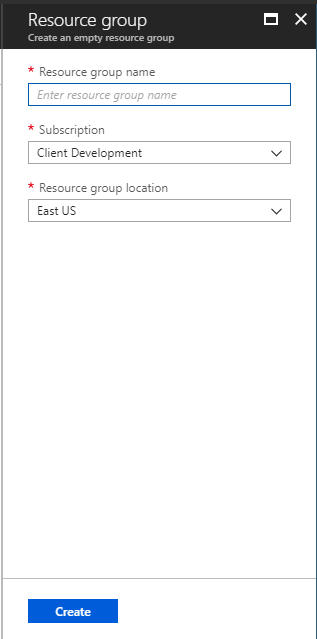

#### Create the Azure Cosmos DB assets

1.  Type **Cosmos** into the Search box at the top of the `All Services` page, then select **Azure Cosmos DB**  section.

2.  Click the **Add** button to create a new Cosmos DB Account.

3.  Complete the resource group creation form with the following:

    3. **Subscription**: Select your Azure subscription.
    4. **Resource Group**: Select the Resource Group you created above, such as `serverless-microservices`.
    5. **Account Name**: Enter a unique ID for the **Cosmos DB Account**, such as `ridesharedata`.
    6. **API**: Select `Core (SQL)`.
    7. **Location**: Select a region closest to you. Make sure you select the same region for the rest of your resources.
    8. **Geo-Redundancy**: Disable.
    9. **Multi-region Writes**: Disable.

    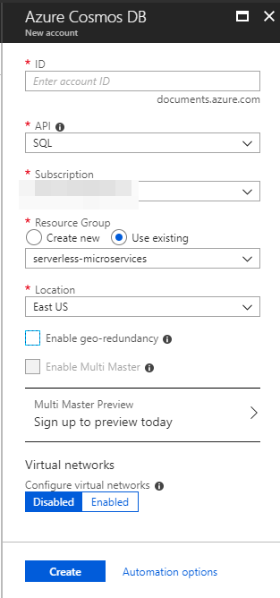

4.  Select **Review + Create**, then select **Create** on the review screen.

    **Please note** that this process of creating a Cosmos DB Account can take between 5-10 minutes.

5.  Once Cosmos Database is online, open it and select **Data Explorer** on the left-hand menu.

6.  Select **New Container** on the toolbar. In the Add Container form that appears, enter the following:

    1. **Database ID**: Select **Create new** and enter `RideShare`.
    2. **Container Id**: Enter `Main`.
    3. **Partition key**: Enter `/code`.
    4. **Throughput**: Select 400.

    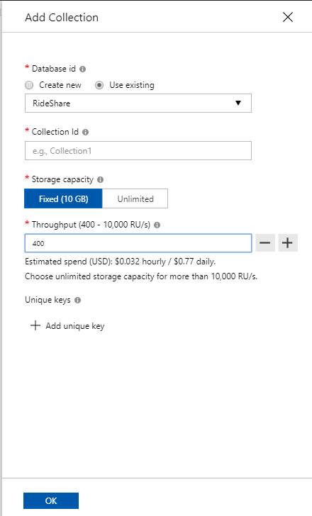

7.  Repeat step 4 -> 2 for a new container called `Archiver`

8.  Take note of the DB Account keys:

    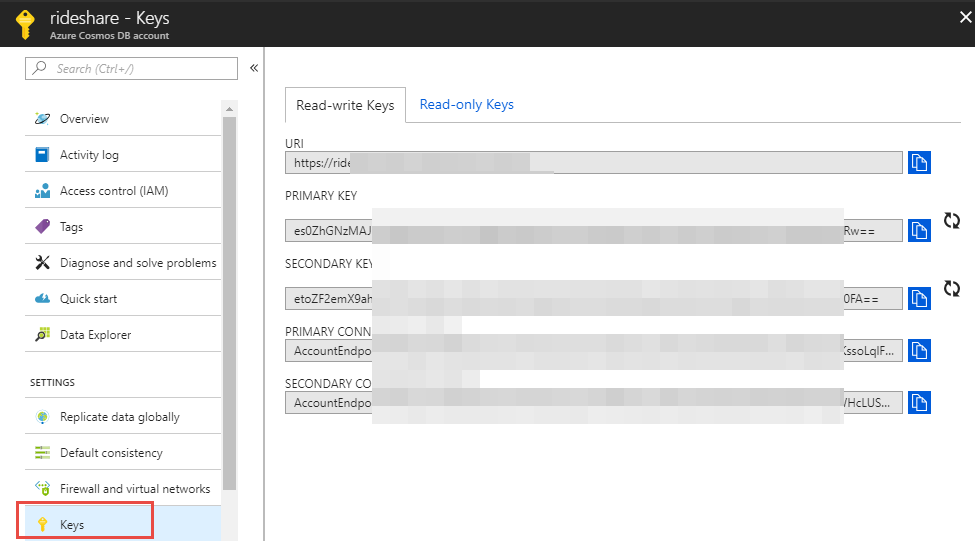

#### Create the Storage account

1.  Type **Storage** into the Search box at the top of the `All Services` page, then select **Storage accounts**  section.

2.  Click the **Add** button to create a new Storage Account.

3.  Complete the storage creation form with the following:

    1. **Name**: Enter a unique name for the **Storage Account** i.e. `ridesharefuncstore`.
    2. **Deployment Model**: Select `Resource Manager`.
    3. **Account Kind**: Select ``Storage V2``.
    4. **Location**: Select a region closest to you. Make sure you select the same region for the rest of your resources.
    5. **Subscription**: Select your Azure subscription.
    6. **Resource Group**: Select the resource group to which you have added your other services, such as `serverless-microservices`.

    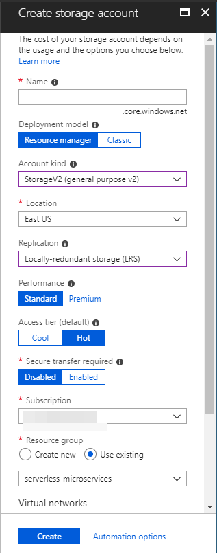

4.  Take note of the DB Account keys:

    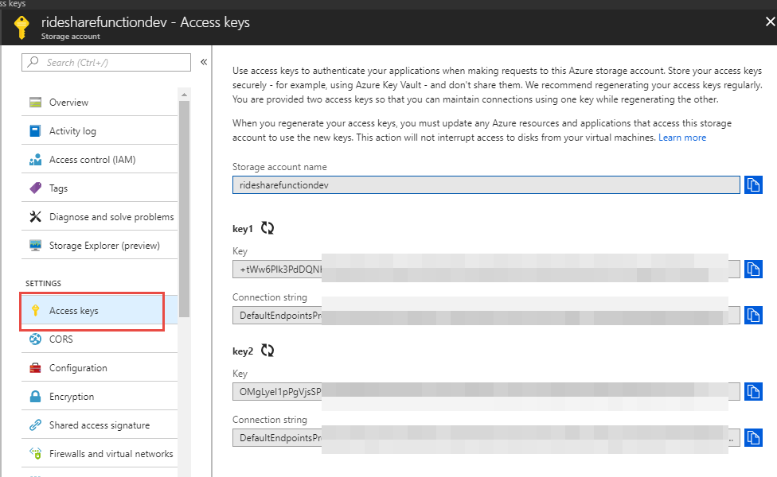

#### Create the Azure Function Apps

In this step, you will be creating six new Azure Function Apps in the Azure portal. There are many ways this can be accomplished, such as [publishing from Visual Studio](), [Visual Studio Code](), the [Azure CLI](), Azure [Cloud Shell](), an [Azure Resource Manager (ARM) template](), and through the Azure portal.

Each of these Function Apps act as a hosting platform for one or more functions. In our solution, they double as microservices with each function serving as an endpoint or method. Having functions distributed amongst multiple function apps enables isolation, providing physical boundaries between the microservices, as well as independent release schedules, administration, and scaling.

1.  Log in to the [Azure portal](https://portal.azure.com).

2.  Type **Function App** into the Search box at the top of the page, then select **Function App** within the Marketplace section.

    

3.  Complete the function app creation form with the following:

    1. **App name**: Enter a unique value for the **Drivers** function app.
    2. **Subscription**: Select your Azure subscription.
    3. **Resource Group**: Select the resource group to which you have added your other services, such as `serverless-microservices`.
    4. **OS**: Select Windows.
    5. **Hosting Plan**: Select Consumption Plan.
    6. **Location**: Select a region closest to you. Make sure you select the same region for the rest of your resources.
    7. **Runtime Stack**: Select .NET Core.
    8. **Storage**: Select Create new and supply a unique name. You will use this storage account for the remaining function apps.
    9. **Application Insights**: Set to Disabled. We will create an Application Insights instance later that will be associated with all of the Function Apps and other services.

    

4.  Repeat the steps above to create the **Trips** function app.

    - Enter a unique value for the App name, ensuring it has the word **Trips** within the name so you can easily identify it.
    - Make sure you enter the same remaining settings and select the storage account you created in the previous step.

5.  Repeat the steps above to create the **Orchestrators** function app.

6.  Repeat the steps above to create the **Passengers** function app.

7.  Repeat the steps above to create the **TripArchiver** function app.

    - **Important**: Select **Node.js** for the Runtime Stack, since this Function App will use Node.js.

#### Create the Web App Service Plan

1.  Type **App Service** into the Search box at the top of the `All Services` page, then select **App Service Plans**  section.

2.  Click the **Add** button to create a new app service plan.

3.  Complete the app service plan creation form with the following:

    1. **App Service Plan**: Enter a unique value for the **App Service Plan** i.e. `RideShareAppServicePlan`.
    2. **Subscription**: Select your Azure subscription.
    3. **Resource Group**: Select the resource group to which you have added your other services, such as `serverless-microservices`.
    3. **Operating system**: Select `Windows`
    4. **Location**: Select a region closest to you. Make sure you select the same region for the rest of your resources.
    5. **Pricing Tier**: Select `Free`.

    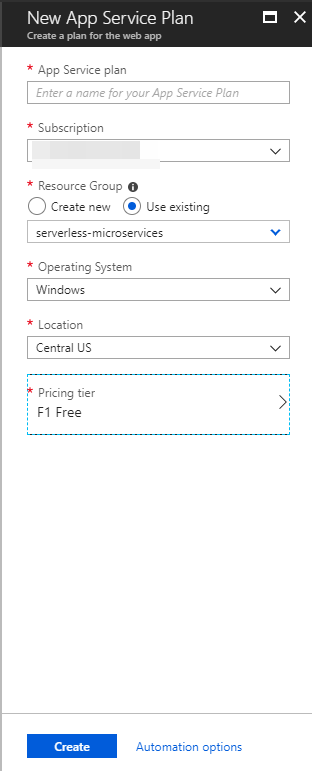

#### Create the Web App

1.  Type **App Service** into the Search box at the top of the `All Services` page, then select **App Services**  section.

2.  Click the **Add** button to create a new app service and select `Web App` from the marketplace. Click `Create`.

3.  Complete the app service creation form with the following:

    1. **App Name**: Enter a unique value for the **App Name** i.e. `RelecloudRideShare`.
    2. **Subscription**: Select your Azure subscription.
    3. **Resource Group**: Select the resource group to which you have added your other services, such as `serverless-microservices`.
    3. **Operating system**: Select `Windows`
    4. **App Service PLan**: Select the pan you created in the previous step.
    5. **Application Insights**: Select `Off`.

    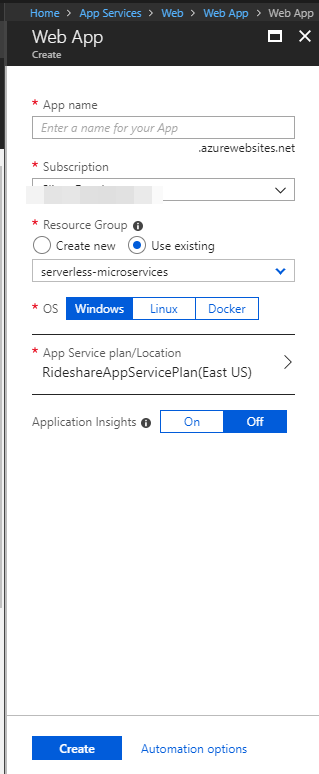

#### Create the Azure SQL Database assets

1.  Type **SQL** into the Search box at the top of the `All Services` page, then select **SQL Database**  section.

2.  Click the **Add** button to create a new SQL Database.

3.  Complete the SQL Database creation form with the following:

    1. **Name**: Enter a unique value for the **Database** i.e. `RideShare`.
    2. **Subscription**: Select your Azure subscription.
    3. **Resource Group**: Select the resource group to which you have added your other services, such as `serverless-microservices`.
    4. **Source**: Select `Blank Database`.
    5. **Server**: Select and Create a new server.
    6. **Elastic Pool**: Select `Not Now`.
    7. **Pricing Tier**: Will be filled in automaticlaly once you complete the server creation i.e `10 DTUs, 250 GB` 
    8. **Collation**: Select `SQL_Latin_1_General_CP1_CI_AS`.

    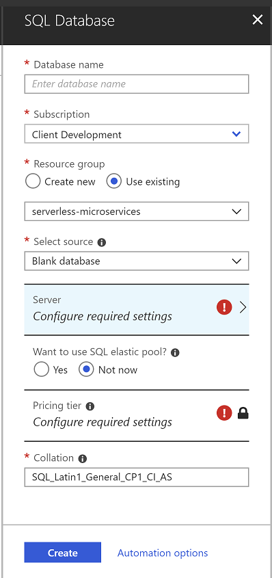

4. Complete the SQL Database Server creation form with the following:

    1. **Name**: Enter a unique value for the SQL Database **Server** i.e. `rideshare-db`.
    2. **Server admin login**: Select your login.
    3. **Password**: select your password.
    4. **Confirm password**: Re-type your password.
    5. **Location**: Select a region closest to you. Make sure you select the same region for the rest of your resources.
    6. **Allow Azure services to access server**: Select `Checked`.

    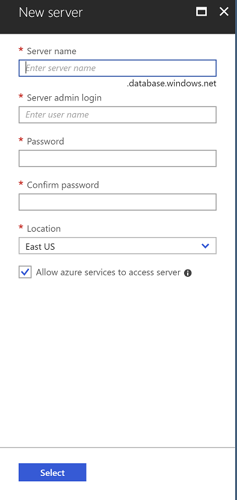

5. Take note of the newly-created database connection string:

    

#### Create the Event Grid Topic

1.  Type **Event Grid** into the Search box at the top of the `All Services` page, then select **Event Grid Topic**  section.

2.  Click the **Add** button to create a new Event Grid Topic.

3.  Complete the event grid topic creation form with the following:

    1. **Name**: Enter a unique value for the Event Grid **Topic** i.e. `RideShareExternalizations`.
    2. **Subscription**: Select your Azure subscription.
    3. **Resource Group**: Select the resource group to which you have added your other services, such as `serverless-microservices`.
    4. **Location**: Select a region closest to you. Make sure you select the same region for the rest of your resources.
    5. **Event Schema**: Select `Event Grid Schema`.

    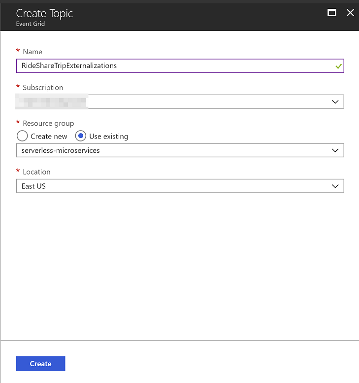

4. Take note of the newly-created topic key:

    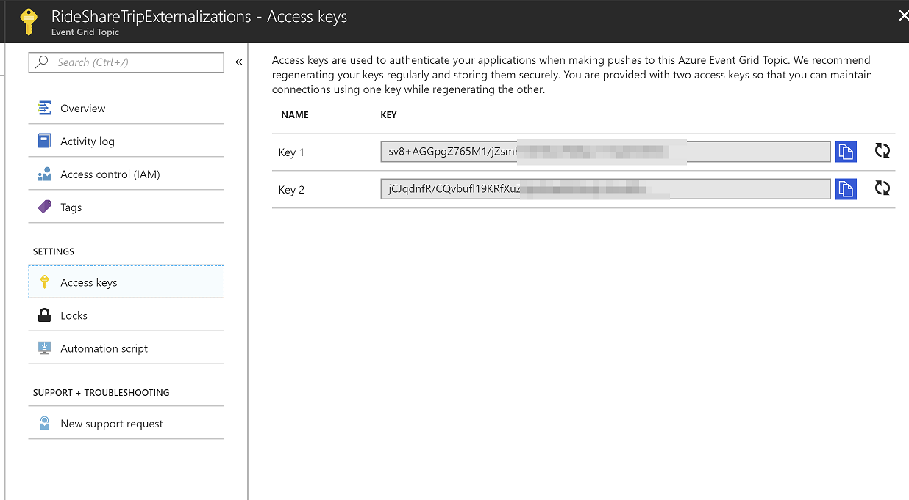

5. Take note of the newly-created topic endpoint URL:

    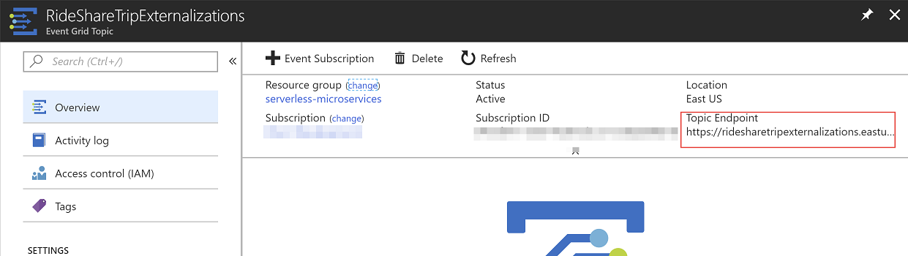

#### Create the Application Insights resource

1.  Type **Application Insights** into the Search box at the top of the `All Services` page, then select **Application Insights**  section.

2.  Click the **Add** button to create a new Application Insights resource.

3.  Complete the application insights creation form with the following:

    1. **Name**: Enter a unique value for the application Insights i.e. `rideshare`.
    2. **Application Type**: Select `General`. This is required by Function Apps.
    3. **Subscription**: Select your Azure subscription.
    4. **Resource Group**: Select the resource group to which you have added your other services, such as `serverless-microservices`.
    5. **Location**: Select a region closest to you. Make sure you select the same region for the rest of your resources.

    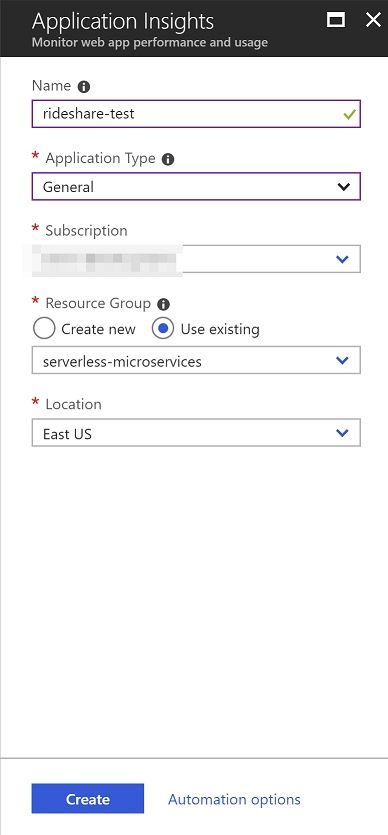

4. Take note of the newly-created resource instrumentation key:

    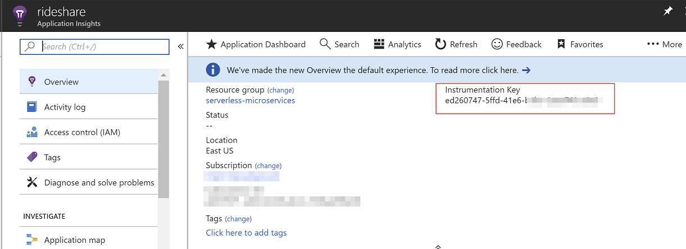

#### Create the API Management Service

1.  Type **API Management** into the Search box at the top of the `All Services` page, then select **API Management**  section.

2.  Click the **Add** button to create a new API Management service.

3.  Complete the API Management service creation form with the following:

    1. **Name**: Enter a unique value for the APIM Service i.e. `rideshare`.
    2. **Subscription**: Select your Azure subscription.
    3. **Resource Group**: Select the resource group to which you have added your other services, such as `serverless-microservices`.
    3. **Location**: Select a region closest to you. Make sure you select the same region for the rest of your resources.
    5. **Organization name**: Type in your organization name.
    6. **Administrator email**: Type in an admin email.
    7. **Pricing tier**: Select `Developer (No SLA)`.

    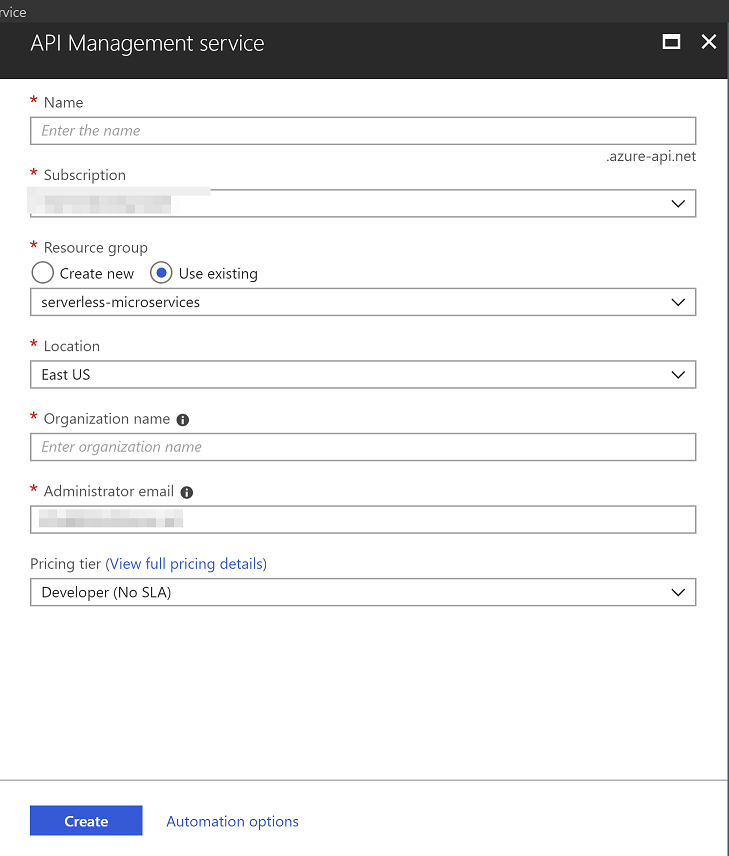

#### Create the SignalR Service

1.  Click **Create a resource** and type **SignalR** into the Search box, then select **SignalR Service**  section.

2.  Click the **Create** button to create a new SignalR service.

3.  Complete the SignalR service creation form with the following:

    1. **Resource Name**: Enter a unique value for the SignalR Service i.e. `rideshare`.
    2. **Subscription**: Select your Azure subscription.
    3. **Resource Group**: Select the resource group to which you have added your other services, such as `serverless-microservices`.
    4. **Location**: Select a region closest to you. Make sure you select the same region for the rest of your resources.
    5. **Pricing tier**: Select `Free`.
    6. **ServiceMode**: Select `Serverless`.

    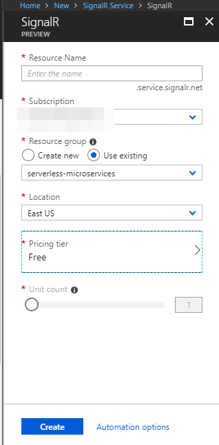

4. Take note of the newly-created resource connection string:

    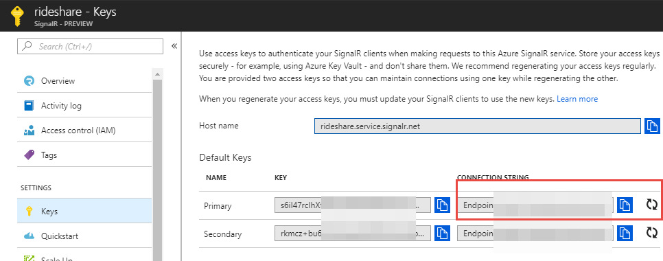

#### Create Azure Key Vault

Azure Key Vault is used to securely store all secrets, such as database connection strings and keys. It is accessible by all Function Apps, which helps prevent storing duplicate values.

1.  Click **Create a resource** and type **Key Vault** into the Search box, then select **Key Vault** from the search results.

2.  Click the **Create** button to create a new Key Vault.

3.  Complete the Key Vault service creation form with the following:

    1. **Resource Name**: Enter a unique value for Key Vault, such as `RideshareVault`.
    2. **Subscription**: Select your Azure subscription.
    3. **Resource Group**: Select the resource group to which you have added your other services, such as `serverless-microservices`.
    4. **Location**: Select a region closest to you. Make sure you select the same region for the rest of your resources.
    5. **Pricing tier**: Select `Standard`.
    6. **Access policies**: Leave as default.
    7. **Virtual Network Access**: Leave as default (all networks can access).

    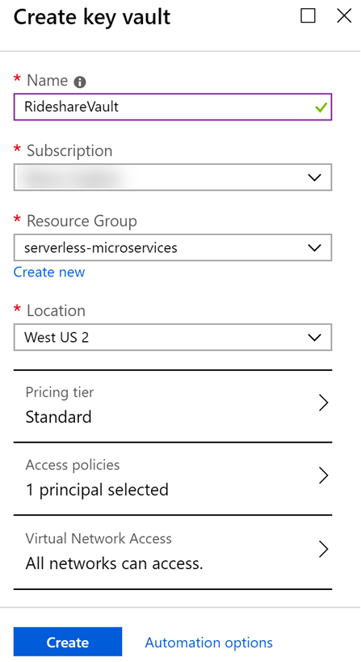

#### Create the Azure AD B2C tenant

The Azure Active Directory B2C tenant is used to store customer/passenger accounts and information, such as their full name, address, etc.

1.  Sign in to the [Azure portal](https://portal.azure.com/).

1.  Make sure that you are using the directory that contains your subscription by clicking the **Directory and subscription filter** in the top menu and choosing the directory that contains it. This is a different directory than the one that will contain your Azure AD B2C tenant.

    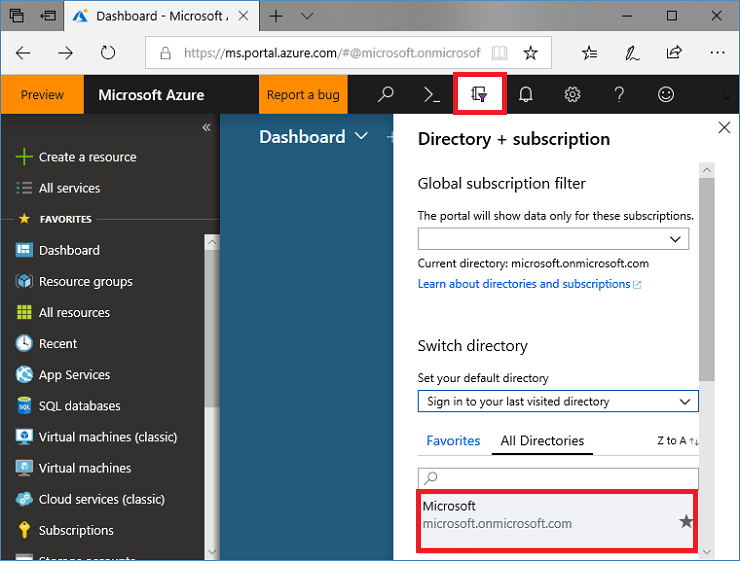

3.  Choose **Create a resource** in the top-left corner of the Azure portal.

4.  Search for and select **Active Directory B2C**, and then click **Create**.

5.  Choose **Create a new Azure AD B2C Tenant**, enter an organization name and initial domain name, which is used in the tenant name, select the country (it can't be changed later), and then click **Create**.

    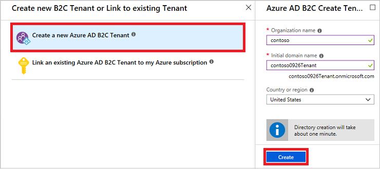

    In this example the tenant name is contoso0926Tenant.onmicrosoft.com

6.  On the **Create new B2C Tenant or Link to an exiting Tenant** page, choose **Link an existing Azure AD B2C Tenant to my Azure subscription**, select the tenant that you created, select your subscription, click **Create new** and enter a name for the resource group that will contain the tenant, select the location, and then click **Create**.

7.  To start using your new tenant, make sure you are using the directory that contains your Azure AD B2C tenant by clicking the **Directory and subscription filter** in the top menu and choosing the directory that contains it.

    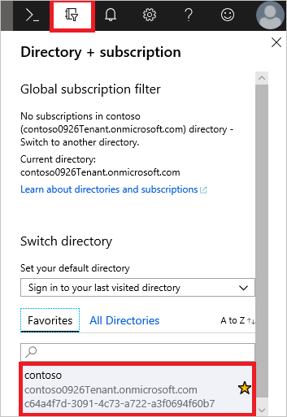

8.  Once you have switched to your new tenant directory, select **Azure Active Directory** from the left-hand menu.

    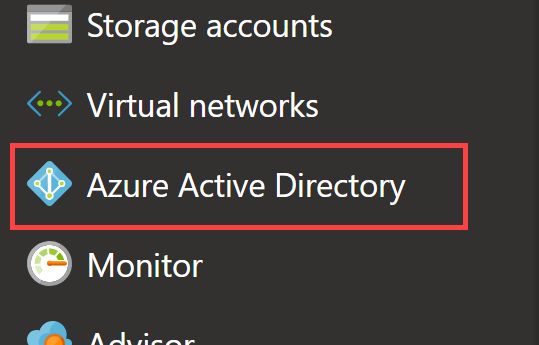

9.  Select **Users** from the Azure AD blade.

10. Select **Password reset**, then select **Properties**.

11. Select **All** underneath the "Self service password reset enabled" setting. Select **Save**.

12. Close the **Password reset** blade to go back to the **Users** blade.

13. Select **User settings**. Select **Yes** underneath "App registrations", and **No** underneath "Administration  Portal". Select **Save**.

    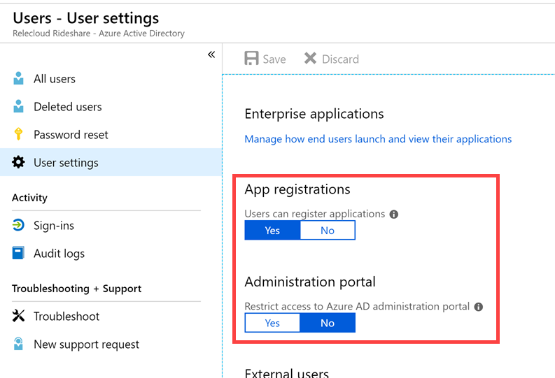

#### Add Azure AD Graph API

Adding the Azure AD Graph API to the new Azure AD B2C tenant will allow you to query user data from the Passengers Azure Function App.

1.  Make sure you are still switched to your new Azure AD B2C tenant directory. Select **Azure Active Directory** on the left-hand menu, if not already selected.

2.  In the left-hand navigation pane, select **App registrations**, and select **New application registration**.

3.  Follow the prompts and create a new application.

    1.  Enter a **Name**, such as "Relecloud Rideshare Graph API".

    2.  Select **Web App / API** as the Application Type.

    3.  Provide **any Sign-on URL** (e.g. https://foo) as it's not relevant for this example.

4.  The application will now show up in the list of applications, click on it to obtain the **Application ID** (also known as Client ID). **Copy it as you'll need it in a later section**. This will be the value for the `GraphClientId` App Setting for your Passengers Function App.

5.  In the Settings menu, click **Keys**.

6.  In the **Passwords** section, enter the key description and select a duration, and then click **Save**. Copy the key value (also known as Client Secret) **for use in a later section**. This will be the value for the `GraphClientSecret` App Setting for your Passengers Function App.

7.  In the Settings menu, click on **Required permissions**.

8.  In the Required permissions menu, click on **Windows Azure Active Directory**.

9.  In the Enable Access  menu, select the **Read and write directory data** permission from **Application Permissions** and click **Save**.

10. Finally, back in the Required permissions menu, click on the **Grant Permissions** button.

    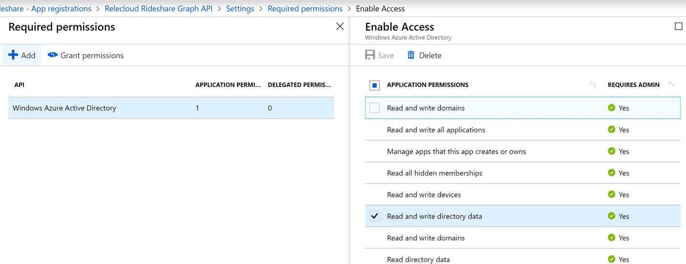

#### Configure Azure AD B2C tenant

Your new Azure AD B2C tenant must be configured before it can be used from the website. The Reply URLs you add will allow the website to successfully route the users to the login/logout forms.

1.  Switch back to your Azure subscription tenant that contains the resources you have created.

2.  Navigate to your `serverless-microservices` Resource Group, or the one you created at the beginning of this document.

3.  Find and select the B2C Tenant you created.

    

4.  Copy the **Tenant ID** value located within the Essentials section of the Overview blade. **Save the value for later**. This will be the value for the `GraphTenantId` App Setting for your Passengers Function App.

    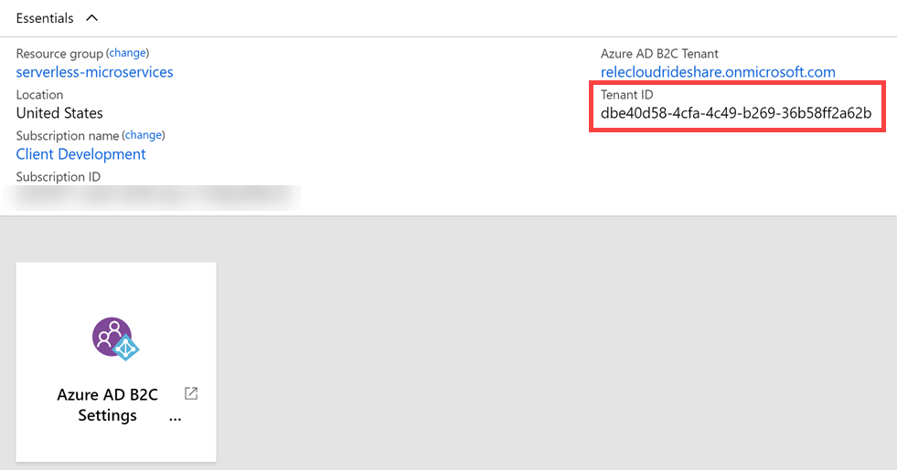

5.  Select the **Azure AD B2C Settings** tile.

6.  Select **Applications** in the left-hand navigation menu, then select **Add**.

7.  In the New application form, provide the following:

    1.  **Name**: rideshare-site

    2.  **Web App / Web API**: select Yes

    3.  **Allow implicit flow**: select Yes

    3.  **Native client**: select No

    4.  **App ID URI**: api

    5.  Enter the following **Reply URL** values (replace YOUR-WEB-APP with the name of the web app [you created](#create-the-web-app)):

    | Reply URL |
    | --- |
    | http://localhost:8080/no-auth |
    | http://localhost:8080/drivers |
    | http://localhost:8080/passengers |
    | http://localhost:8080/trips |
    | http://localhost:8080/login |
    | http://localhost:8080 |
    | https://YOUR-WEB-APP.azurewebsites.net/no-auth |
    | https://YOUR-WEB-APP.azurewebsites.net/drivers |
    | https://YOUR-WEB-APP.azurewebsites.net/passengers |
    | https://YOUR-WEB-APP.azurewebsites.net/trips |
    | https://YOUR-WEB-APP.azurewebsites.net/login |
    | https://YOUR-WEB-APP.azurewebsites.net |

    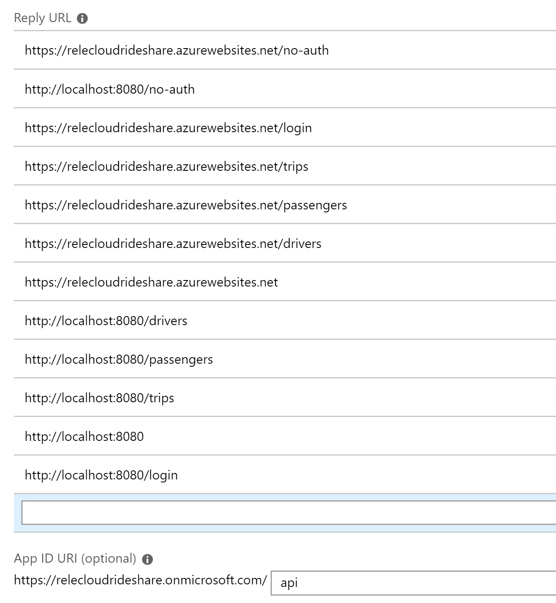

8.  Select **Create**.

9.  After the new application is created, open it and copy the **Application ID**. **Save the value for later**. This will be the value for the `ApiApplicationId` App Setting for several of your Function Apps. This value will also be used as the value for the `window.authClientId` setting in the `settings.js` file within the website project.

10. With the application still open, select **Published scopes** on the left-hand navigation menu.

11. Add two new scopes as defined below:

    | Scope | Description |
    | --- | --- |
    | rideshare | Rideshare API |
    | user_impersonation | Access this app on behalf of the signed-in user |

12. Select **Save**. After saving is complete, you will see a Full Scope Value next to each scope you added.

    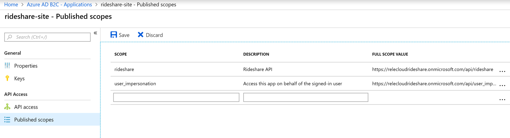

13. Copy the **Full Scope Value** for the new **rideshare** scope you created. **Save the value for later**. This will be the value for the `window.authScopes` setting in the `settings.js` file within the website project.

14. Select **API access** from the left-hand navigation menu. You should have, at minimum, the published rideshare-site scope listed here. If not, perform the following:

15. Select **Add**.

16. Under **Select API**, select rideshare-site.

17. Under **Select Scopes**, select all.

18. Select **OK**.

19. Close the rideshare-site API access blade to navigate back to the **Azure AD B2C - Applications** blade.

#### Create a sign-up or sign-in policy

You must create a policy for the sign-up/in user workflow. Without this, users will not be able to sign up for an account or sign in.

1.  While still within the **Azure AD B2C** portal page, select **Sign-up or sign-in policies** and click **Add**.

    To configure your policy, use the following settings:

    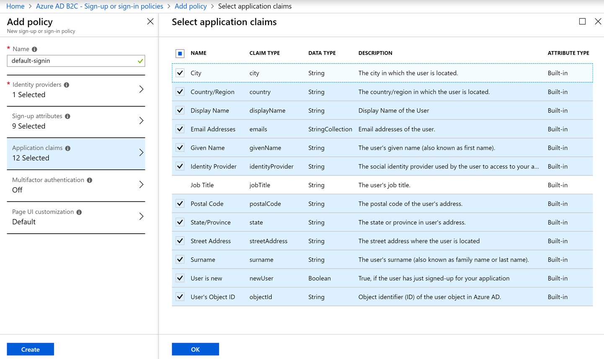

    | Setting      | Suggested value  | Description                                        |
    | ------------ | ------- | -------------------------------------------------- |
    | **Name** | default-signin | Enter a **Name** for the policy. The policy name is prefixed with **b2c_1_**. You use the full policy name **b2c_1_default-signin** in the application code. **Record this name for later**. |
    | **Identity provider** | Email signup | The identity provider used to uniquely identify the user. |
    | **Sign up attributes** | City, Country/Region, Display Name, Email Address, Given Name, Postal Code, State/Province, Street Address, and Surname | Select attributes to be collected from the user during signup. |
    | **Application claims** | City, Country/Region, Display Name, Email Address, Given Name, Postal Code, State/Province, Street Address, Surname, User is new, and User's Object ID | Select [claims](https://docs.microsoft.com/en-us/azure/active-directory/develop/developer-glossary#claim) you want to be included in the [access token](https://docs.microsoft.com/en-us/azure/active-directory/develop/developer-glossary#access-token). |

2.  Click **Create** to create your policy.

3.  After your policy has been created, select **Overview** on the left-hand navigation menu for Azure AD B2C.

4.  Make note of the **Domain name** value. Use this to construct the B2C Authority URL. The URL is structured as follows: `https://DOMAIN-NAME.b2clogin.com/tfp/DOMAIN-NAME.onmicrosoft.com/b2c_1_POLICY-NAME/v2.0`. For example, in the screenshot below, you see that the domain name is `relecloudshare.onmicrosoft.com`. In addition, the policy name we used is `default-signin`, as shown in Step 1 above. Therefore, the B2C Authority URL in our example is: `https://relecloudrideshare.b2clogin.com/tfp/relecloudrideshare.onmicrosoft.com/b2c_1_default-signin/v2.0`. **Record this URL for later**. You will use it as the value for the `AuthorityUrl` setting in the App Setting for several of your Function Apps. In addition, it will be used as the value for the `window.authAuthority` setting in the `settings.js` file within your website project.

    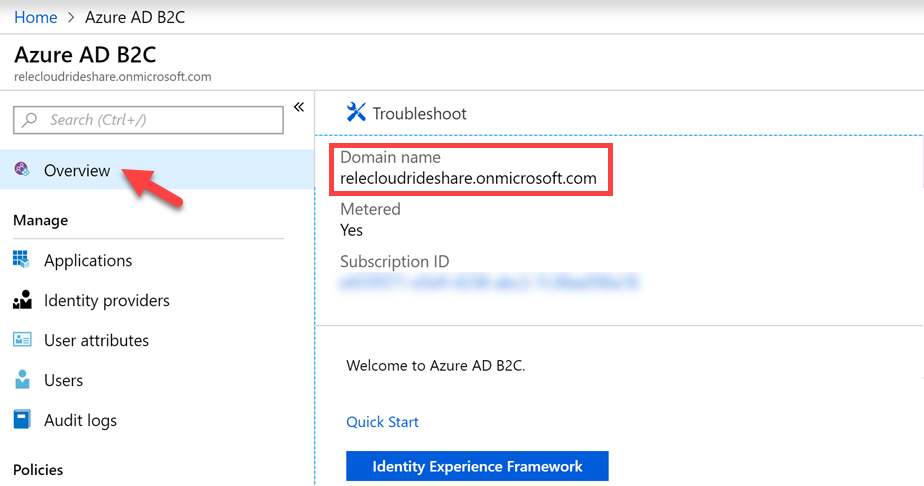

Once completed, please jump to the [setup](#setup) section to continue.

### Cake Provision

> ⚠️ Cake provisioning support and docs will be deprecated soon. Please use [Bicep provisioning](#deploy-from-bicep) instead.

The `Cake` script responsible to `deploy` and `provision` is included in the `dotnet` source directory. In order to run the Cake Script locally and deploy to your Azure Subscription, there are some pre-requisites:

1. Create a service principal that can be used to authenticate the script to use your Azure subscription. This can be easily accomplished using the following PowerShell script:

```powershell
# Login
Login-AzureRmAccount

# Set the Subscriptions
Get-AzureRmSubscription  

# Set the Subscription to your preferred subscription
Select-AzureRmSubscription -SubscriptionId "<your_subs_id>"

# Create an application in Azure AD
$pwd = convertto-securestring "<your_pwd>" -asplaintext -force
$app = New-AzureRmADApplication  -DisplayName "RideSharePublisher"  -HomePage "http://rideshare" -IdentifierUris "http://rideshare" -Password $pwd

# Create a service principal
New-AzureRmADServicePrincipal -ApplicationId $app.ApplicationId

# Assign role
New-AzureRmRoleAssignment -RoleDefinitionName Contributor -ServicePrincipalName $app.ApplicationId.Guid
```
2. Place two text files in the `dotnet` directory that can tell the Cake script about the service principal that you just created. The two text files are: `dev_authfile.txt` and `prod_authfile.txt`. They contain the following:

```
subscription=<your_subs_id>  
client=<your_client_id_produced_by_ps_above>  
key=<your_pwd_you_set_up_in_ps_above>  
tenant=<your_azure_tenant_id>
managementURI=https\://management.core.windows.net/  
baseURL=https\://management.azure.com/  
authURL=https\://login.windows.net/  
graphURL=https\://graph.windows.net/ 
```

If your `dev` and `prod` environments are hosted on the same Azure subscription, then the two auth files will be identical.

:eight_spoked_asterisk: **Please note** that you must adjust the `cake/paths.cake` file to match your resource names. The `public static class Resources` class defines the resource names.

Once the above is completed, from a PowerShell command, use the following commands to provision the `Dev` and `Prod` environments:

- `./build.ps1 -Target Provision -ScriptArgs '--Env=Dev'`
- `./build.ps1 -Target Provision -ScriptArgs '--Env=Prod'`

**Please note** that provisioning a Cosmos DB Account takes a long time to be online. If you proceed with creating a database and the collections while the DB account status is `Creating`, you will get an error that says something like `bad request` without much of an explanation. Once the DB Account becomes `Online`, you can continue to provision the rest (by re-invoking the `provision` command). The exact error is: One or more errors occurred. Long running operation failed with status `BadRequest`.

Unfortunately, the Cake script cannot provision the following resources because they are currently not supported in the [Azure Management Libraries for .NET](https://github.com/Azure/azure-libraries-for-net). So please complete the following provisions manually as described in the manual steps above:

- [Event Grid](#create-the-event-grid-topic)
- [Application Insights](#create-the-application-insights-resource)
- [Logic App](#create-the-logic-app)
- [API Management Service](#create-the-api-management-service)
- [SignalR Service](#create-the-signalr-service)
- [Azure Key Vault](#create-azure-key-vault)
- [B2C Tenant](#create-the-b2c-tenant)

Once completed, please jump to the [setup](#setup) section to continue.

### Deploy from Bicep

You can provision most of the services required through the supplied [Bicep](../bicep/main.bicep) with command-line using [Azure PowerShell](https://docs.microsoft.com/en-us/azure/azure-resource-manager/bicep/deploy-powershell#deploy-local-bicep-file) or [Azure CLI](https://docs.microsoft.com/en-us/azure/azure-resource-manager/bicep/deploy-cli#deploy-local-bicep-file). The Azure portal provides a nice user interface for deploying resources when using a Bicep file. To use this interface, start by [clicking this link](https://portal.azure.com/#create/Microsoft.Template/uri/https%3A%2F%2Fraw.githubusercontent.com%2FAzure-Samples%2FServerless-microservices-reference-architecture%2Frefresh-functions-v4%2Fbicep%2Fmain.json).

Unfortunately, the Bicep cannot provision the following resources. Please provision these manually as described in the steps above:

- [Logic App](#create-the-logic-app)
- [B2C Tenant](#create-the-b2c-tenant)

Once completed, please jump to the [setup](#setup) section to continue.

## Setup

After you have provisioned all your resources, there are some manual steps that you need to do to complete the setup:

- [Add APIM Products and APIs](#Add-APIM-Products-and-APIs)
- [Connect Event Grid to Function Apps](#connect-event-grid-to-functions-apps)
- [Connect Event Grid to Logic App](#connect-event-grid-to-logic-app)
- [Run a script to create the TripFact table](#create-tripfact-table)

### Add APIM Products and APIs

**Please note** that you should have created the [Create the API Management Service ](#create-the-api-management-service) before you can proceed with this step. In addition, you should have already [deployed](#deployment) the Function Apps to Azure before you can make them available in the API Management Service.

APIM defines two top-level entities: `Product` and `Api`. They are related this way:

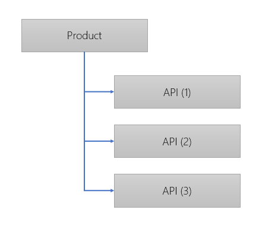

Therefore we want to create a new product and add to it several APIs.

1.  Type **API Management** into the Search box at the top of the `All Services` page, then select **API Management Service**  section.

2.  Select the **resource** you created earlier i.e. `rideshare`.

3.  Select it to go to detail and click on `products`. Click the **Add** button to create a new API Management product.

4.  Complete the API Management product creation form with the following:

    1. **Display Name**: Enter a name i.e. `RideShare`.
    2. **Id**: Enter a unique identifier `rideshare-product`.
    3. **Description**: Enter an optional description.
    3. **State**: Select `Not Published`.
    5. **Requires subscription**: Checked.

    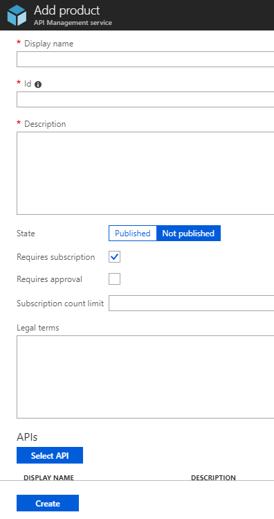

5.  Re-select the API Management Service to go to detail and click on `APIs`. Click the **Add a new API** and select **Function App**.

6.  On the Create from Function App form, select **Browse** next to Function App.

    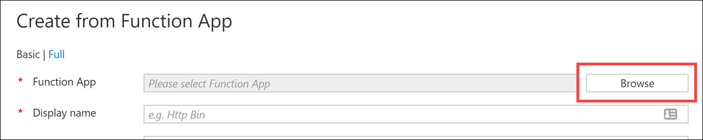

7.  On the Import Azure Functions form, select **Configure required settings** under Function App.

    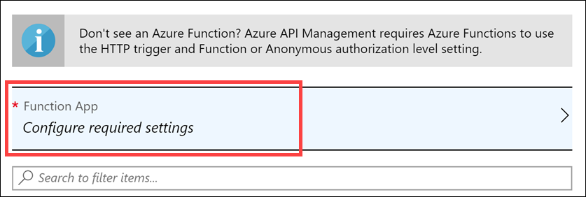

8.  Select the **Drivers** Function App you created. Make sure all the functions are selected, then click **Select**.

    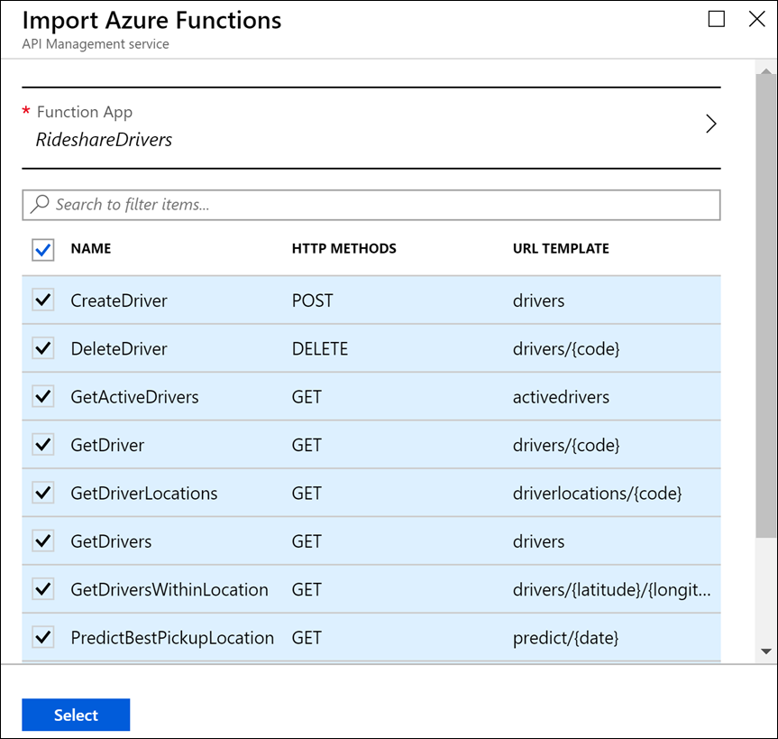

9.  Complete the API Management API creation form for `Drivers` with the following:

    1. **Display Name**: Enter a name i.e. `RideShare Drivers API`.
    2. **Name**: Enter an identifier `rideshare-drivers`.
    3. **API URL Suffix**: Enter `d`.
    4. **Product**: Select the `RideShare` product you created earlier. This is how the API is linked to the product.

    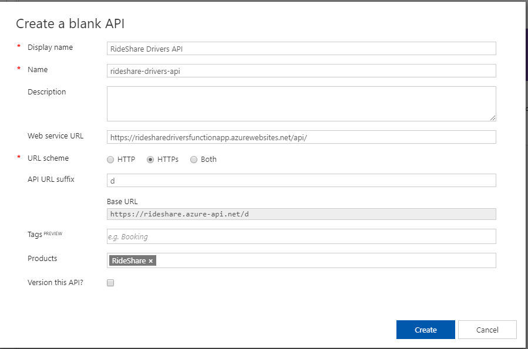

10.  **Repeat steps 5-9** for the `Trips` and `Passengers` Function Apps. The `Orchestrators` are not exposed to the outside world and hence they should not be added to APIM.

     - For the `Trips` API, enter `t` for the **API URL Suffix**.
     - For the `Passengers` API, enter `p` for the **API URL Suffix**.

The following APIs should have been created when you imported the functions:

#### Drivers API

| Display Name | Name | URL | Template | Query |
|---|---|---|---|---|
| Get Drivers | get-drivers | `GET`/drivers | None | `GetDrivers` Auth Code | 
| Get Drivers Within Location| get-drivers-within-location | `GET`/drivers/{latitude}/{longitude}/{miles} | latitude = double, longitude = double, miles = double | `GetDriversWithinLocation` Auth Code | 
| Get Active Drivers | get-active-drivers | `GET`/activedrivers | None | `GetActiveDrivers` Auth Code | 
| Get Driver | get-driver | `GET`/drivers/{code} | code = driver code = string | `GetDriver` Auth Code | 
| Create Driver | create-driver | `POST`/drivers | None | `CreateDriver` Auth Code | 
| Update Driver | update-driver | `PUT`/drivers | None | `UpdateDriver` Auth Code | 
| Update Driver Location | update-driver-location | `PUT`/driverlocations | None | `UpdateDriverLocation` Auth Code | 
| Get Driver Locations | get-driver-locations | `GET`/driverlocations/{code} | code = driver code = string | `GetDriverLocations` Auth Code | 
| Delete Driver | delete-driver | `DELETE`/drivers/{code} | code = driver code = string | `DeleteDriver` Auth Code | 

#### Trips API

| Display Name | Name | URL | Template | Query |
|---|---|---|---|---|
| Get Trips | get-trips | `GET`/trips | None | `GetTrips` Auth Code | 
| Get Active Trips | get-active-trips | `GET`/activetrips | None | `GetActiveTrips` Auth Code | 
| Get Trip | get-trip | `GET`/trips/{code} | code = trip code = string | `GetTrip` Auth Code | 
| Create Trip | create-trip | `POST`/trips | None | `CreateTrip` Auth Code | 
| Assign Trip Driver | assign-trip-driver | `POST`/trips/{code}/drivers/{drivercode} | code = trip code = string, drivercode = driver code = string | `AssignTripDriver` Auth Code | 

#### Passengers API

| Display Name | Name | URL | Template | Query |
|---|---|---|---|---|
| Get Passengers | get-passengers | `GET`/passengers | None | `GetPassengers` Auth Code | 
| Get Passenger | get-passenger | `GET`/passengers/{code} | code = passenger code = string | `GetPassenger` Auth Code |

### Publish the RideShare APIM product

Now that you've added your APIs, you need to publish your `RideShare` product. To do this, select **Products** on the left-hand menu of your APIM service. You will see that the `RideShare` product is in the **Not published** state.

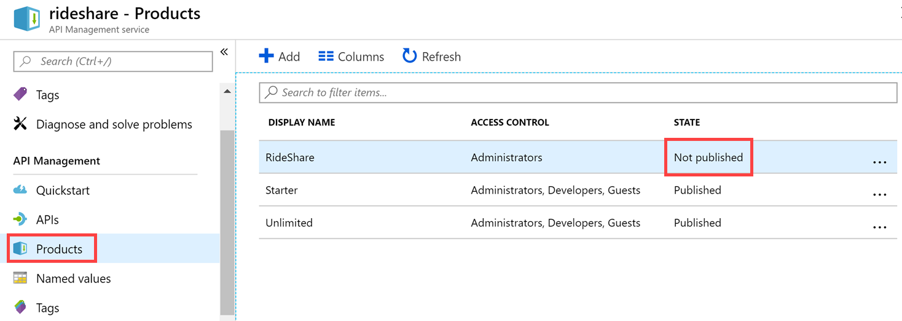

Select the ellipses (...) on the right-hand side of the `RideShare` product, then select **Publish**.

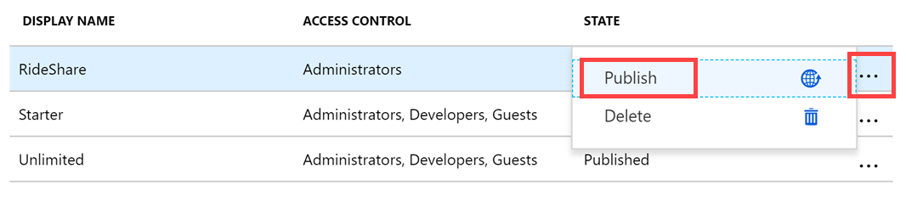

### Retrieve the APIM API key

**Please note** that you should have created the [Create the API Management Service](#create-the-api-management-service) as well as [added the RideShare APIM Product](#add-apim-products-and-apis) before you can proceed with this step.

When accessing APIs hosted by APIM, you are required to pass an `Ocp-Apim-Subscription-Key` HTTP header value that contains an API Key from a valid subscription to the RideShare Product you created. Perform the following steps to retrieve this key:

1.  Type **API Management** into the Search box at the top of the `All Services` page, then select **API Management Service**  section.

2.  Select the **resource** you created earlier i.e. `rideshare`.

3.  Select the **Users** link in the left-hand navigation menu. At this point, you should have one user named "Administrator". Select this account.

    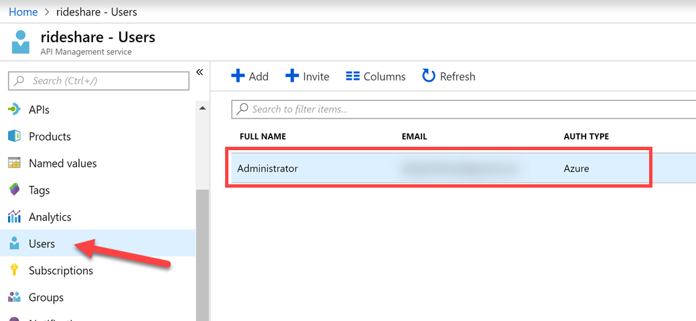

4.  Select the ellipses (...) next to the **RideShare** product that you created, then select **Show/hide keys**. Finally, copy the **Primary Key** value. **Save this value for later**. This value will be used for the `window.apiKey` setting in the `settings.js` file within the website project.

    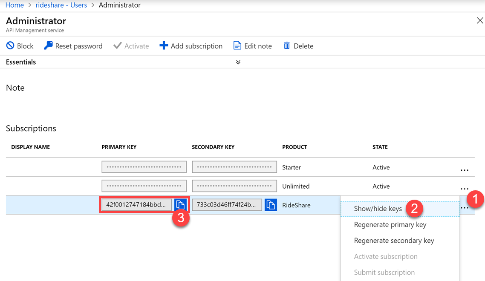

### Connect Event Grid to Function Apps

**Please note** that you should have created the [Event Grid Topic](#create-the-event-grid-topic) and the [Function Apps](#create-the-azure-function-apps) before you can proceed with this step. In addition, you should have already [deployed](#deployment) the Function Apps to Azure before you can make them listen to an Event Grid Topic. 

1.  Type **Function Apps** into the Search box at the top of the `All Services` page, then select **Function Apps**  section.

2.  Select the **RideShareTripsFunctionApp** app.

3. Expand the Functions (Read Only) tree leaf:

  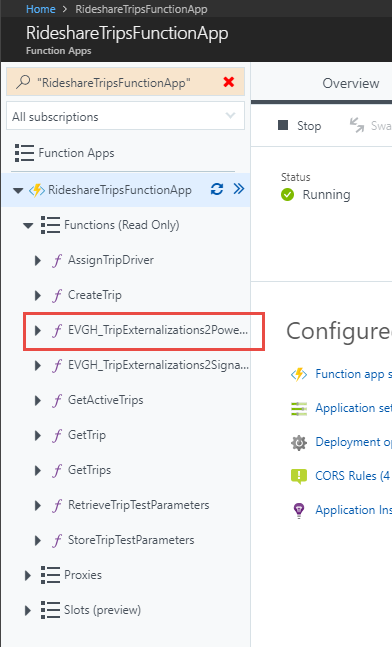

4. Select the `EVGH_TripExternalizations2PowerBI` Function and click on **Add Event Grid Subscription**. This will show a dialog to allow you to make this function a listener for the Event Grid Topic: 

    1. **Name**: Select a name i.e. `RideShareTripExternalizations2PpowerBI`.
    2. **Topic Type**: Select `Event Grid Topic`.
    3. **Subscription**: Select your Azure subscription.
    4. **Resource Group**: Either select an existing Resource Group or create a new one such as `serverless-microservices`.
    5. **Instance**: Select the Event Grid Topic you are subscribing to i.e. `RideShareTripExternalizations`
    6. Check the **Subscribe to all event types**

    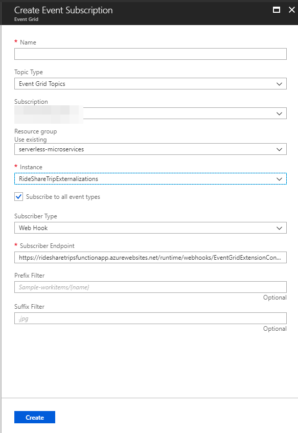

5. Repeat step 4 for the `EVGH_TripExternalizations2SignalR` Function.

6. Repeat step 5 for the `EVGH_TripExternalizations2CosmosDB` Function. This is located in the Trip Archiver Node.js Function App.

### Connect Event Grid to Logic App

**Please note** that you should have created the [Event Grid Topic](#create-the-event-grid-topic) before you can proceed with this step.

1.  Type **Logic Apps** into the Search box at the top of the `All Services` page, then select **Logic Apps**  section.

2.  Click the **Add** button to create a new Logic App.

3.  Complete the logic app creation form with the following:

    1. **Name**: Enter a unique value for the logic app i.e. `ProcessTripExternalization`.
    2. **Subscription**: Select your Azure subscription.
    3. **Resource Group**: Either select an existing Resource Group or create a new one such as `serverless-microservices`.
    4. **Location**: Select a region closest to you. Make sure you select the same region for the rest of your resources.

    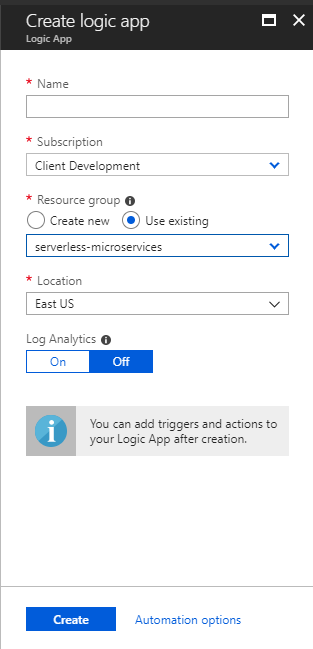

4. Once the resource is created, navigate to it and select `Blank Logic App`. In the `Search connectors and triggers`, type `Event Grid` and select the `Azure Event Grid` trigger:

    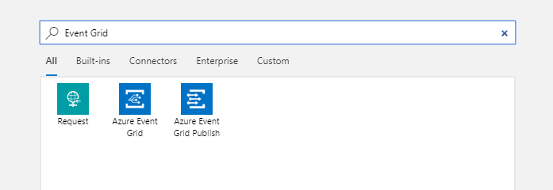

5. Then select the `When Event source occurs`:

    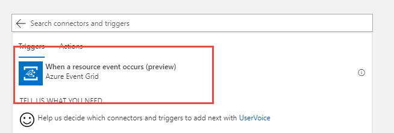

6. Finally select the `When Event source occurs`:

    1. **Subscription**: Select your Azure subscription.
    2. **Resource Type**: Select `Microsoft.EventGrid.Topic`.
    3. **Resource Name**: Select the Event Grid Topic you provisioned.

    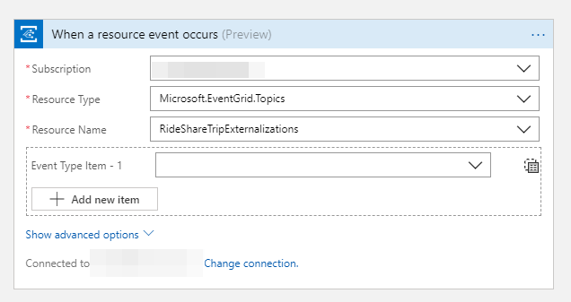

7. Then click on the `New Step` and type in the `Choose an action` search box `SendGrid`:

    1. Select `Send Email (v2) (preview).
    2. You may need to setup a [SendGrid account](https://sendgrid.com/) if you have not done so already. Alternatively you can choose Office 365 Email email sender or Gmail sender or whatever Logic App supports.

    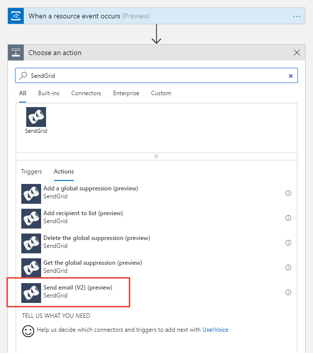

8. Fill out the Email Sender form:
    1. **From**: The email address you wish this notification be sent from
    2. **To**: The email address you wish this notification be sent to
    3. **Subject**: If you select this field, you can either type whatever you want the subject or pick from one the dynamic fields shown. The Event Grid `Subject` is what makes sense. 

    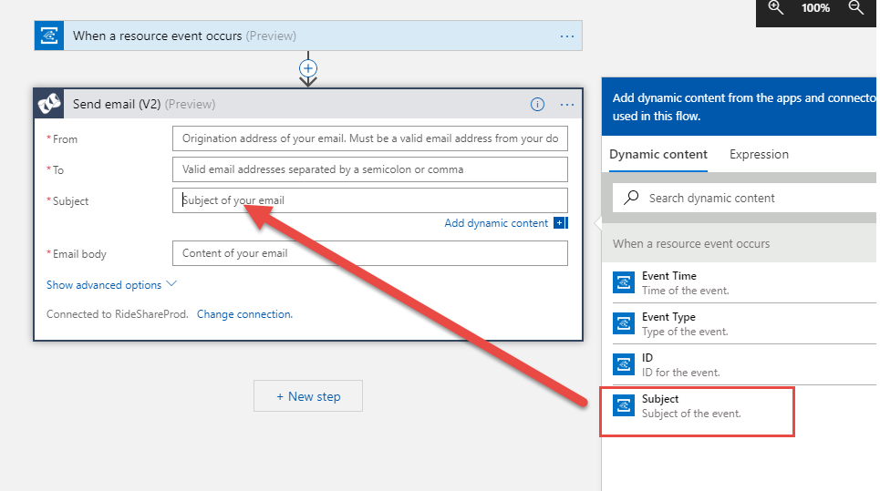

    4. **Body**: If you select this field, you can either type whatever you want the body or pick from one the dynamic fields shown. The Event data does not appear automatically in the list of available dynamic content. You must switch to `Code view` to access the event data i.e. `@{triggerBody()?['data']}`. 

### Create TripFact Table

Connect to the SQL database and run the following script to create the `TripFact` table and its indices:  

```sql
    USE [RideShare]
    GO

    SET ANSI_NULLS ON
    GO

    SET QUOTED_IDENTIFIER ON
    GO

    CREATE TABLE[dbo].TripFact (
        [Id][int] IDENTITY(1, 1) NOT NULL,
        [StartDate][datetime] NOT NULL,
        [EndDate][datetime] NULL,
        [AcceptDate][datetime] NULL,
        [TripCode] [nvarchar] (20) NOT NULL,
        [PassengerCode] [nvarchar] (20) NULL,
        [PassengerName] [nvarchar] (100) NULL,
        [PassengerEmail] [nvarchar] (100) NULL,
        [AvailableDrivers] [int] NULL,
        [DriverCode] [nvarchar] (20) NULL,
        [DriverName] [nvarchar] (100) NULL,
        [DriverLatitude] [float] NULL,
        [DriverLongitude] [float] NULL,
        [DriverCarMake] [nvarchar] (100) NULL,
        [DriverCarModel] [nvarchar] (100) NULL,
        [DriverCarYear] [nvarchar] (4) NULL,
        [DriverCarColor] [nvarchar] (20) NULL,
        [DriverCarLicensePlate] [nvarchar] (20) NULL,
        [SourceLatitude] [float] NULL,
        [SourceLongitude] [float] NULL,
        [DestinationLatitude] [float] NULL,
        [DestinationLongitude] [float] NULL,
        [Duration] [float] NULL,
        [MonitorIterations] [int] NULL,
        [Status] [nvarchar] (20) NULL,
        [Error] [nvarchar] (200) NULL,
        [Mode] [nvarchar] (20) NULL
        CONSTRAINT[PK_dbo.TripFact] PRIMARY KEY CLUSTERED
    (
        [Id] ASC
    )WITH(PAD_INDEX = OFF, STATISTICS_NORECOMPUTE = OFF, IGNORE_DUP_KEY = OFF, ALLOW_ROW_LOCKS = ON, ALLOW_PAGE_LOCKS = ON)
    )

    GO

    CREATE INDEX IX_TRIP_START_DATE ON dbo.TripFact(StartDate);
    CREATE INDEX IX_TRIP_CODE ON dbo.TripFact(TripCode);
    CREATE INDEX IX_TRIP_PASSENGER_CODE ON dbo.TripFact(PassengerCode);
    CREATE INDEX IX_TRIP_DRIVER_CODE ON dbo.TripFact(DriverCode);
```

## Add secrets to Key Vault

In this step, you will add all of your secrets to Key Vault. These secrets will be referred to by the App Settings within your Function Apps.

1. Open your Key Vault instance in the portal.

2. Select **Secrets** under Settings in the left-hand menu.

3. Select **Generate/Import** to add a new key.

    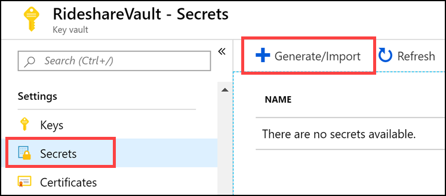

4. Use the table below as a guide to add each new **Name** and **Value** pair:

    | Name | Value |  
    |---|---|
    | AppInsightsInstrumentation | The Application Insights Resource Instrumentation Key. This key is required by the Function App so it knows there is an application insights resource associated with it |
    | DocDbApiKey | The Cosmos DB API Key |
    | DocDbEndpointUri | The Cosmos DB Endpoint URI |
    | DocDbRideShareDatabaseName | The Cosmos DB database i.e. `RideShare` |
    | DocDbRideShareMainCollectionName | The Cosmos DB Main container i.e. `Main` |
    | DocDbThroughput | The provisioned container RUs i.e. 400  |
    | AuthorityUrl | The B2C Authority URL i.e. https://relecloudrideshare.b2clogin.com/tfp/relecloudrideshare.onmicrosoft.com/b2c_1_default-signin/v2.0 |
    | ApiApplicationId | The B2C Client ID |
    | ApiScopeName | The Scope Name i.e. rideshare |
    | GraphTenantId| Azure Tenant ID |
    | GraphClientId| Azure Graph client ID |
    | GraphClientSecret| Azure Graph secret |
    | TripExternalizationsEventGridTopicApiKey|The API Key of the event grid topic |
    | SqlConnectionString | The connection string to the Azure SQL Database where `TripFact` is provisioned |
    | AzureSignalRConnectionString | The connection string to the SignalR Service |

    When you are finished creating the secrets, your list should look similar to the following:

    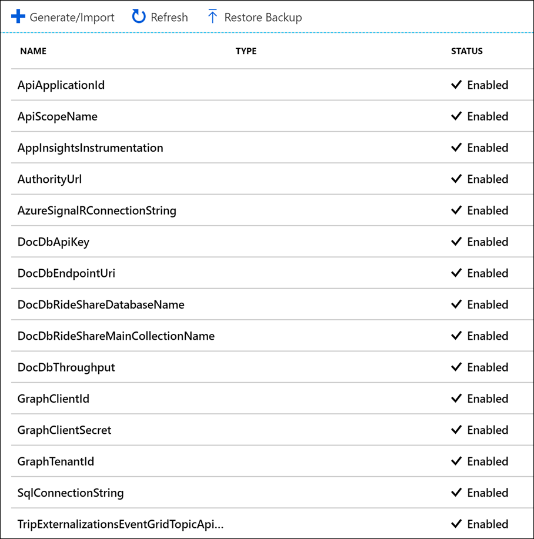

### Retrieving a secret's URI

When you set the App Settings for each of your Function App in the next section below, you will need to reference the URI of a secret in Key Vault, including the version number. To do this, perform the following steps for each secret.

1. Open your Key Vault instance in the portal.

2. Select **Secrets** under Settings in the left-hand menu.

3. Select the secret whose URI value you wish to obtain.

4. Select the **Current Version** of the secret.

    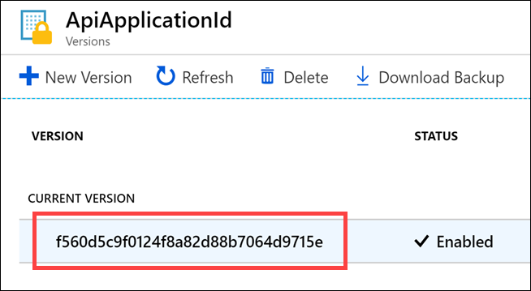

5. Copy the **Secret Identifier**.

    

When you add the Key Vault reference to this secret within a Function App's App Settings, you will use the following format: `@Microsoft.KeyVault(SecretUri={referenceString})`, where `{referenceString}` is replaced by the Secret Identifier (URI) value above.

For example, a complete reference would look like the following:

`@Microsoft.KeyVault(SecretUri=https://ridesharevault.vault.azure.net/secrets/ApiApplicationId/b520d8c3f0124f9a82d88b7064d9715e)`

## Function App Application Settings

The reference implementation solution requires several settings for each Function App. The `settings` directory contains the setting file for each Function App. The files are a collection of `KEY` and `VALUE` delimited by a `|`. They need to be imported as `Application Settings` for each Function App. The Cake deployment script can auto-import these files into the `Application Settings`.

**Note**: If you are manually adding the Application Settings for your Function Apps, use the tables below as a guide. To get to Application Settings, open you Function App, then select **Configuration**.

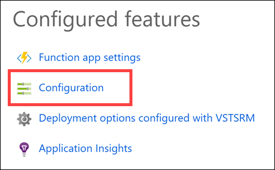

### Drivers Function App

| KEY | DESCRIPTION |
|---|---|
| APPINSIGHTS_INSTRUMENTATIONKEY | Enter `@Microsoft.KeyVault(SecretUri={referenceString})`, where `{referenceString}` is the URI for the **AppInsightsInstrumentation** Key Vault secret |
| FUNCTIONS_EXTENSION_VERSION | Must be set to `~2` since the solution uses V2 |
| DocDbApiKey | Enter `@Microsoft.KeyVault(SecretUri={referenceString})`, where `{referenceString}` is the URI for the **DocDbApiKey** Key Vault secret |
| DocDbEndpointUri | Enter `@Microsoft.KeyVault(SecretUri={referenceString})`, where `{referenceString}` is the URI for the **DocDbEndpointUri** Key Vault secret |
| DocDbRideShareDatabaseName | Enter `@Microsoft.KeyVault(SecretUri={referenceString})`, where `{referenceString}` is the URI for the **DocDbRideShareDatabaseName** Key Vault secret |
| DocDbRideShareMainCollectionName | Enter `@Microsoft.KeyVault(SecretUri={referenceString})`, where `{referenceString}` is the URI for the **DocDbRideShareMainCollectionName** Key Vault secret |
| DocDbThroughput | Enter `@Microsoft.KeyVault(SecretUri={referenceString})`, where `{referenceString}` is the URI for the **DocDbThroughput** Key Vault secret |
| InsightsInstrumentationKey | Same value as APPINSIGHTS_INSTRUMENTATIONKEY. This value is used by the Function App while the other is used by the Function framework  |
| AuthorityUrl | Enter `@Microsoft.KeyVault(SecretUri={referenceString})`, where `{referenceString}` is the URI for the **AuthorityUrl** Key Vault secret |
| ApiApplicationId | Enter `@Microsoft.KeyVault(SecretUri={referenceString})`, where `{referenceString}` is the URI for the **ApiApplicationId** Key Vault secret |
| ApiScopeName | Enter `@Microsoft.KeyVault(SecretUri={referenceString})`, where `{referenceString}` is the URI for the **ApiScopeName** Key Vault secret |
| EnableAuth | if set to true, the JWT token validation will be enforced |

### Passengers Function App

| KEY | DESCRIPTION |
|---|---|
| APPINSIGHTS_INSTRUMENTATIONKEY | Enter `@Microsoft.KeyVault(SecretUri={referenceString})`, where `{referenceString}` is the URI for the **AppInsightsInstrumentation** Key Vault secret |
| FUNCTIONS_EXTENSION_VERSION | Must be set to `~2` since the solution uses V2 |
| AzureWebJobsDashboard | The Storage Account Connection String |
| AzureWebJobsStorage | The Storage Account Connection String |
| DocDbApiKey |  Enter `@Microsoft.KeyVault(SecretUri={referenceString})`, where `{referenceString}` is the URI for the **DocDbApiKey** Key Vault secret |
| DocDbEndpointUri | Enter `@Microsoft.KeyVault(SecretUri={referenceString})`, where `{referenceString}` is the URI for the **DocDbEndpointUri** Key Vault secret | 
| DocDbRideShareDatabaseName | Enter `@Microsoft.KeyVault(SecretUri={referenceString})`, where `{referenceString}` is the URI for the **DocDbRideShareDatabaseName** Key Vault secret |
| DocDbRideShareMainCollectionName | Enter `@Microsoft.KeyVault(SecretUri={referenceString})`, where `{referenceString}` is the URI for the **DocDbRideShareMainCollectionName** Key Vault secret |
| DocDbThroughput | Enter `@Microsoft.KeyVault(SecretUri={referenceString})`, where `{referenceString}` is the URI for the **DocDbThroughput** Key Vault secret |
| InsightsInstrumentationKey | Same value as APPINSIGHTS_INSTRUMENTATIONKEY. This value is used by the Function App while the other is used by the Function framework  |
| AuthorityUrl | Enter `@Microsoft.KeyVault(SecretUri={referenceString})`, where `{referenceString}` is the URI for the **AuthorityUrl** Key Vault secret |
| ApiApplicationId | Enter `@Microsoft.KeyVault(SecretUri={referenceString})`, where `{referenceString}` is the URI for the **ApiApplicationId** Key Vault secret |
| ApiScopeName | Enter `@Microsoft.KeyVault(SecretUri={referenceString})`, where `{referenceString}` is the URI for the **ApiScopeName** Key Vault secret |
| EnableAuth | if set to true, the JWT token validation will be enforced |
| GraphTenantId| Enter `@Microsoft.KeyVault(SecretUri={referenceString})`, where `{referenceString}` is the URI for the **GraphTenantId** Key Vault secret |
| GraphClientId| Enter `@Microsoft.KeyVault(SecretUri={referenceString})`, where `{referenceString}` is the URI for the **GraphClientId** Key Vault secret |
| GraphClientSecret| Enter `@Microsoft.KeyVault(SecretUri={referenceString})`, where `{referenceString}` is the URI for the **GraphClientSecret** Key Vault secret |

### Orchestrators Function App

| KEY | DESCRIPTION |
|---|---|
| APPINSIGHTS_INSTRUMENTATIONKEY | Enter `@Microsoft.KeyVault(SecretUri={referenceString})`, where `{referenceString}` is the URI for the **AppInsightsInstrumentation** Key Vault secret |
| FUNCTIONS_EXTENSION_VERSION | Must be set to `~2` since the solution uses V2 |
| AzureWebJobsDashboard | The Storage Account Connection String |
| AzureWebJobsStorage | The Storage Account Connection String |
| DocDbApiKey |  Enter `@Microsoft.KeyVault(SecretUri={referenceString})`, where `{referenceString}` is the URI for the **DocDbApiKey** Key Vault secret |
| DocDbEndpointUri | Enter `@Microsoft.KeyVault(SecretUri={referenceString})`, where `{referenceString}` is the URI for the **DocDbEndpointUri** Key Vault secret | 
| DocDbRideShareDatabaseName | Enter `@Microsoft.KeyVault(SecretUri={referenceString})`, where `{referenceString}` is the URI for the **DocDbRideShareDatabaseName** Key Vault secret |
| DocDbRideShareMainCollectionName | Enter `@Microsoft.KeyVault(SecretUri={referenceString})`, where `{referenceString}` is the URI for the **DocDbRideShareMainCollectionName** Key Vault secret |
| DocDbThroughput | Enter `@Microsoft.KeyVault(SecretUri={referenceString})`, where `{referenceString}` is the URI for the **DocDbThroughput** Key Vault secret |
| InsightsInstrumentationKey | Same value as APPINSIGHTS_INSTRUMENTATIONKEY. This value is used by the Function App while the other is used by the Function framework  |
| DriversAcknowledgeMaxWaitPeriodInSeconds |The number of seconds to wait before the solution times out waiting for drivers to accept a trip i.e. 120|
| DriversLocationRadiusInMiles |The miles radius that the solution locates available drivers within i.e. 15|
| TripMonitorIntervalInSeconds | The number of seconds the `TripMonitor` waits in its monitoring loop i.e. 10 |
| TripMonitorMaxIterations |The number of maximum iterations the `TripMonitor` loops before it aborts the trip i.e. 20|
| IsPersistDirectly| If true, the orchestrators access the data storage layer directly. Default to true |
| TripManagersQueue | The `TripManagers` queue name i.e. `trip-managers` |
| TripMonitorsQueue | The `TripMonitors` queue name i.e. `trip-monitors` |
| TripDemosQueue | The `TripDemos` queue name i.e. `trip-demos` |
| TripDriversQueue | The `TripDrivers` queue name i.e. `trip-drivers` |
| TripExternalizationsEventGridTopicUrl| The URL of the event grid topic i.e. https://ridesharetripexternalizations.eastus-1.eventgrid.azure.net/api/events|
| TripExternalizationsEventGridTopicApiKey| Enter `@Microsoft.KeyVault(SecretUri={referenceString})`, where `{referenceString}` is the URI for the **TripExternalizationsEventGridTopicApiKey** Key Vault secret |

### Trips Function App

| KEY | DESCRIPTION |
|---|---|
| APPINSIGHTS_INSTRUMENTATIONKEY | Enter `@Microsoft.KeyVault(SecretUri={referenceString})`, where `{referenceString}` is the URI for the **AppInsightsInstrumentation** Key Vault secret |
| FUNCTIONS_EXTENSION_VERSION | Must be set to `~2` since the solution uses V2 |
| AzureWebJobsDashboard | The Storage Account Connection String |
| AzureWebJobsStorage | The Storage Account Connection String |
| DocDbApiKey |  Enter `@Microsoft.KeyVault(SecretUri={referenceString})`, where `{referenceString}` is the URI for the **DocDbApiKey** Key Vault secret |
| DocDbEndpointUri | Enter `@Microsoft.KeyVault(SecretUri={referenceString})`, where `{referenceString}` is the URI for the **DocDbEndpointUri** Key Vault secret | 
| DocDbRideShareDatabaseName | Enter `@Microsoft.KeyVault(SecretUri={referenceString})`, where `{referenceString}` is the URI for the **DocDbRideShareDatabaseName** Key Vault secret |
| DocDbRideShareMainCollectionName | Enter `@Microsoft.KeyVault(SecretUri={referenceString})`, where `{referenceString}` is the URI for the **DocDbRideShareMainCollectionName** Key Vault secret |
| DocDbThroughput | Enter `@Microsoft.KeyVault(SecretUri={referenceString})`, where `{referenceString}` is the URI for the **DocDbThroughput** Key Vault secret |
| InsightsInstrumentationKey | Same value as APPINSIGHTS_INSTRUMENTATIONKEY. This value is used by the Function App while the other is used by the Function framework  |
| IsEnqueueToOrchestrators | Trigger Orchestrators via queues instead of HTTP. Default and recommended value is **true** |
| TripManagersQueue | The `TripManagers` queue name i.e. `trip-managers` |
| TripMonitorsQueue | The `TripMonitors` queue name i.e. `trip-monitors` |
| TripDemosQueue | The `TripDemos` queue name i.e. `trip-demos` |
| AuthorityUrl | Enter `@Microsoft.KeyVault(SecretUri={referenceString})`, where `{referenceString}` is the URI for the **AuthorityUrl** Key Vault secret |
| ApiApplicationId | Enter `@Microsoft.KeyVault(SecretUri={referenceString})`, where `{referenceString}` is the URI for the **ApiApplicationId** Key Vault secret |
| ApiScopeName | Enter `@Microsoft.KeyVault(SecretUri={referenceString})`, where `{referenceString}` is the URI for the **ApiScopeName** Key Vault secret |
| EnableAuth | if set to true, the JWT token validation will be enforced |
| SqlConnectionString | Enter `@Microsoft.KeyVault(SecretUri={referenceString})`, where `{referenceString}` is the URI for the **SqlConnectionString** Key Vault secret |
| AzureSignalRConnectionString  | Enter `@Microsoft.KeyVault(SecretUri={referenceString})`, where `{referenceString}` is the URI for the **AzureSignalRConnectionString** Key Vault secret |
| StartTripManagerOrchestratorApiKey| (**Optional**: only needed if `IsEnqueueToOrchestrators` is `false`) The Start Trip Manager Orchestrator trigger endpoint function code key |
| StartTripManagerOrchestratorBaseUrl|(**Optional**: only needed if `IsEnqueueToOrchestrators` is `false`) The Start Trip Manager Orchestrator trigger endpoint function base url |
| StartTripDemoOrchestratorApiKey|(**Optional**: only needed if `IsEnqueueToOrchestrators` is `false`) The Trip Start Demo Orchestrator trigger endpoint function code key |
| StartTripDemoOrchestratorBaseUrl|(**Optional**: only needed if `IsEnqueueToOrchestrators` is `false`) The Trip Start Demo Orchestrator trigger endpoint function base url |
| TerminateTripManagerOrchestratorApiKey|(**Optional**: only needed if `IsEnqueueToOrchestrators` is `false`) The Terminate Trip Manager Orchestrator trigger endpoint function code key |
| TerminateTripManagerOrchestratorBaseUrl|(**Optional**: only needed if `IsEnqueueToOrchestrators` is `false`) The Trip Manager Orchestrator trigger endpoint function base url |
| TerminateTripMonitorOrchestratorApiKey|(**Optional**: only needed if `IsEnqueueToOrchestrators` is `false`) The Terminate Trip Demo Orchestrator trigger endpoint function code key |
| TerminateTripMonitorOrchestratorBaseUrl|(**Optional**: only needed if `IsEnqueueToOrchestrators` is `false`) The Trip Terminate Demo Orchestrator trigger endpoint function base url |

### Trip Archiver Function App

| KEY | DESCRIPTION |
|---|---|
| FUNCTIONS_EXTENSION_VERSION | Must be set to `~1` since this Function App uses 1.0.11959.0 |
| DocDbConnectionStringKey | The Cosmos DB Connection String |

## Configure your Function Apps to connect to Key Vault

In order for your Function Apps to be able to access Key Vault to read the secrets, you must [create a system-assigned managed identity](https://docs.microsoft.com/azure/app-service/overview-managed-identity#adding-a-system-assigned-identity) for each Function App, and [create an access policy in Key Vault](https://docs.microsoft.com/azure/key-vault/key-vault-secure-your-key-vault#key-vault-access-policies) for each application identity.

### Create a system-assigned managed identity

Perform these steps for **each of your Function Apps** (Drivers, Passengers, Orchestrators, and Trips):

1. Open the Function App and navigate to **Platform features**.

2. Select **Identity**.

3. Within the **System assigned** tab, switch **Status** to **On**. Select **Save**.

    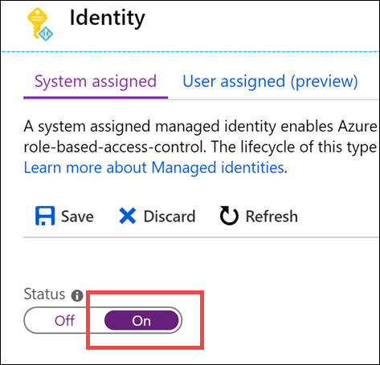

### Add Function Apps to Key Vault access policy

Perform these steps for **each of your Function Apps** to create an access policy that enables the "Get" secret permission:

1. Open your Key Vault service.

2. Select **Access policies**.

3. Select **+ Add new**.

4. Select the **Select principal** section on the Add access policy form.

    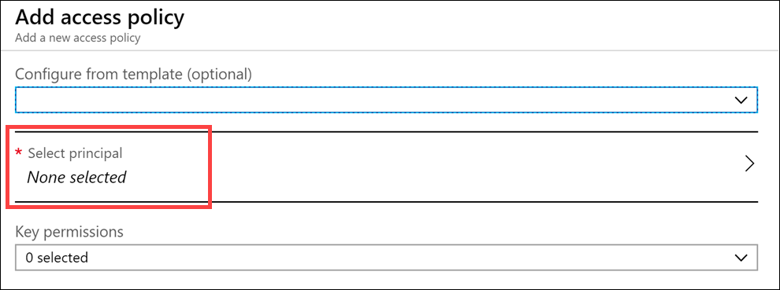

5. In the Principal blade, search for your Rideshare Function App's service principal, select it, then click the **Select** button.

    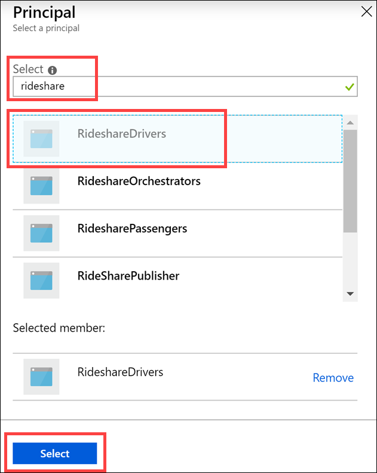

6. Expand the **Secret permissions** and check **Get** under Secret Management Operations.

    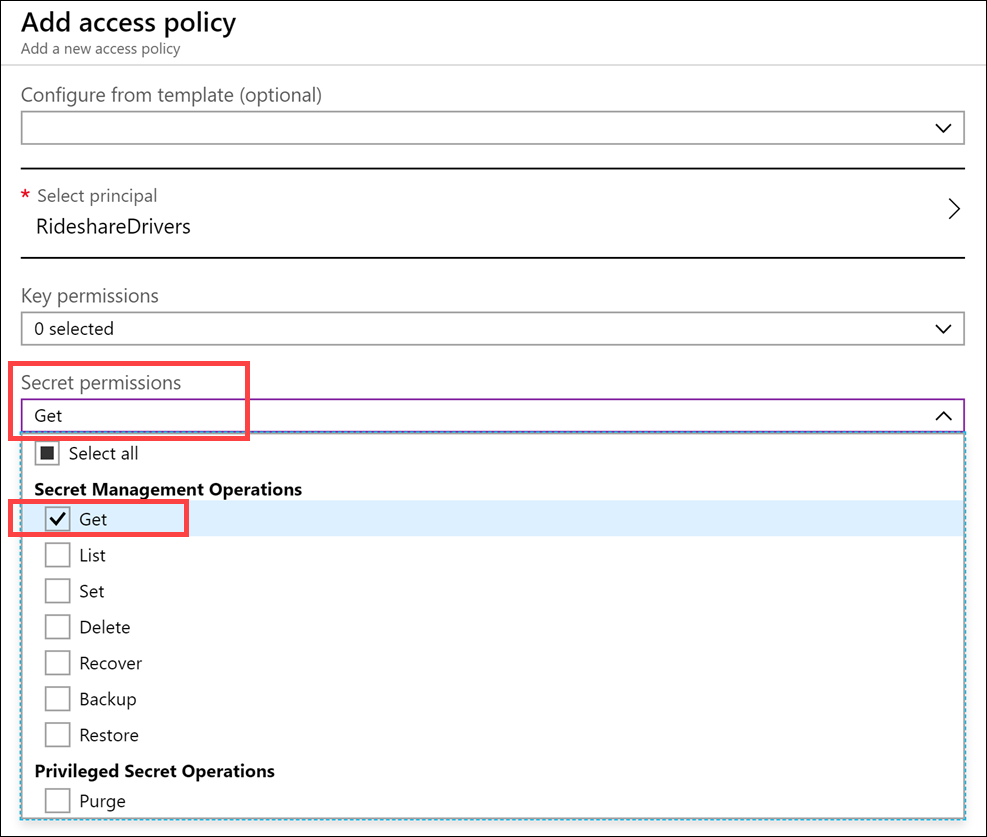

7. Select **OK** to add the new access policy. **Repeat** these steps for each Function App identity.

8. When you are done, you should have an access policy for each Function App's managed identity. Select **Save** to finish the process.

    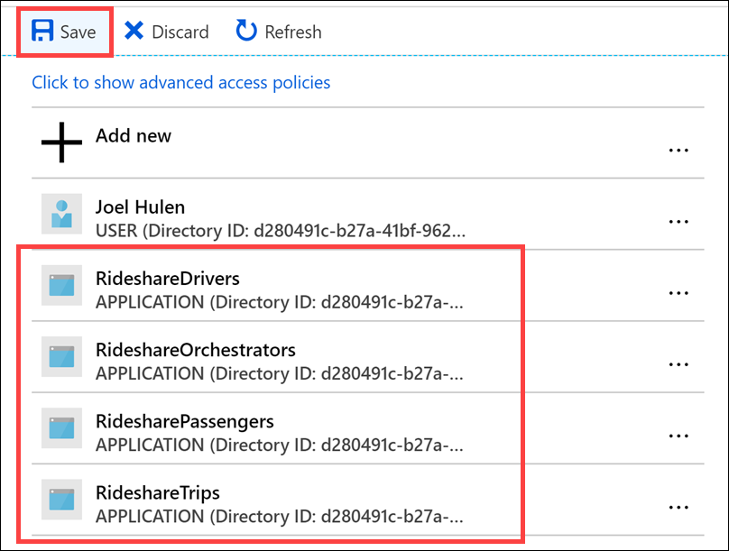

## Build the solution

### .NET

In order to build .NET solution from Visual Studio, you need:

- VS 2017 15.7 or later
- .NET Core 2.1 SDK Installed

### Node.js

In order to build Node.js Archiver Function App, you need:

- [Node.js](https://nodejs.org/) 8.11.4 or later

### Web

It is not required to build the website on your local machine. It is ready to deploy as-is. However, if you wish to build and run the website locally, you need:

- [Node.js](https://nodejs.org/) 8.9 or later
- Install Vue.js with NPM:

```shell
npm install vue
```

You may run the website in developer mode by opening a command prompt or terminal window, navigating to the web directory (`/web/serverless-microservices-web`), running `npm install` to download the NPM packages, then running the following command:

```shell
npm run serve
```

#### Create and populate settings.js

The website uses a `settings.js` file to store site-wide settings that are specific to your environment, such as URLs and keys. Due to the sensitive nature of these settings, the `settings.js` file is excluded from the source code by way of the `.gitignore` file located in the web project directory.

Creating the `settings.js` file locally in your web project directory is optional and only used if you decide to run the website locally. You will be adding this file to the deployed website that is hosted in your Azure Web App that was [created earlier](#create-the-web-app). However, it might be easier to create it locally first, then copy the contents of the file to its deployed location later.

1.  Open the **/web/serverless-microservices-web** directory in your favorite IDE, such as [Visual Studio Code](https://code.visualstudio.com/). Optionally, open a file explorer and navigate to this directory.

2.  Expand the **/public/js** folder. Copy `settings.sample.js` and save it as `settings.js` in this folder.

3.  Update the values within as follows:

| KEY | DESCRIPTION |
|---|---|
| window.authClientId | The B2C Client ID you [recorded earlier](#configure-azure-ad-b2c-tenant) |
| window.authAuthority | The B2C Authority URL you [recorded earlier](#create-a-sign-up-or-sign-in-policy) i.e. https://relecloudrideshare.b2clogin.com/tfp/relecloudrideshare.onmicrosoft.com/b2c_1_default-signin/v2.0 |
| window.authScopes | The B2C full Scope name (including URL) you [recorded earlier](#configure-azure-ad-b2c-tenant) i.e. https://relecloudrideshare.onmicrosoft.com/api/rideshare |
| window.authEnabled | true |
| window.apiKey | The APIM API key you [saved earlier](#retrieve-the-apim-api-key) |
| window.apiBaseUrl | The APIM Gateway URL, found on the Overview blade of your APIM service, i.e. https://rideshare.azure-api.net |
| window.apiDriversBaseUrl | ``${window.apiBaseUrl}/d`` |
| window.apiTripsBaseUrl | ``${window.apiBaseUrl}/t`` |
| window.apiPassengersBaseUrl | ``${window.apiBaseUrl}/p`` |
| window.signalrInfoUrl | The URL to your `signalrinfo` function within the Trips Function App, i.e. https://ridesharetripsfunctionapp.azurewebsites.net/api/signalrinfo |

#### Compile and minify for production

Because the SPA website runs on static files with no server-side rendering, you must compile and minify the files to make them production-ready. Your build configuration for the website that you create in the [next section within Azure DevOps](#azure-devops) will handle this for you in preparation for releasing the build to Azure. However, if you wish to run the command locally and manually copy the files yourself, perform the following:

1.  Open a command prompt or terminal window and navigate to the web directory (/web/serverless-microservices-web). Execute the following command:

```shell
npm run build
```

2.  Copy the files within the `/dist/` directory to your chosen deployment location. To manually upload these files to your Azure Web App, perform the following steps:

    1.  Open a web browser and go to: `https://{sitename}.scm.azurewebsites.net/DebugConsole` (Kudu).
    
    2.  Navigate to: `site/wwwroot`.

    3.  Drag and drop the files from your newly created `/dist/` directory to `site/wwwroot` in Kudu.

    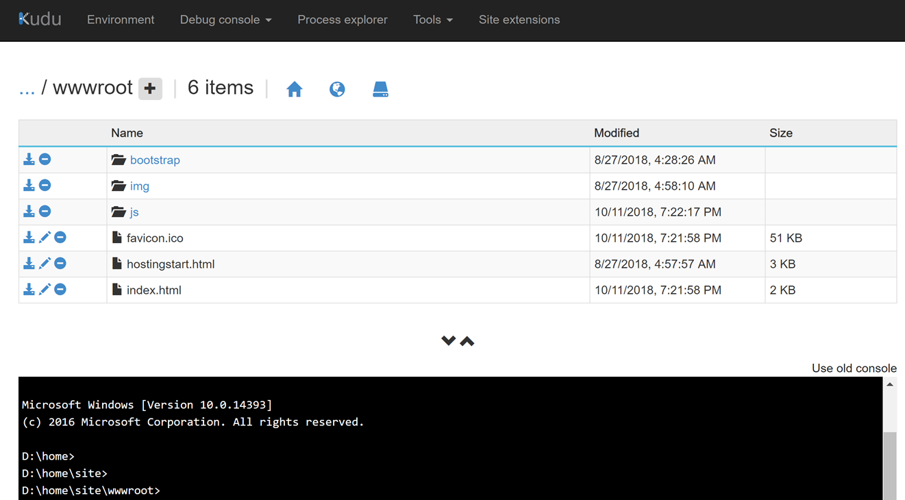

#### Create settings.js in Azure

You must upload or create the `settings.js` file for your website in Azure before it can function properly.

**Perform these steps after deploying your website to Azure**. You may continue on to the [Azure DevOps section below](#azure-devops) to initially deploy your site before coming back to this section to add the settings.js file. Otherwise, if you have followed the steps above to manually deploy the website, continue with the steps below:

1.  Open a web browser and go to: `https://{sitename}.scm.azurewebsites.net/DebugConsole` (Kudu).
    
2.  Navigate to: `site/wwwroot/js`.

3.  Click the **+** button next to **/ js** on the upper-left above the file list, then select **New file**.

    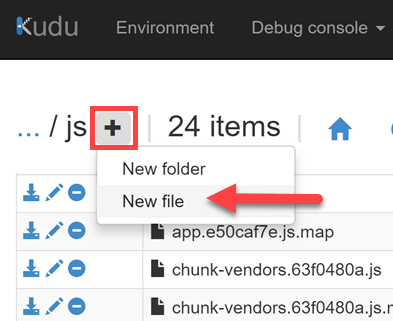

4.  Type the file name **settings.js**, then hit Enter on the keyboard.

    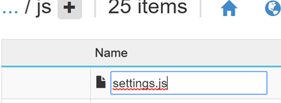

5.  Select the Edit icon (looks like a pencil) located to the left of the new settings.js file.

    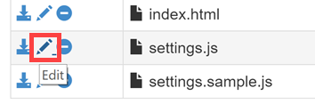

6.  Paste the contents of the local `settings.js` file you [created earlier](#create-and-populate-settingsjs), then click **Save**.

    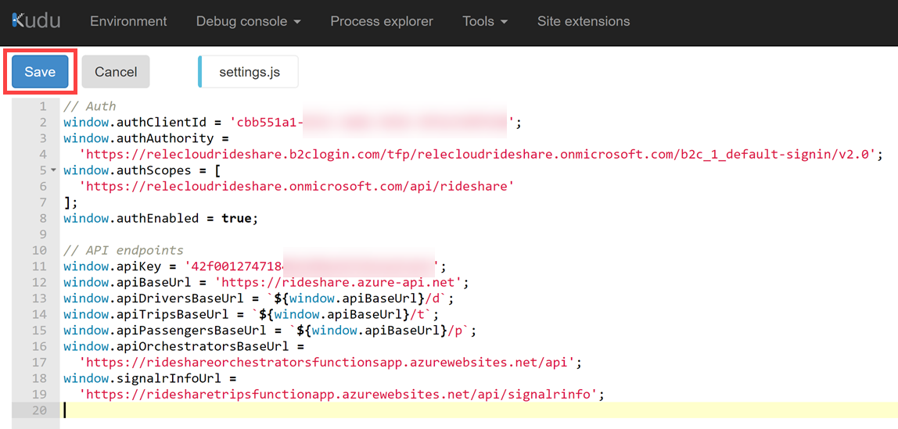

Alternatively, you can drag and drop your local settings.js file to the `site/wwwroot/js` directory in Kudu.

At this point, your website is all set. Your settings.js file will not get overwritten in subsequent deployments from Azure DevOps.

## Deployment

Function App deployments can happen from [Visual Studio]() IDE, [Azure DevOps](https://azure.microsoft.com/en-us/services/devops/) by defining a build pipeline that can be triggered upon push to the code repository, for example, or a build script such as [Cake](https://cakebuild.net/) or [Psake](https://github.com/psake/psake).

Relecloud decided to use [Azure DevOps](https://azure.microsoft.com/en-us/services/devops/) for production build and deployment and [Cake](https://cakebuild.net/) for development build and deployment.

### Azure DevOps

[Azure DevOps](https://docs.microsoft.com/en-us/azure/devops/index?view=vsts) provides development collaboration tools, source code repositories, and DevOps-specific services, such as [DevOps Pipelines](https://docs.microsoft.com/en-us/azure/devops/pipelines/?view=vsts), that help you easily set up continuous integration and continuous delivery (CI/CD) for your applications.

When configuring build pipelines, Azure Pipelines enables you to configure and automate your build and delivery tools and environments in YAML (as Infrastructure-as-Code) or through the visual designer in your Azure DevOps web portal at <https://dev.azure.com>. The preferred method is to use YAML files, as build configurations can be managed in code and included as part of the CI/CD process. The visual designer is good when you are new to creating CI/CD pipelines or are unsure of the available options.

While it is possible to define your release pipeline to Azure from within the YAML file, it is best practice to create a separate [release pipeline](https://docs.microsoft.com/en-us/azure/devops/pipelines/release/what-is-release-management?view=vsts&WT.mc_id=azurepipelines-blog-dabrady). This gives you the flexibility to build once and release to several places, including deployment slots.

This section will walk you through creating YAML-based build pipelines and separate release pipelines.

#### Prerequisites

- You need an Azure DevOps organization. If you don't have one, you can [create one for free](https://go.microsoft.com/fwlink/?LinkId=307137). If your team already has one, then make sure you're an administrator of the Azure DevOps project that you want to use.

- You need a GitHub account, where you can fork the serverless-microservices repository.

#### Create build pipelines

1.  Sign in to <https://dev.azure.com>.

2.  Go to your Azure DevOps project. If you don't have one, [create one](https://docs.microsoft.com/en-us/azure/devops/organizations/projects/create-project?view=vsts&tabs=new-nav).

3.  Select **Pipelines** from the menu, then **Builds**. Click the **New pipeline** button.

    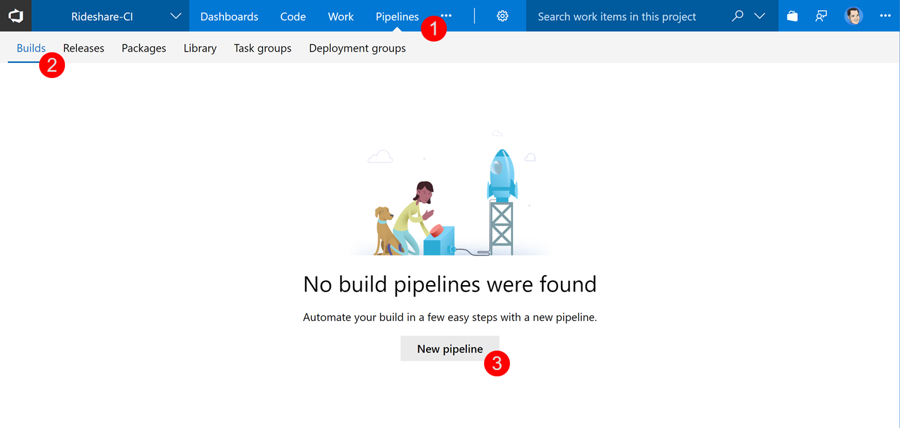

4.  Select **GitHub** as your source, then click the **Authorize using OAuth** button to create a secure connection with your GitHub account.

    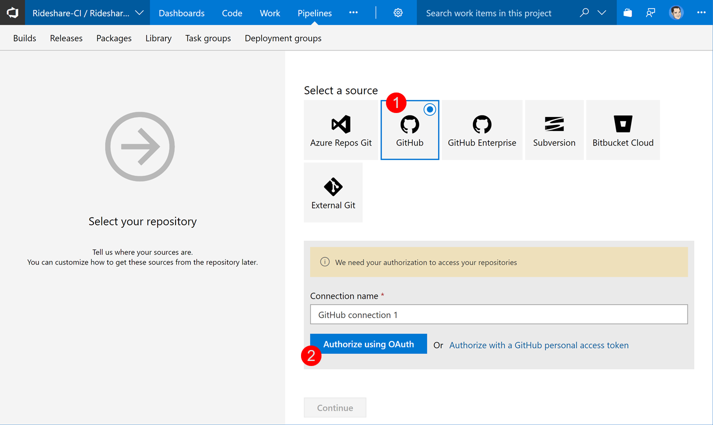

5.  Select the ellipses button (...) next to **Repository** to browse and select your forked repository. Make sure **master** is selected as the **default branch**, then select **Continue**.

    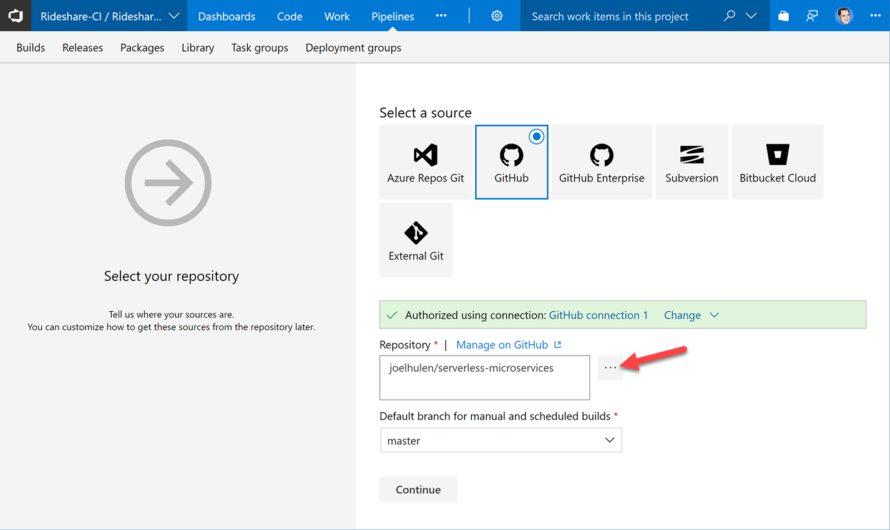

6.  Click the **Apply** button next to the **YAML** template.

    

7.  In the YAML build template form, enter **Rideshare-StaticWebsite-CI** into the Name field. Select **Hosted Linux Preview** under Agent pool, then select the ellipses button (...) next to the **YAML file path** textbox.

    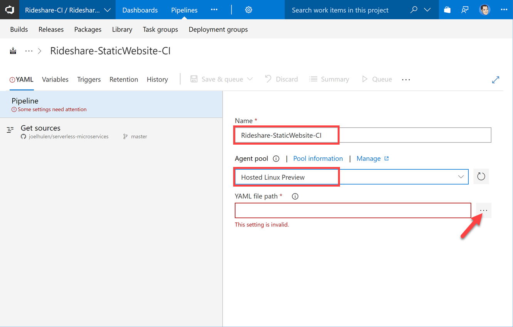

8.  In the Select path modal dialog box, expand the root repository folder, then expand `pipelines`, and expand `build`. Select **Rideshare-StaticWebsite-CI.yaml**, then select **OK**.

    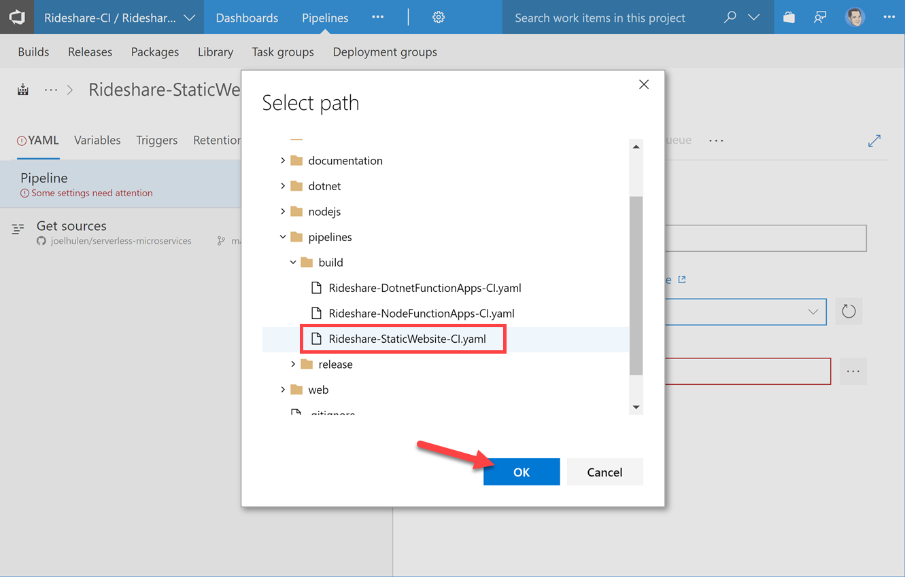

9.  Select the **Save & queue** menu item, then select **Save**.

    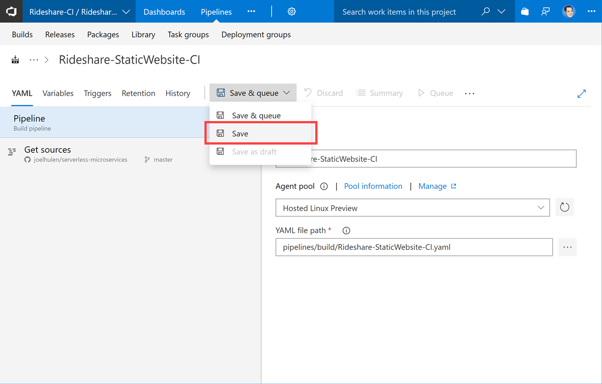

10. Select **Builds** under Pipelines, then select the **+ New** dropdown above the list of build pipelines on the left, then select **New build pipeline**.

    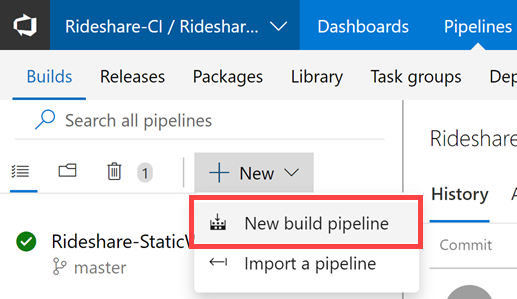

11. Repeat steps **5 through 9** to create the following additional build pipelines:

| Name | Agent pool | YAML file path |
| --- | --- | --- |
| Rideshare-DotnetFunctionApps-CI | Hosted Linux Preview | pipelines/build/Rideshare-DotnetFunctionApps-CI.yaml |
| Rideshare-NodeFunctionApps-CI | Hosted Linux Preview | pipelines/build/Rideshare-NodeFunctionApps-CI.yaml |

When you are finished creating the three build pipelines, your Builds page should look similar to the following screenshot:

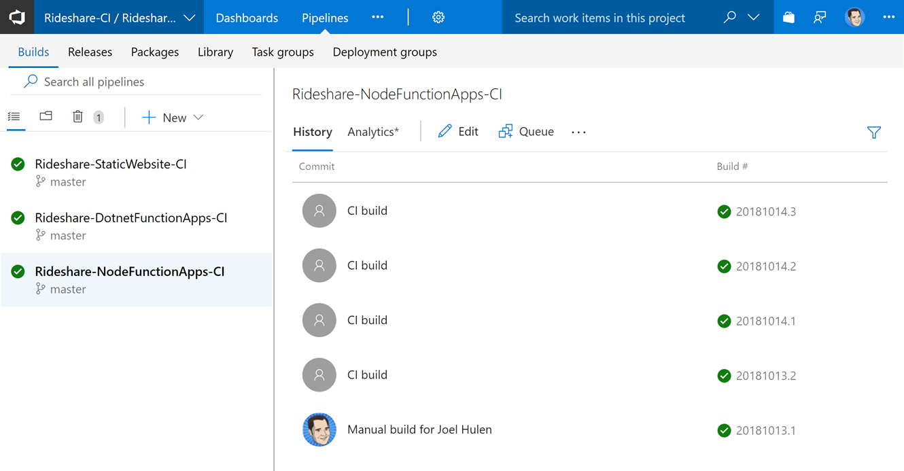

Notice that there are both manual builds and CI builds listed in the history. "CI build" represents the build agent that performed a continuous integration (CI) build, triggered by changes made to the master branch. Try committing new changes to automatically trigger a build.

To manually trigger a build, select **Queue**, then click the **Queue** button in the modal dialog box that appears:

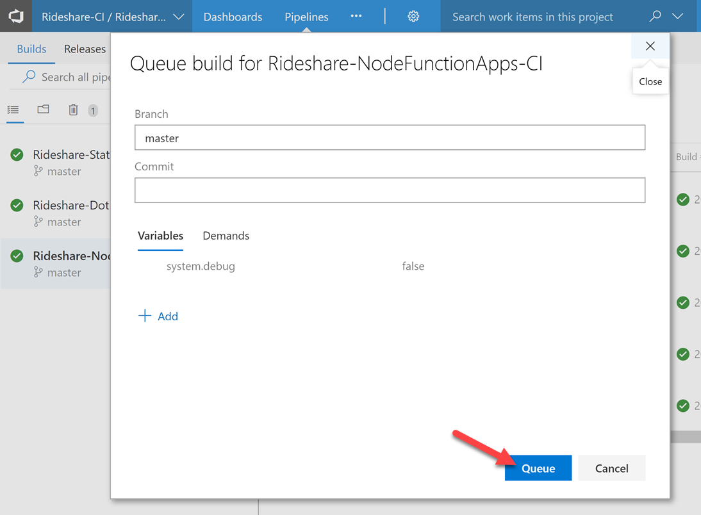

> Be sure to manually queue each of the three builds before continuing to the next section. **This is an important step**, as it will allow you to select the build artifacts when you configure the release pipeline for each.

#### Create release pipeline

We will begin by creating a new release pipeline for the static website, using the web interface. The section that follows will have you import the remaining two release pipelines to speed up the process.

:eight_spoked_asterisk: **Make sure** the App Settings (under [Application settings](https://docs.microsoft.com/en-us/azure/azure-functions/functions-how-to-use-azure-function-app-settings#settings)) for each of your Azure Function Apps are configured as shown in the [Function App Application Settings](#function-app-application-settings) section to reflect your own resource app settings and connection strings. Your deployed Function Apps will not work without these settings.

1.  Select **Pipelines** from the menu, then **Releases**. Click the **New pipeline** button.

    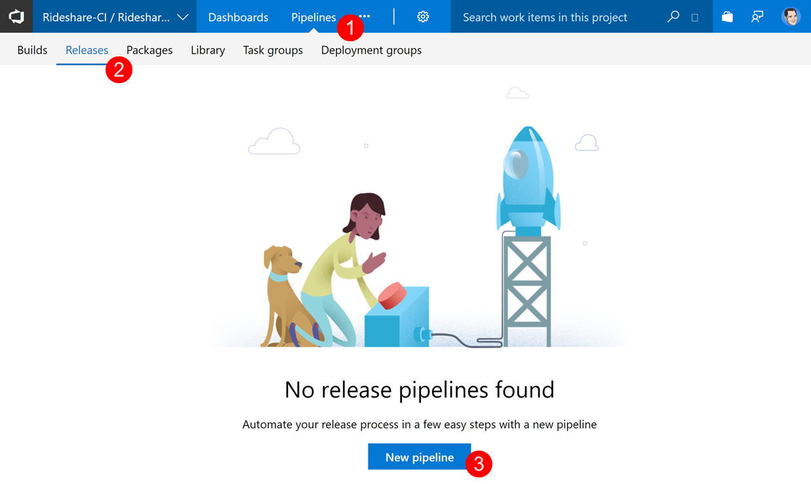

2.  Select **Azure App Service deployment** within the list of templates.

    

3.  Change the **Stage name** to "Web app".

    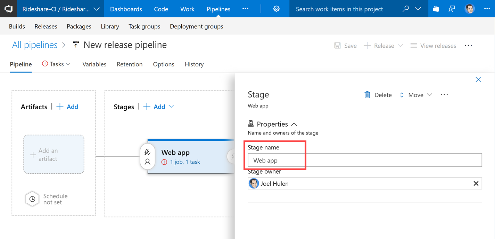

4.  Close the Stage dialog box, then select **+ Add an artifact** within the Artifacts box on the left-hand side of the pipeline.

5.  Select the **Build** source type. Select **Rideshare-StaticWebsite-CI** in the **Source** dropdown. Set **Default version** to **Latest**. Keep the default source alias, then select **Add**.

    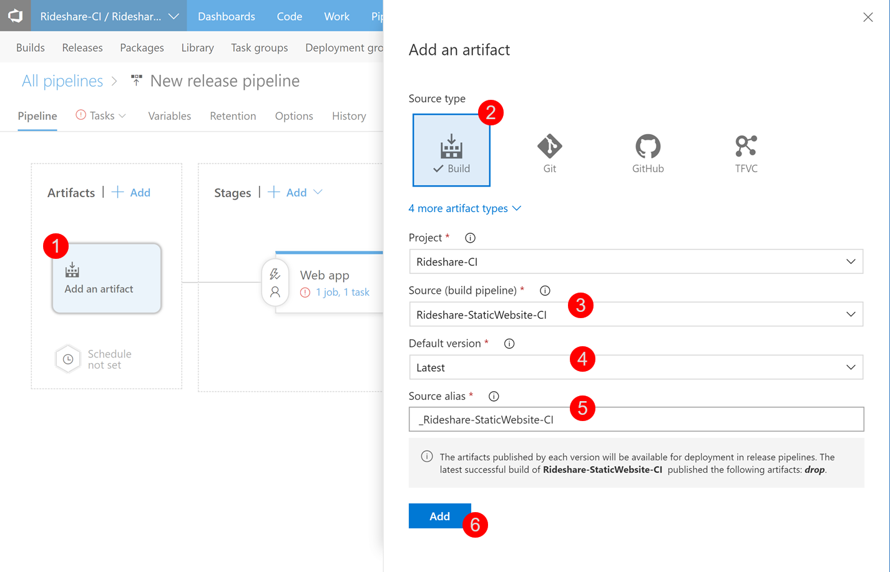

6.  Select the **1 job, 1 task** link under the Web app stage you created.

    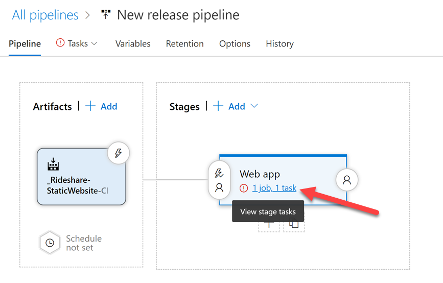

7.  Under the Web app stage configuration, select your Azure subscription from the dropdown list, then select **Authorize**. This creates a secure connection the release pipeline can use to deploy your website to Azure.

    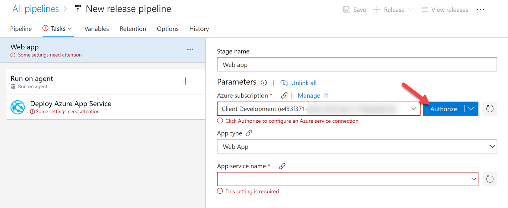

8.  Set the App type to **Web App**, then select your Web App you provisioned earlier, within the **App service name** dropdown list.

    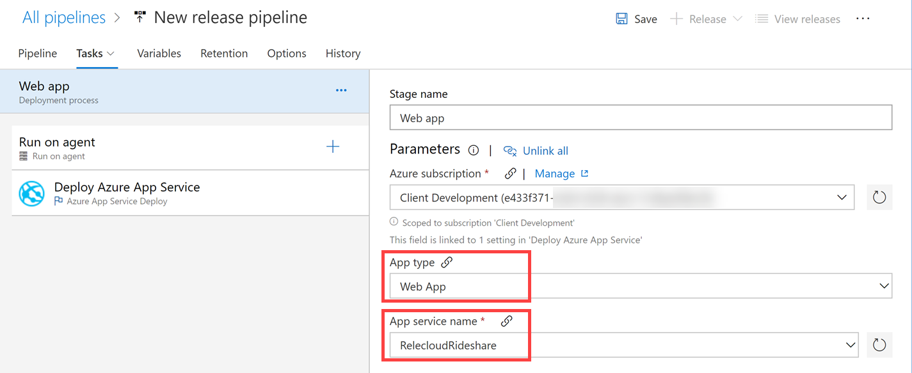

9.  Select the **Deploy Azure App Service** task on the left-hand side. Scroll down and select the ellipses button (...) next to the **Package or folder** textbox to browse the artifacts directory.

    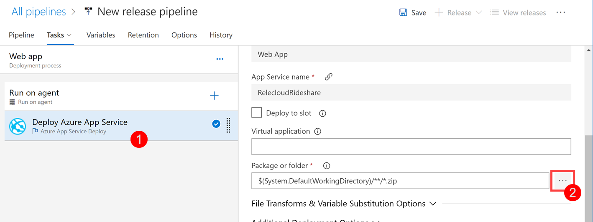

10. In the modal dialog box that appears, expand the Linked artifacts folder, then the _Rideshare-StaticWebsite-CI folder, and finally, the drop folder. Select **dist**, then click the **OK** button.

    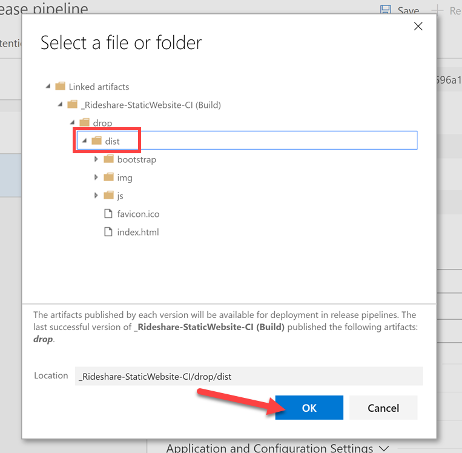

11. The **Package or folder** textbox should now be populated with `$(System.DefaultWorkingDirectory)/_Rideshare-StaticWebsite-CI/drop/dist`.

12. Select the "New release pipeline" title, and change it to **Static website release pipeline**. Next, select the **Save** button to the right. When the save dialog appears, click **OK**.

    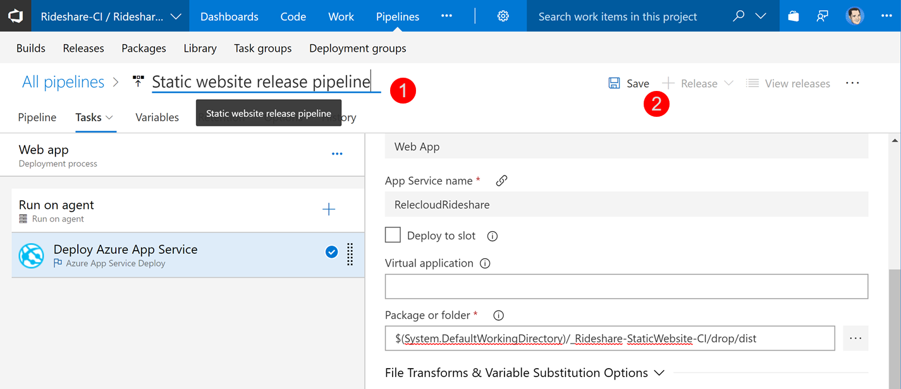

13. After saving, select **+ Release**, then **Create a release**.

    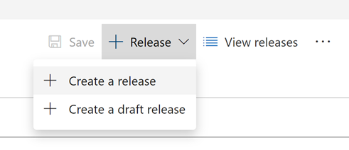

14. In the dialog that appears, select **Create**. You will see a notification afterwards that a release has been created. You can select the name of the release to view its progress.

    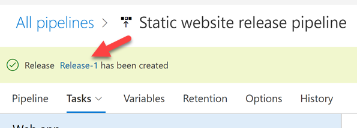

15. If all goes well, you should see that the release was successful, as indicated by the **Succeeded** status underneath the Web app stage.

    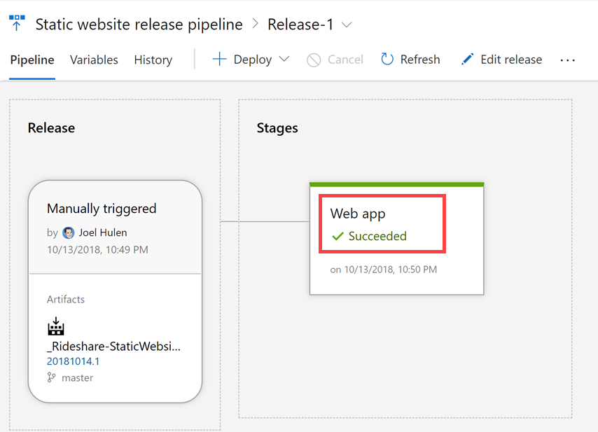

#### Import remaining two release pipelines

Release pipelines can be exported as a `.json` file. This is especially useful for more complex pipelines, as you will see with the .NET-based Function App release pipeline. In this section, you will import the release pipelines for the Azure Function Apps.

1.  Select **Pipelines** from the menu, then **Releases**.

2.  Select **+ New**, then **Import a pipeline**.

    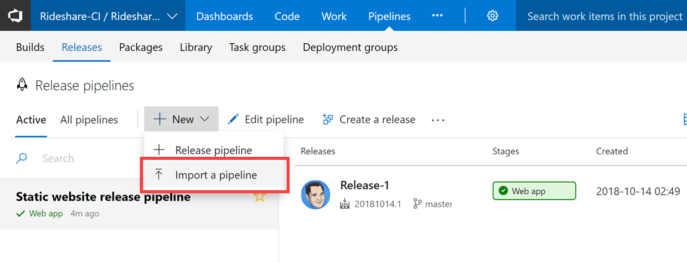

3.  Select **Browse** within the "Import release pipeline" dialog box. Browse your file system to the local directory containing this project. Select the following file: `\pipelines\release\Function-apps-release-pipeline.json`. Finally, click the **OK** button on the dialog.

    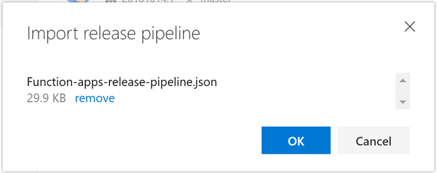

4.  You should see the following release pipeline, which includes stages for the Drivers, Trips, Orchestrators, and Passengers Function Apps:

    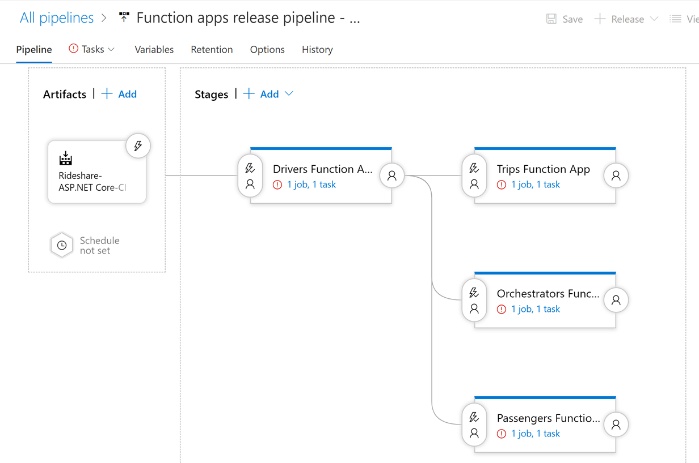

5.  Notice that the Tasks menu items has a red circle icon with an exclamation mark inside. This means it contains tasks that need your attention. Select **Tasks**, then **Drivers Function App**. First, select your linked **Azure subscription**, then select the **App service name** for your Drivers Function App.

    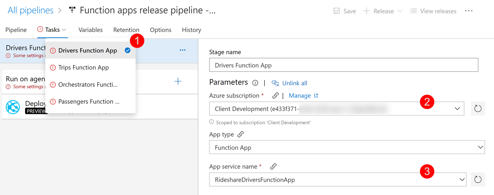

6.  Select the **Run on agent** job on the left-hand side. Select **Hosted VS2017** underneath Agent pool.

    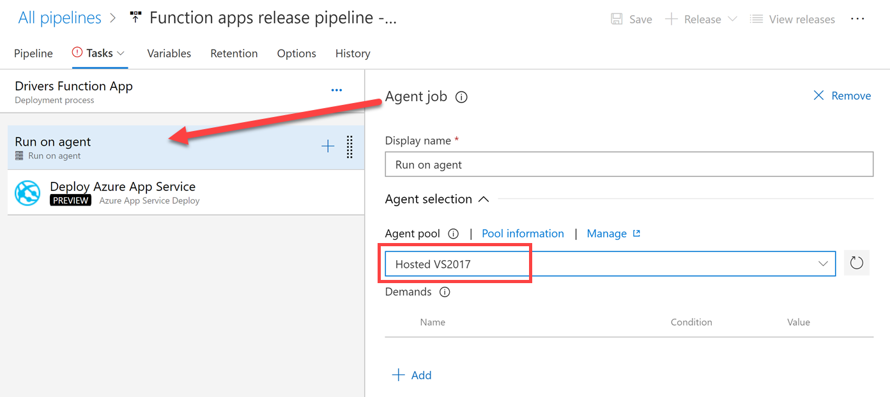

7.  Repeat steps **5 and 6** for the remaining tasks: Trips Function App, Orchestrators Function App, and Passengers Function App. When you are done, there should be no more tasks that need your attention (marked with the red circle icon). When you are done, select **Save** on top of the page.

    > **Note**: When you select the "Deploy Azure App Service" step on any of the tasks, make note of the following items of interest: each has a specific Zip file selected for the "Package or folder" setting. This is what allows us to deploy from several different Function App projects that are part of the Visual Studio solution. Also, the RunFromZip deployment method is selected for each. This allows us to reduce cold start times for the Function Apps by copying just the Zip file and running from it without extracting it, each time a new VM is provisioned to host the Function App. This is much faster than copying many small files or even extracting a Zip.

    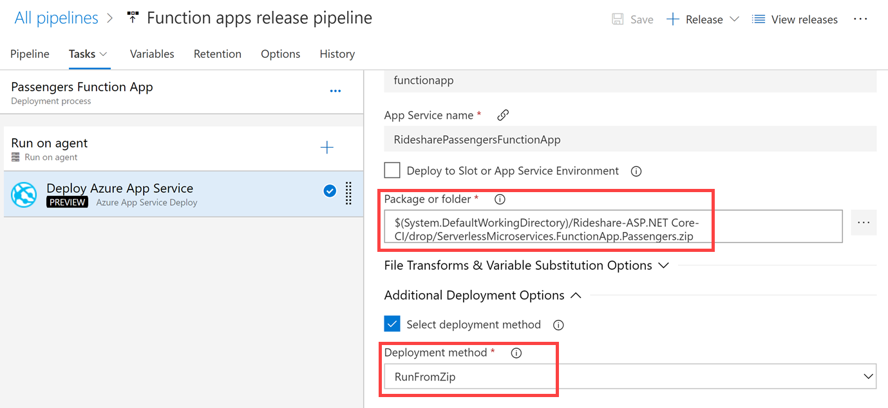

8.  After saving, select **+ Release**, then **Create a release**.

    

9.  In the dialog that appears, select **Create**. You will see a notification afterwards that a release has been created. You can select the name of the release to view its progress.

10. Verify that the release to each Function App was successfully completed.

    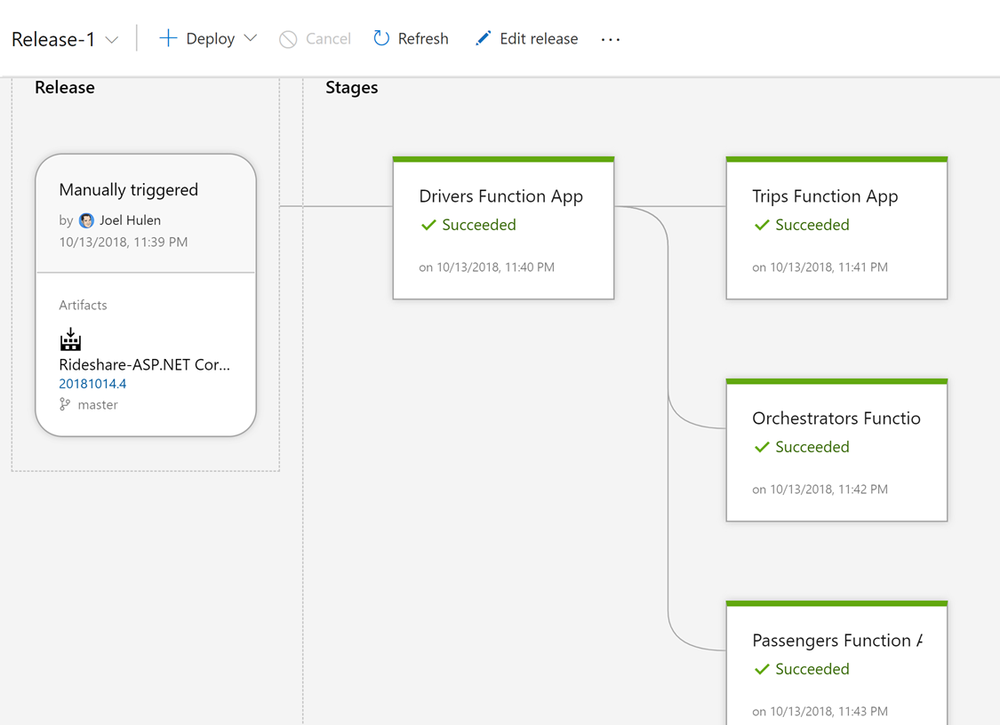

11. Select **Pipelines** from the menu, then **Releases**.

12. Select **+ New**, then **Import a pipeline**.

    

13. Select **Browse** within the "Import release pipeline" dialog box. Browse your file system to the local directory containing this project. Select the following file: `\pipelines\release\Node-function-apps-release-pipeline.json`. Finally, click the **OK** button on the dialog.

    

14. You should see the following release pipeline, which deploys the node.js-based Trip Archiver Function App:

    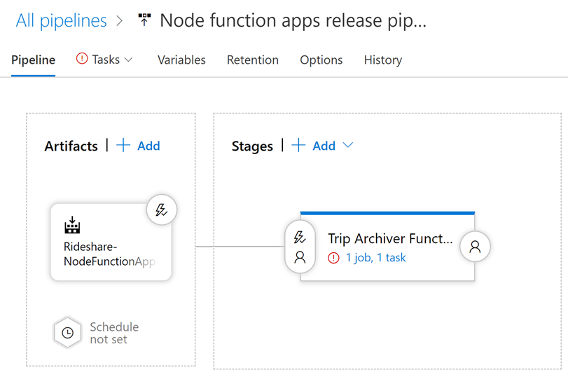

15. Select **Tasks**, then **Trip Archiver Function App**.

16. Select the **Run on agent** job on the left-hand side. Select **Hosted VS2017** underneath Agent pool.

17. Select the **Azure App Service Deploy** task on the left-hand side. Select your linked **Azure subscription**, then select your Trip Archiver's Function App from the **App Service name** dropdown.

    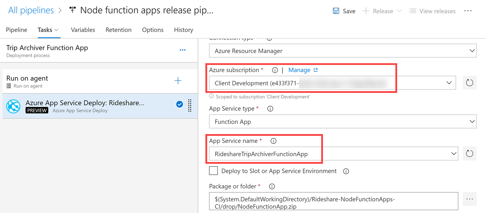

18. Select **Save** on top of the page.

19. After saving, select **+ Release**, then **Create a release**.

    

20. In the dialog that appears, select **Create**. You will see a notification afterwards that a release has been created. You can select the name of the release to view its progress.

21. Verify that the release to the Trip Archiver Function App was successfully completed.

    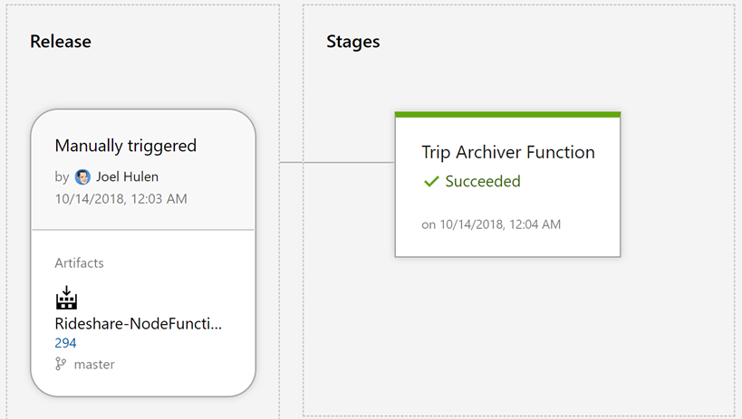

### Cake Deployment

The `Cake` script responsible to `deploy` and `provision` is included in the `dotnet` source directory. In order to run the Cake Script locally and deploy to your Azure Subscription, there are some pre-requisites. Please refer to the [Cake](#cake-provision) provision section to know how to do this.

**Make sure** the `settings` are updated as shown in the [Function App Application Settings](#function-app-application-settings) section to reflect your own resource app settings and connection strings.

Once all of the above is in place, Cake is now able to authenticate and deploy the C# function apps.

:eight_spoked_asterisk: **Please note** that you must adjust the `cake/paths.cake` file to match your resource names. The `public static class Resources` class defines the resource names.

From a PowerShell command, use the following commands for the `Dev` environment:

- `./build.ps1 -Target Deploy -Configuration Debug -ScriptArgs '--Site=Drivers','--App=ServerlessMicroservices.FunctionApp.Drivers','--Env=Dev'`
- `./build.ps1 -Target Deploy -Configuration Debug -ScriptArgs '--Site=Orchestrators','--App=ServerlessMicroservices.FunctionApp.Orchestrators','--Env=Dev'`
- `./build.ps1 -Target Deploy -Configuration Debug -ScriptArgs '--Site=Trips','--App=ServerlessMicroservices.FunctionApp.Trips','--Env=Dev'`
- `./build.ps1 -Target Deploy -Configuration Debug -ScriptArgs '--Site=Passengers','--App=ServerlessMicroservices.FunctionApp.Passengers','--Env=Dev'`

From a PowerShell command, use the following commands for the `Prod` environment:

- `./build.ps1 -Target Deploy -Configuration Release -ScriptArgs '--Site=Drivers','--App=ServerlessMicroservices.FunctionApp.Drivers','--Env=Prod'`
- `./build.ps1 -Target Deploy -Configuration Release -ScriptArgs '--Site=Orchestrators','--App=ServerlessMicroservices.FunctionApp.Orchestrators','--Env=Prod'`
- `./build.ps1 -Target Deploy -Configuration Release -ScriptArgs '--Site=Trips','--App=ServerlessMicroservices.FunctionApp.Trips','--Env=Prod'`
- `./build.ps1 -Target Deploy -Configuration Release -ScriptArgs '--Site=Passengers','--App=ServerlessMicroservices.FunctionApp.Passengers','--Env=Prod'`

## Seeding

The .NET `ServerlessMicroservices.Seeder` project contains a seeding command that can be used to seed `drivers` using the `Drivers APIs`.

**Please note** that the `seed` command will seed drivers only if there are no drivers.

> You must set the **EnableAuth** App Setting on the **Drivers** and **Passengers** Function Apps to `false` for the seeder to work.

```
> ServerlessMicroservices.Seeder.exe seed --help

Usage:  seed [options]

Options:
  --help               Show help information
  -t|--seeddriversurl  Set seed drivers url
  -t|--testurl         Set test url
  -i|--testiterations  Set test iterations
  -s|--testseconds     Set test seconds
  -v|--signalrinfourl  Set SignalR Info URL

> ServerlessMicroservices.Seeder.exe seed --seeddriversurl https://ridesharedrivers.azurewebsites.net
```

## Containers

We have seen in the [deployment](#deployment) section, Function Apps in Azure are usually hosted in `App Services`. They can also run locally during development. However, there are other compelling deployment options if we are able to containerize the Functions Apps as Docker images. 

This is made easier in Function Apps v2 since they run on `.NET Core` and hence cross-platform. This means that Function Apps can be containerized as Docker images and then deployed to one of many possibilities:

- Docker on a VM or development machine with [Docker installed](https://docs.docker.com/docker-for-windows/)
- [Azure Container Instances ACI](https://azure.microsoft.com/en-us/services/container-instances/)
- [Azure Kubernetes Service AKS](https://azure.microsoft.com/en-us/services/kubernetes-service/)  
- Other Cloud providers
- On-Premises

**Please note** that when Function Apps are not run in Azure consumption plan, it implies that:

- The micro billing and the auto-scaling features are no longer applicable.
- The connected Azure resources such as storage and event grids will still run in Azure.

### Docker Files

It turned out that Microsoft produces a Docker image for Azure Functions .NET Core V2 and is available via [DockerHub](https://cloud.docker.com):
```
microsoft/azure-functions-dotnet-core2.0
```

In the `Dockerfiles` folder of the `.NET` source code, there is a `docker` file for each .NET function app:

**Drivers**:

```docker
FROM microsoft/azure-functions-dotnet-core2.0:2.0

COPY ./ServerlessMicroservices.FunctionApp.Drivers/bin/Debug/netstandard2.0 /home/site/wwwroot
```

**Passengers**:

```docker
FROM microsoft/azure-functions-dotnet-core2.0:2.0

COPY ./ServerlessMicroservices.FunctionApp.Passengers/bin/Debug/netstandard2.0 /home/site/wwwroot
```

**Orchestrators**:

```docker
FROM microsoft/azure-functions-dotnet-core2.0:2.0

COPY ./ServerlessMicroservices.FunctionApp.Orchestrators/bin/Debug/netstandard2.0 /home/site/wwwroot
```

**Trips**:

```docker
FROM microsoft/azure-functions-dotnet-core2.0:2.0

COPY ./ServerlessMicroservices.FunctionApp.Trips/bin/Debug/netstandard2.0 /home/site/wwwroot
```

The `Dockerfile` is straightforward! We base it on the `microsoft/azure-functions-dotnet-core2.0` image with `v2~2` tag (as it is the current version) and we copy the output of the `bin\<build>\netstandard2.0` to the `wwwroot` of the image.

### Docker Images

**Please note** that this assumes that you have `Docker` installed on your Windows or Mac development machine.

Once the .NET solution is built, we can generate the `Docker` images for each function app:

```
docker build -t rideshare-drivers:v1 -f dockerfiles/drivers .
docker build -t rideshare-passengers:v1 -f dockerfiles/passengers .
docker build -t rideshare-orchestrators:v1 -f dockerfiles/orchestrators .
docker build -t rideshare-trips:v1 -f dockerfiles/trips .
```

The `docker build` command uses the `dockerfile` specified in the `-f` switch, produces an image and tags it i.e. `rideshare-drivers:v1`.

Once the above commands are run, issue `docker images` to make sure that the images do exist with proper tags. By the way, you can remove an image by ID using `docker rmi <id>`.

**Please note** that there are some source code changes to support containers:

- The Functions Authorization Level is set to `Anonymous` instead of `Function`:
```csharp
[FunctionName("GetTrips")]
public static async Task<IActionResult> GetTrips([HttpTrigger(AuthorizationLevel.Anonymous, "get", Route = "trips")] HttpRequest req,
    ILogger log)
```
- Changed the `DocumentDB` client not to use `TCP Direct Mode`! It turned out it is not supported in `Linux` which caused `Upserts` against Cosmos to cause `Service Unavailable` error. There is an issue in `GitHub` on [this](https://github.com/Azure/azure-cosmosdb-dotnet/issues/194).  

### Running Locally

Now that the `Docker` images are produced, we can use `docker` commands to start the containers locally. Because the containers require the environment variables to be fed into the container at `run` time, we point to a file that contains the settings in the format required by `Docker`:

```
docker run --env-file settings/RideShareDriversDockerDev-AppSettings.csv -p 8080:80 rideshare-drivers:v1
docker run --env-file settings/RideSharePassengersDockerDev-AppSettings.csv -p 8081:80 rideshare-passengers:v1
docker run --env-file settings/RideShareOrchestratorsDockerDev-AppSettings.csv -p 8082:80 rideshare-orchestrators:v1
docker run --env-file settings/RideShareTripsDockerDev-AppSettings.csv -p 8083:80 rideshare-trips:v1
```

**Please note**:

- The `settings` folder contains all the environment variables for each function app.
- The [Docker environment variables via a file](https://docs.docker.com/engine/reference/commandline/run/#set-environment-variables--e---env---env-file) requires that KEYs and VALUEs be separated by a `=`. 
- Map different port for each function app so we do not get into a conflict. So `Drivers` is mapped to 8080, `Passengers` is mapped to 8081, `Orchestrators` is mapped to 8082 and `Trips` is mapped to 8083. 
- The connected Azure resources are still in Azure. For example, Cosmos DB and the storage accounts are still pointing to Azure.
- Issue `docker ps` command to make sure that the containers are running.

Once the containers are running, use something like `Postman` to interact with the different function apps using their respective ports. For example:

| Function App | Verb | URL | Description |
|---|---|---|---|
| Drivers | GET | `GET http://localhost:8080/api/drivers` | Retrieve all drivers  | 
| Trips | GET | `GET http://localhost:8083/api/trips` | Retrieve all trips  | 
| Trips | POST | `POST http://localhost:8083/api/trips` | Create a new trip  |

### Running in ACI

In order to deploy our containers to [Azure Container Instances ACI](https://azure.microsoft.com/en-us/services/container-instances/), we must first publish them to a container registry such as [DockerHub](https://cloud.docker.com) or [Azure Container Registry](https://azure.microsoft.com/en-us/services/container-registry/). For our demo purposes, we can publish to [DockerHub](https://cloud.docker.com). Let us `tag` each container and `push`:

```
docker tag rideshare-drivers:v1 joesmith/rideshare-drivers:v1
docker push joesmith/rideshare-drivers:v1
docker tag rideshare-passengers:v1 joesmith/rideshare-passengers:v1
docker push joesmith/rideshare-passengers:v1
docker tag rideshare-orchestrators:v1 joesmith/rideshare-orchestrators:v1
docker push joesmith/rideshare-orchestrators:v1
docker tag rideshare-trips:v1 joesmith/rideshare-trips:v1
docker push joesmith/rideshare-trips:v1
```

**Please note** that the above requires that you have signed in to [Docker hub](https://cloud.docker.com) account.

In order to actually create an ACI , we use [Azure CLI](https://docs.microsoft.com/en-us/cli/azure/) with `YAML` files to drive the properties and setup the container environment variables. In the `yamlfiles` folder of the `.NET` source code, there is a `yaml` file for each .NET function app. Here is a sample:

```yaml
apiVersion: 2018-06-01
location: eastus
name: rideshare-drivers
properties:
  containers:
  - name: rideshare-drivers
    properties:
      environmentVariables:
        - "name": "APPINSIGHTS_INSTRUMENTATIONKEY"
          "value": "<your-own>"
        - "name": "FUNCTIONS_EXTENSION_VERSION"
          "value": "~2"
        - "name": "AzureWebJobsDashboard"
          "value": "<your-own>"
        - "name": "AzureWebJobsStorage"
          "value": "<your-own>"
        - "name": "DocDbApiKey"
          "value": "<your-own>"
        - "name": "DocDbEndpointUri"
          "value": "<your-own>"
        - "name": "DocDbRideShareDatabaseName"
          "value": "RideShare"
        - "name": "DocDbRideShareMainCollectionName"
          "value": "Main"
        - "name": "DocDbThroughput"
          "value": 400
        - "name": "InsightsInstrumentationKey"
          "value": "<your-own>"
        - "name": "IsRunningInContainer"
          "value": "true"
        - "name": "IsPersistDirectly"
          "value": "true"
        - "name": "AuthorityUrl"
          "value": "<your-own>"
        - "name": "ApiApplicationId"
          "value": "<your-own>"
        - "name": "ApiScopeName"
          "value": "rideshare"
        - "name": "EnableAuth"
          "value": "false"
      image: joesmith/rideshare-drivers:v1
      ports: 
      - port: 80
      resources:
        requests:
          cpu: 1.0
          memoryInGB: 1.5
  osType: Linux
  ipAddress:
    type: Public
    dnsNameLabel: rideshare-drivers
    ports:
      - protocol: tcp
        port: '80'
  restartPolicy: Always
tags: null
type: Microsoft.ContainerInstance/containerGroups
```
 
**Please note** the following requires that you log in to Azure using `az login`. To learn how to manage ACI using [Azure CLI](https://docs.microsoft.com/en-us/cli/azure/?view=azure-cli-latest), please use this [link](https://docs.microsoft.com/en-us/cli/azure/container?view=azure-cli-latest).

In order to create the ACIs:

```
az container create --resource-group serverless-microservices-dev --file yamlfiles/aci_drivers.yaml
az container create --resource-group serverless-microservices-dev --file yamlfiles/aci_passengers.yaml
az container create --resource-group serverless-microservices-dev --file yamlfiles/aci_orchestrators.yaml
az container create --resource-group serverless-microservices-dev --file yamlfiles/aci_trips.yaml
```

In order to check on the provision status of the ACIs:

```
az container show -n rideshare-drivers -g serverless-microservices-dev
az container show -n rideshare-passengers -g serverless-microservices-dev
az container show -n rideshare-orchestrators -g serverless-microservices-dev
az container show -n rideshare-trips -g serverless-microservices-dev
```

In order to check the logs of the ACIs:

```
az container logs -n rideshare-drivers -g serverless-microservices-dev
az container logs -n rideshare-passengers -g serverless-microservices-dev
az container logs -n rideshare-orchestrators -g serverless-microservices-dev
az container logs -n rideshare-trips -g serverless-microservices-dev
```

In order to delete the ACIs:

```
az container delete -n rideshare-drivers -g serverless-microservices-dev --yes -y
az container delete -n rideshare-passengers -g serverless-microservices-dev --yes -y
az container delete -n rideshare-orchestrators -g serverless-microservices-dev --yes -y
az container delete -n rideshare-trips -g serverless-microservices-dev --yes -y
```

Once the containers are running, use something like `Postman` to interact with the different function apps using their respective urls. For example:

| Function App | Verb | URL | Description |
|---|---|---|---|
| Drivers | GET | `GET http://rideshare-drivers.eastus.azurecontainer.io/api/drivers` | Retrieve all drivers  | 
| Trips | GET | `GET http://rideshare-trips.eastus.azurecontainer.io/api/trips` | Retrieve all trips  | 
| Trips | POST | `POST http://rideshare-trips.eastus.azurecontainer.io/api/trips` | Create a new trip  | 

### Running in AKS

[Azure AKS](https://azure.microsoft.com/en-us/services/kubernetes-service/) provides much more robust way to deploy and manage the different containers as it provides orchestration and self-healing capabilities. 

Since we already have the rideshare Docker images pushed to [DockerHub](https://cloud.docker.com), all we really need to do is to create an AKS cluster and deploy the rideshare app. 

Here is a PowerShell script that can be used to provision a 1-node AKS cluster:

```powershell
# Login to Azure - the client-id, the client-password and the tenant password are the same as setup in the Cake provision section
az login --service-principal -u <your-client-id> -p <your-client-password> --tenant <your-tenant-id>

# Display all accounts
az account list --output table

# Make sure you are using the proper subs
az account set --subscription "your-subs"

# Create a resource group
az group create --name serverless-microservices-k8s --location eastus

# Create a 1-node AKS cluster 
az aks create --resource-group serverless-microservices-k8s --name rideshareAKSCluster --service-principal <your-client-id> --client-secret <your-password>  --node-count 1 --enable-addons monitoring --generate-ssh-keys

# Make sure Kubectl is installed
az aks install-cli

# Allow Kubectrl use the cluster by getting the cluster credentials
az aks get-credentials --resource-group serverless-microservices-k8s --name rideshareAKSCluster 

# Check the cluster nodes
kubectl get nodes

# Deploy the rideshare app
kubectl apply -f rideshare-app.yaml

# Wait until the services expose drivers, passengers and trips to the Internet 
kubectl get service rideshare-drivers --watch
kubectl get service rideshare-passengers --watch
kubectl get service rideshare-trips --watch
```

The `rideshare-app-yaml` can be defined this way:

```yaml
apiVersion: apps/v1beta1
kind: Deployment
metadata:
  name: rideshare-drivers
spec:
  replicas: 1
  template:
    metadata:
      labels:
        app: rideshare-drivers
    spec:
      containers:
      - name: rideshare-drivers
        image: khaledhikmat/rideshare-drivers:v1
        ports:
        - containerPort: 80
        env:
        - "name": "APPINSIGHTS_INSTRUMENTATIONKEY"
          "value": "<your-own>"
        - "name": "FUNCTIONS_EXTENSION_VERSION"
          "value": "~2"
        - "name": "AzureWebJobsDashboard"
          "value": "<your-own>"
        - "name": "AzureWebJobsStorage"
          "value": "<your-own>"
        - "name": "DocDbApiKey"
          "value": "<your-own>"
        - "name": "DocDbEndpointUri"
          "value": "<your-own>"
        - "name": "DocDbRideShareDatabaseName"
          "value": "RideShare"
        - "name": "DocDbRideShareMainCollectionName"
          "value": "Main"
        - "name": "DocDbThroughput"
          "value": "400"
        - "name": "InsightsInstrumentationKey"
          "value": "<your-own>"
        - "name": "IsRunningInContainer"
          "value": "true"
        - "name": "IsPersistDirectly"
          "value": "true"
        - "name": "AuthorityUrl"
          "value": "https://relecloudrideshare.b2clogin.com/tfp/relecloudrideshare.onmicrosoft.com/b2c_1_default-signin/v2.0"
        - "name": "ApiApplicationId"
          "value": "<your-own>"
        - "name": "ApiScopeName"
          "value": "rideshare"
        - "name": "EnableAuth"
          "value": "false"
---
apiVersion: v1
kind: Service
metadata:
  name: rideshare-drivers
spec:
  type: LoadBalancer
  ports:
  - port: 80
  selector:
    app: rideshare-drivers
---
apiVersion: apps/v1beta1
kind: Deployment
metadata:
  name: rideshare-passengers
spec:
  replicas: 1
  template:
    metadata:
      labels:
        app: rideshare-passengers
    spec:
      containers:
      - name: rideshare-passengers
        image: khaledhikmat/rideshare-passengers:v1
        ports:
        - containerPort: 80
        env:
        - "name": "APPINSIGHTS_INSTRUMENTATIONKEY"
          "value": "<your-own>"
        - "name": "FUNCTIONS_EXTENSION_VERSION"
          "value": "~2"
        - "name": "AzureWebJobsDashboard"
          "value": "<your-own>"
        - "name": "AzureWebJobsStorage"
          "value": "<your-own>"
        - "name": "DocDbApiKey"
          "value": "<your-own>"
        - "name": "DocDbEndpointUri"
          "value": "<your-own>"
        - "name": "DocDbRideShareDatabaseName"
          "value": "RideShare"
        - "name": "DocDbRideShareMainCollectionName"
          "value": "Main"
        - "name": "DocDbThroughput"
          "value": "400"
        - "name": "InsightsInstrumentationKey"
          "value": "<your-own>"
        - "name": "IsRunningInContainer"
          "value": "true"
        - "name": "IsPersistDirectly"
          "value": "true"
        - "name": "GraphTenantId"
          "value": "<your-own>"
        - "name": "GraphClientSecret"
          "value": "<your-own>"
        - "name": "AuthorityUrl"
          "value": "https://relecloudrideshare.b2clogin.com/tfp/relecloudrideshare.onmicrosoft.com/b2c_1_default-signin/v2.0"
        - "name": "ApiApplicationId"
          "value": "<your-own>"
        - "name": "ApiScopeName"
          "value": "rideshare"
        - "name": "EnableAuth"
          "value": "false"
---
apiVersion: v1
kind: Service
metadata:
  name: rideshare-passengers
spec:
  type: LoadBalancer
  ports:
  - port: 80
  selector:
    app: rideshare-passengers
---
apiVersion: apps/v1beta1
kind: Deployment
metadata:
  name: rideshare-orchestrators
spec:
  replicas: 1
  template:
    metadata:
      labels:
        app: rideshare-orchestrators
    spec:
      containers:
      - name: rideshare-orchestrators
        image: khaledhikmat/rideshare-orchestrators:v1
        ports:
        - containerPort: 80
        env:
        - "name": "APPINSIGHTS_INSTRUMENTATIONKEY"
          "value": "<your-own>"
        - "name": "FUNCTIONS_EXTENSION_VERSION"
          "value": "~2"
        - "name": "AzureWebJobsDashboard"
          "value": "<your-own>"
        - "name": "AzureWebJobsStorage"
          "value": "<your-own>"
        - "name": "DocDbApiKey"
          "value": "<your-own>"
        - "name": "DocDbEndpointUri"
          "value": "<your-own>"
        - "name": "DocDbRideShareDatabaseName"
          "value": "RideShare"
        - "name": "DocDbRideShareMainCollectionName"
          "value": "Main"
        - "name": "DocDbThroughput"
          "value": "400"
        - "name": "DriversAcknowledgeMaxWaitPeriodInSeconds"
          "value": "120"
        - "name": "DriversLocationRadiusInMiles"
          "value": "15"
        - "name": "TripMonitorIntervalInSeconds"
          "value": "10"
        - "name": "TripMonitorMaxIterations"
          "value": "20"
        - "name": "InsightsInstrumentationKey"
          "value": "<your-own>"
        - "name": "IsRunningInContainer"
          "value": "true"
        - "name": "IsPersistDirectly"
          "value": "true"
        - "name": "TripManagersQueue"
          "value": "trip-managers"
        - "name": "TripMonitorsQueue"
          "value": "trip-monitors"
        - "name": "TripDemosQueue"
          "value": "trip-demos"
        - "name": "TripExternalizationsEventGridTopicUrl"
          "value": "<your-own>"
        - "name": "TripExternalizationsEventGridTopicApiKey"
          "value": "<your-own>"
---
apiVersion: apps/v1beta1
kind: Deployment
metadata:
  name: rideshare-trips
spec:
  replicas: 1
  template:
    metadata:
      labels:
        app: rideshare-trips
    spec:
      containers:
      - name: rideshare-trips
        image: khaledhikmat/rideshare-trips:v1
        ports:
        - containerPort: 80
        env:
        - "name": "APPINSIGHTS_INSTRUMENTATIONKEY"
          "value": "<your-own>"
        - "name": "FUNCTIONS_EXTENSION_VERSION"
          "value": "~2"
        - "name": "AzureWebJobsDashboard"
          "value": "<your-own>"
        - "name": "AzureWebJobsStorage"
          "value": "<your-own>"
        - "name": "DocDbApiKey"
          "value": "<your-own>"
        - "name": "DocDbEndpointUri"
          "value": "<your-own>"
        - "name": "DocDbRideShareDatabaseName"
          "value": "RideShare"
        - "name": "DocDbRideShareMainCollectionName"
          "value": "Main"
        - "name": "DocDbThroughput"
          "value": "400"
        - "name": "SqlConnectionString"
          "value": "<your-own>"
        - "name": "AzureSignalRConnectionString"
          "value": "<your-own>"
        - "name": "InsightsInstrumentationKey"
          "value": "<your-own>"
        - "name": "IsRunningInContainer"
          "value": "true"
        - "name": "IsEnqueueToOrchestrators"
          "value": "true"
        - "name": "IsPersistDirectly"
          "value": "true"
        - "name": "TripManagersQueue"
          "value": "trip-managers"
        - "name": "TripMonitorsQueue"
          "value": "trip-monitors"
        - "name": "TripDemosQueue"
          "value": "trip-demos"
        - "name": "AuthorityUrl"
          "value": "https://relecloudrideshare.b2clogin.com/tfp/relecloudrideshare.onmicrosoft.com/b2c_1_default-signin/v2.0"
        - "name": "ApiApplicationId"
          "value": "<your-own>"
        - "name": "ApiScopeName"
          "value": "rideshare"
        - "name": "EnableAuth"
          "value": "false"
---
apiVersion: v1
kind: Service
metadata:
  name: rideshare-trips
spec:
  type: LoadBalancer
  ports:
  - port: 80
  selector:
    app: rideshare-trips
```

**Please note** that the `rideshare-orchestrators` deployment does not have an associated service. This is because the `orchestrators` does not need to be exposed to the Internet.

Alternatively, please refer to the following post to see how to run Functions in Kubernetes with AKS: 
[https://medium.com/@asavaritayal/azure-functions-on-kubernetes-75486225dac0](https://medium.com/@asavaritayal/azure-functions-on-kubernetes-75486225dac0)  
