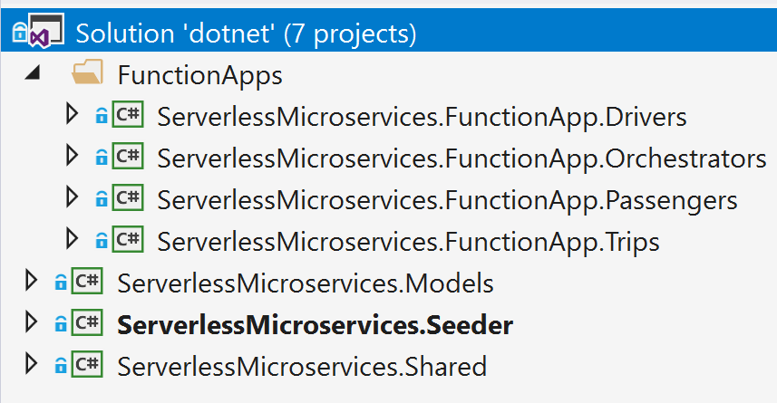
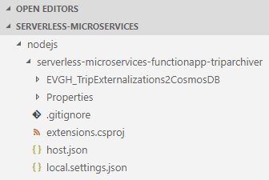
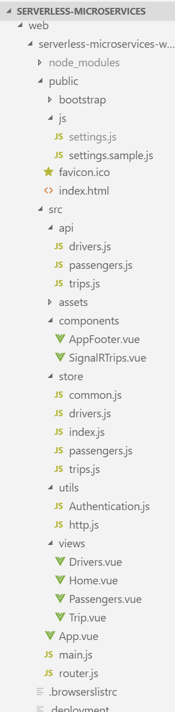

# Source code structure

- [.NET](#net)
- [Node.js](#nodejs)
- [Web](#web)

### .NET

The .NET solution consists of 7 projects:



- The `Models` project defines all the model classes required by RideShare
- The `Shared` project contains all the services which are used by the functions to provide different functionality
- The `Seeder` project contains some integration tests to pump trips through the solution
- The `Drivers` Function App project contains the `Drivers` APIs
- The `Trips` Function App project contains the `Trips` APIs
- The `Passengers` Function App project contains the `Passengers` APIs
- The `Orchestrators` Function App project contains the `Orchestrators`

The following are some notes about the source code:

- The `Factory` pattern is used to create static singleton instances via the `ServiceFactory`:

```csharp
private static ISettingService _settingService = null;

public static ISettingService GetSettingService()
{
    if (_settingService == null)
    _settingService = new SettingService();

    return _settingService;
}
```

- The `ISettingService` service implementation is used to read settings from environment variables:

```csharp
var seconds = _settingService.GetTripMonitorIntervalInSeconds();
var maxIterations = _settingService..GetTripMonitorMaxIterations();
```

- The `ILoggerService` service implementation sends traces, exceptions, custom events and metrics to the `Application Insights` resource associated with the Function App:

```csharp
    // Send a trace
    _loggerService.Log($"{LOG_TAG} - TripCreated - Error: {error}");

    // Send an event telemetry
    _loggerService.Log("Trip created", new Dictionary<string, string>
    {
        {"Code", trip.Code },
        {"Passenger", $"{trip.Passenger.FirstName} {trip.Passenger.LastName}" },
        {"Destination", $"{trip.Destination.Latitude} - {trip.Destination.Longitude}" },
        {"Mode", $"{trip.Type}" }
    });

    // Send a metric telemetry
    _loggerService.Log("Active trips", activeTrips);
```

- `IPersistenceService` has two implementations: `CosmosPersistenceService` and `SqlPersistenceService`. The Azure Cosmos DB implementation is complete and used in the APIs while the SQL implementation is partially implemented and only used in the `TripExternalizations2PowerBI` handler to persist trip summaries to SQL.
- The `CosmosPersistenceService` assigns Cosmos DB IDs manually, which is a combination of the `collection type` and some identifier. Cosmos DB's `ReadDocumentAsync` retrieves really fast if an `id` is provided.
- The `IsPersistDirectly` setting is used mainly by the orchestrators to determine whether to communicate with the storage directly (via the persistence layer) or whether to use the exposed APIs to retrieve and update. In the reference implementation, the `IsPersistDirectly` setting is set to true.

### Node.js

The [nodejs](../nodejs) folder contains the Archiver Function App with the following folder structure:



- The **serverless-microservices-functionapp-triparchiver** folder contains the Archiver Function App.
- The **EVGH_TripExternalizations2CosmosDB** folder contains the function to send data to the Archiver Collection in Azure Cosmos DB:
  - **function.json**: Defines the function's in (eventGridTrigger) and out (documentDB) bindings.
  - **index.js**: The function code that defines the data to be sent.
- **.gitignore**: Local Git ignore file.
- **host.json**: This file can include global configuration settings that affect all functions for this function app.
- **local.settings.json**: This file can include configuration settings needed when running the functions locally.

### Web

The [web](../web) folder contains the Vue.js-based SPA website with the following folder structure:



- The **public** folder contains the `index.html` page, as well as `js` folder that contains important settings for the SPA. The `settings.sample.js` file is included and shows the expected settings for reference. The `settings.js` file is excluded to prevent sensitive data from leaking. This file is added via the Web App's debug console (Kudu) after deploying the website.
- The **src** folder contains the bulk of the files:
  - **api**: these files use the http helper (`utils/http.js`) to execute REST calls against the API Management endpoints.
  - **assets**: site images.
  - **components**: Vue.js components, including a SignalR component that contains the [client-side functions](#javascript-signalr-client) called by the SignalR Service.
  - **store**: [Vuex store](https://vuex.vuejs.org/), which represents the state management components for the SPA site.
  - **utils**: utilities for authentication (wraps the [Microsoft Authentication Library (MSAL)](https://github.com/AzureAD/microsoft-authentication-library-for-js)) and HTTP (wraps the [Axios](https://github.com/axios/axios) library)
  - **views**: Vue.js files for each of the SPA "pages".
