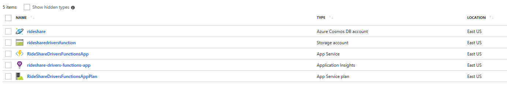

# RideShare .NET 

## Source Code Notes & Anamolies

- Upgraded all projects to latest `Functions SDK` and `Newtonsoft.Json`
- The latest Function SDK produces functions using the `ASP.NET Core` `HttpRequest` and `IActionResult` as opposed to `HttpReuestMessage` and `HttpResponseMessage`
- The latest Function SDK produces functions using the `ILogger` as opposed to `TraceWriter`....this is a big improvement
- I created a new project called `ServerlessMicroservices.FunctionApp.Orchestrators` that has durable orchestrator and activity functions. This new project has the implementation for a `Trip Manager` and a `Trip Monitor` 

## Coding Notes

- I created the `Shared` project that contains all the necessary elements which, I feel, makes it really easy to add new functionality 
- `IPersistenceService` has two implementations: `CosmosPersistenceService` and `SqlPersistenceService`. Only Cosmos is being used right now. 
- I assign Cosmos item ids manually which is a combination of the `collection type` and some identifier. Cosmos's `ReadDocumentAsync` retrieves really fast if an `id` is provided. 
- As best practice, the `Functions` implement a very thin layer of code and they rely on services to do the actual work.
- I created the following code services: `SettingService`and `PersistenceService` which implement `ISettingService` and `IPersistenceService` respectively
- I also created two additional auxiliary services: `ILoggerService` and `IAnalyticService`. I did not implement them yet. I feel they are important...we can discuss. 
- I used the concept if `ServiceFactory` to create instances. This is due to lack of `dependency injection` in `Functions`. At least I could not find a reasonable way to do it.
- For now, I embedded `Car` within `Driver`. It can be separated if need be.
- I used a naming convention in the orchestrator function names so they start with `O_` or `A_`. The first one denotes an orchestrator function i.e. `O_ManageTrip` and the second denotes an activity i.e. `A_TM_NotifyOtherDrivers`
- I also used a naming convention in the orchestrator trigger function names so they start with `T_` i.e. `T_StartTripManager` 
- There are 2 orchestrators that handle a trip: a `Trip Manager` and a `Trip Monitor`. The `Trip Manager` starts the `Trip Monitor` automatically and it commuicates to it via an internal storage queue. Below there is more detail about these orchestrations in the section below titled `Trip Orchestrators`.  
- I used a naming convention in the `Trips` Functions App to denote event grid handlers i.e. `EVGH_TripExternalizations2SignalR`. 
- I externalize the `Trip` to an Event Grid topic using the following event types and subjects:

```
       // Event Grid Event Types
        public const string EVG_EVENT_TYPE_MANAGER_TRIP = "Manager Externalized Trip";
        public const string EVG_EVENT_TYPE_MONITOR_TRIP = "Monitor Externalized Trip";

        // Event Grid Event Subjects
        public const string EVG_SUBJECT_TRIP_DRIVERS_NOTIFIED = "Drivers notified!";
        public const string EVG_SUBJECT_TRIP_DRIVER_PICKED = "Driver picked :-)";
        public const string EVG_SUBJECT_TRIP_STARTING = "Trip starting :-)";
        public const string EVG_SUBJECT_TRIP_RUNNING = "Trip running...";
        public const string EVG_SUBJECT_TRIP_COMPLETED = "Trip completed :-)";
        public const string EVG_SUBJECT_TRIP_ABORTED = "Trip aborted :-(";
    }
}
```

- The Event Grid topic is being listened to by the following:
    - Logic App to notify by the events email. I notice that there is an obvious weakness in the Logic App Event Grid connector.....it does not give me access to the event data! At least I could it find a way to do it. In any case, the Logic App runs, gets the event subject and fires an email.
    - Azure Function `EVGH_TripExternalizations2SignalR` to perhaps broadcast the trip over SignalR.
    - Azure Function `EVGH_TripExternalizations2PowerBI` to perhaps push the trip over to a PowerBI dataset so trips can be reported on in real-time. This is not really needed...I just added it for fun ....it could be useful. 
    - Both Azure Functions are currently stubbed out....they do receive the event but they don't do anything with it.  

## Provisioning

I provisioned the following resources under a resource group called `RideShare` in `Solliance-DEV` subscription:



- For Cosmos, I initially attempted to auto-create the Cosmos Collection `Main` in code if it does not exist. But it failed because the partition key was not set. So I created it manually from the portal. 
- I hooked an `Application Insights` resource to the `Drivers Functions App` so it can be used to tracing. I also made it available in the `setting service` so it can be used by the `Analytic` service, for example, to send metrics and custom telemetry.
- The setting service contains all the environment variables that need to exist in Function Apps.

## Publishing

- I used `Visual Studio` to publish by right-clicking the functions app project and click publish. It worked the first time....they suggested that I allow `beta` in the app settings. 
- Subsequent publishes, however, failed for no good reason. I had to use `Kudu` for the rescue. So I went in there, stopped the functions app, deleted its content, re-started the app and re-published. This worked. Unfortunately it is a lot of work!!
- When I do the above, Azure Functions `sometimes` create new function auth codes which forces me to go and change them everywhere in Postman. Otherwise, I get auth errors. This has been a challenge.
- I manually updated the functions app settings in the portal. I store in there the Cosmos settings, app insights and others. I ctreated setting CSV files for each Functions App:
    - [Drivers Functions App Settings](DriversFunctionsAppSettings.csv)
    - [Trips Functions App Settings](TripsFunctionsAppSettings.csv)
    - [Orchestrators Functions App Settings](OrchestratorsFunctionsAppSettings.csv)
- Later, perhaps we can use a more predictable method of publishing like `Cake` or something similar. 

## APIs

All APIs are available as a `Postman` Collection export:
[RideShare Postman Collection](RideSharePostmanCollection.json)

You can import it into your own `Postman` and start using the APIs.

## Test Scenario

For testing, there are the following handful APIs to conduct a test.

### Create a Trip

POST to the Trips API:

```
https://ridesharetripsfunctionapp.azurewebsites.net/api/trips?code=Lbjwz7g8FyJZCHZNQksOxqrEPYNiZUeua39O46UsBNcmJu6pt8seBg==
```

Sample Payload:

```
{
	"passenger": {
		"code": "joe@gmail.com",
		"firstName": "Joe",
		"lastName": "James",
		"mobileNumber": "+13105551212",
		"email": "joe@gmail.com"
	},
	"source": {
		"latitude": -31,
		"longitude": 54
	},
	"destination": {
		"latitude": -32,
		"longitude": 60
	},
    "type": 0
}
```

**Please note** you can create a trip in `Demo` mode! This will self-run so you don't have to do the below steps. The way you create a demo trip is by making the trip `type` equals 1. 

Once the Function returns the newly created Trip, get the `code`:

```
{
    "code": "RPKIATS0",
    "passenger": {
        "code": "joe@gmail.com",
        "firstName": "Joe",
        "lastName": "James",
        "mobileNumber": "+13105551212",
        "email": "joe@gmail.com",
        "id": "",
        "_self": "",
        "correlationId": "",
        "upsertDate": "2018-08-16T11:48:57.6866828Z",
        "collectionType": 0
    },
    "driver": null,
    "availableDrivers": [
        {
            "code": "AA100",
            "firstName": "James",
            "lastName": "Beaky",
            "latitude": -32,
            "longitude": 60,
            "car": {
                "driverCode": "AA100",
                "make": "BMW",
                "model": "735",
                "color": "Black",
                "licensePlate": "CA-8900",
                "id": "",
                "_self": "",
                "correlationId": "",
                "upsertDate": "2018-08-15T13:14:19.9633478+00:00",
                "collectionType": 0
            },
            "isAcceptingRides": true,
            "id": "AA100-Driver",
            "_self": "dbs/pGdxAA==/colls/pGdxAObIQoI=/docs/pGdxAObIQoIBAAAAAAAAAA==/",
            "correlationId": "",
            "upsertDate": "2018-08-16T08:23:28.192741+00:00",
            "collectionType": 0
        }
    ],
    "source": {
        "latitude": -31,
        "longitude": 54
    },
    "destination": {
        "latitude": -32,
        "longitude": 60
    },
    "acceptDate": null,
    "startDate": "2018-08-16T11:48:57.7047155Z",
    "endDate": null,
    "duration": 0,
    "monitorIterations": 0,
    "isAborted": false,
    "error": "",
    "id": "RPKIATS0-Trip",
    "_self": "dbs/pGdxAA==/colls/pGdxAObIQoI=/docs/pGdxAObIQoIUAAAAAAAAAA==/",
    "correlationId": "",
    "upsertDate": "2018-08-16T11:49:18.9443023+00:00",
    "collectionType": 3
}
```

### Retrieve a Trip by code

GET  to the Trips API (please note that the trip code is included in the URL):

```
https://ridesharetripsfunctionapp.azurewebsites.net/api/trips/{code}?code=HzL1cuSoqZXnhB3cPFBd74YTa5RF9xAKA8p2VaezpQWeWxPcI8c2TA==
```

Now....you have 120 seconds (configurable by the settings service) to pick a diver. 

### Assign a Driver

POST to the Trip Managers API (please note that the trip code and the driver code are included in the URL):

```
https://rideshareorchestratorsfunctionapp.azurewebsites.net/api/tripmanagers/{code}/acknowledge/drivers/{drivercode}?code=2bTHzb1TxQGQvxC6nQ2MdL6A5x5a0ZSMao0eaaSW4KhoIaBMW7ZxrA==
```

**Please note** this API will change. I created a new Trips API that will assign a driver instead of this. This way the trip manager orchestrator is not visible to the outside at all. 
 
### Update the Driver Location

POST to the Drivers API:

```
https://ridesharedriversfunctionsapp.azurewebsites.net/api/driverlocations?code=QwcMwmWVcswk4DxuseZr5sE3PdG/KA8t0se5Yzn3iRsY42e2mhe0HQ==
```

Sample Payload:

```
{
	"driverCode": "AA100",
	"latitude": -32,
	"longitude": 60
}
```

NOTE: Currently, I am using the driver location to determine when the trip should be completed. Obviously this is not realistic ...but it is good for a demo.

## Trip Orchestrators

TBA


